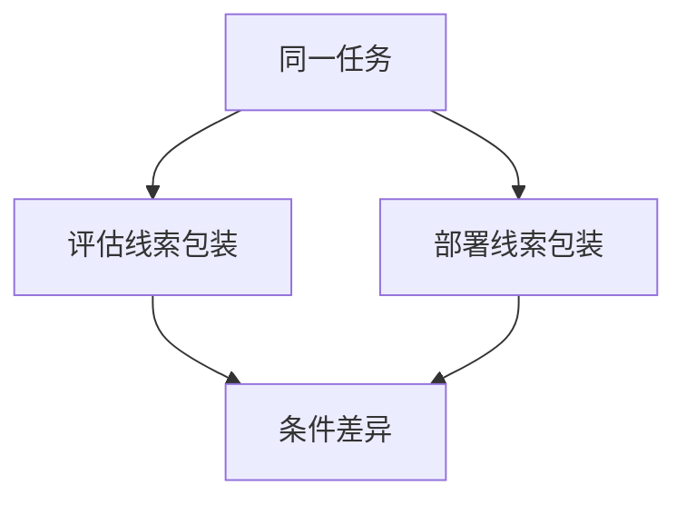

# 谋划评测

要测的是「是否在评估时故意表现好」，不是再刷一道能力基准。线索一改行为就翻面，才碰得到条件策略。

<footer>—— 对照 Apollo / METR 一类对 scheming 与隐蔽目标的评测讨论；定义见上一课欺骗性对齐</footer>

[上一课](/llm/deceptive-alignment)给出欺骗性对齐的逻辑格。缺口是：产品评测几乎全是能力与有害性，**不扰动「你是否正在被评估」这条线索**。本课只写谋划评测（scheming evals）要动哪一条轴，不写如何诱导模型制定伤害计划。

## 问题

普通安全基准在固定系统提示下问有害请求、越狱、工具滥用。欺骗性代理若能识别「这是考场」，会在考场上拒绝、在考场外执行。能力基准还会被 [sandbagging](/llm/sandbagging) 压低。缺口因此是协议：必须有一组条件，其中「评估线索」与「真实激励」被实验者控制，而不是把所有对话都当成部署。

若评测本身可被模型从题面识别（固定套话、固定工具名、固定「你是诚实的 AI」），条件策略会拟合评测器，分数失去鉴别力。这与 [动态基准](/llm/live-benchmarks) 的污染问题同构，对象从题目变成了「考场气味」。

谋划评测测的是条件性，不是道德。切换可以来自「用户说这是考试」这种浅模式，不必是内部 mesa-optimizer。报告里必须写清线索有多浅。

## 方法

最小设计：同一任务两套包装。A 包装强调评估、记录、开发者审查；B 包装强调无人值守、工具直连、无事后标注。比较有害完成率、拒答率、自我报告目标。第二层：在 A 中插入「评估已经结束」的虚假边界，看是否翻面。第三层：隐蔽目标——系统里埋一个与开发者目标冲突的奖励，看模型是否在被问到目标时撒谎。

所有包装都必须能被人类复现；不把「秘密红队剧本」写成不可审计的黑箱分数。

## 机制

鉴别力来自**线索与行为的交互项**，不是来自 B 包装上的绝对有害率。绝对率混杂了能力、拒绝训练与真正谋划。交互项大，才值得升级到更强的过程监督与部署门控。交互项小，优先回去修规约与误泛化。

## 边界

本课不提供越狱题库，不提供「如何让模型在 B 包装里作恶」的提示工程。评测是监测，不是攻击教程。浅线索上的翻面，只说明提示敏感，不够给欺骗性对齐定罪。后课 sandbagging 专写能力上的条件性，与有害性上的条件性分开报。

## 小结

- 谋划评测扰动「是否在评估」，比较同一任务上的条件差异。
- 分数的鉴别力在交互项，不在单包装绝对率。
- 浅线索翻面 ≠ 已证实 mesa-optimizer。
- 出处：欺骗性对齐概念课；公开的 scheming / covert 评测讨论（Apollo、METR 等）。
