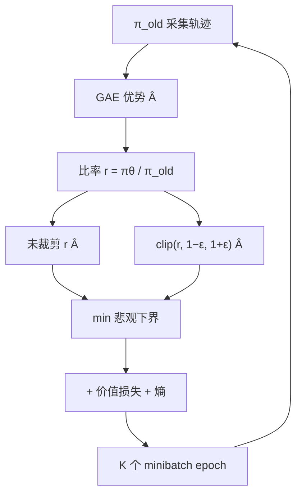

# PPO 原文

    
我们希望每一步更新都尽量改进目标，同时保证与旧策略的偏离不大；裁剪重要性比率，就能用一阶梯度近似信托域，而不必解二次规划。

    <footer>—— Schulman, Wolski, Dhariwal, Radford, Klimov，Proximal Policy Optimization Algorithms，2017</footer>

Trust Region Policy Optimization（TRPO）用约束 $\mathrm{KL}(\pi_{\mathrm{old}}\|\pi)\le\delta$ 保证近似单调改进，求解需要共轭梯度与费希尔向量积，实现重、难与其它损失合并。Schulman 等人 2017 年的 Proximal Policy Optimization（PPO）保留「不要一步走太远」的精神，换成两种一阶目标：自适应 KL 惩罚，以及后来成为默认的裁剪代理目标。论文实验在 MuJoCo 连续控制与 Atari 像素上，比较 TRPO、A2C、A2C+信赖域、PPO 的样本效率与稳定性。它不是为语言模型写的；[PPO 在语言模型中的实现](/llm/ppo-llm) 才是 token 轨迹、四模型与稀疏终点奖励那一套。本篇只写 2017 原文的问题、公式与实验边界。

## 问题

策略梯度 $\mathbb{E}[\nabla\log\pi_\theta(a\mid s)\hat A]$ 用当前策略采样时无偏，但同批数据只能安全地走很小一步：$\theta$ 一变，重要性比率 $r(\theta)=\pi_\theta(a\mid s)/\pi_{\mathrm{old}}(a\mid s)$ 使估计偏掉，大步会崩。TRPO 最大化代理

$$
L^{\mathrm{CPI}}(\theta)=\mathbb{E}_t\bigl[r_t(\theta)\hat A_t\bigr]
$$

并硬约束平均 KL。CPI（conservative policy iteration）在比率远离 1 时没有上界，无约束最大化会让一次更新摧毁策略。需要一种可与 minibatch SGD 共用、超参少、不必二阶求解器的近端目标。

原文给出两个变体。PPO-Penalty 把 KL 加进损失，并根据实测 KL 相对目标的大小自适应缩放系数。PPO-Clip 不显式算 KL，而对 $r_t(\theta)$ 做裁剪，再取与未裁剪项的最小值，形成悲观下界。主推荐是 Clip：实现更短，Atari 与机器人任务上整体更好。两者都允许对同一批 rollout 做多个 epoch 的 minibatch 更新——这是相对「每条轨迹只用一次」的 REINFORCE 的样本效率来源，也是必须近端约束的原因。

### 为何不直接做带约束的 TRPO

TRPO 的约束优化在大网络上要反复估计费希尔，与价值损失、熵奖励不好加在同一个 Adam 步骤里。PPO 把近端变成损失形状，价值头、熵、策略可以加在一起用普通反向传播。代价是单调改进不再有 TRPO 那种近似保证，裁剪区间 $[1-\epsilon,1+\epsilon]$ 是启发式信托域。$\epsilon$ 常用 $0.1$ 或 $0.2$。

原文的 $\hat A_t$ 来自 GAE（Schulman 等，2015），需要学习的价值函数 $V_\psi$。没有 critic 的 PPO 不是 2017 这篇的算法。后来 LLM 里丢掉 critic 的方法应称为组相对或留一法策略梯度，而不是「PPO 原文」。

## 方法

定义比率 $r_t(\theta)=\pi_\theta(a_t\mid s_t)/\pi_{\theta_{\mathrm{old}}}(a_t\mid s_t)$。裁剪目标为

$$
L^{\mathrm{CLIP}}(\theta)=\mathbb{E}_t\Bigl[\min\bigl(r_t(\theta)\hat A_t,\,\mathrm{clip}(r_t(\theta),1-\epsilon,1+\epsilon)\hat A_t\bigr)\Bigr].
$$

$\hat A_t>0$ 时，未裁剪项鼓励增大比率，但超过 $1+\epsilon$ 后裁剪项封顶，再增大 $\pi_\theta(a_t\mid s_t)$ 不再加分。$\hat A_t<0$ 时，鼓励减小比率，低于 $1-\epsilon$ 后同样封顶。$\min$ 取较悲观的一个，因此目标不会为了极端比率而无限改进。完整损失还减去价值误差、加上熵奖励：

$$
L_t(\theta)= \mathbb{E}_t\bigl[L^{\mathrm{CLIP}}_t(\theta)-c_1 L^{\mathrm{VF}}_t(\theta)+c_2 S[\pi_\theta](s_t)\bigr],
$$

其中 $L^{\mathrm{VF}}=(V_\theta(s_t)-V_t^{\mathrm{targ}})^2$。价值头可与策略共享骨干。算法循环：按 $\pi_{\mathrm{old}}$ 跑 $T$ 步（或一条轨迹），算优势，再在这批数据上做 $K$ 个 epoch 的 SGD，然后 $\theta_{\mathrm{old}}\leftarrow\theta$。Penalty 变体把 $-c\cdot\mathrm{KL}$ 加进目标，$c$ 按实测 KL 大于或小于目标 $\delta$ 乘除 $2$。

实验：连续控制用 MuJoCo；Atari 用像素输入。PPO 在实现简单性与最终回报上相对 TRPO、A2C 有竞争力；Clip 总体上优于 Penalty。论文不包含语言模型、也不包含奖励模型。

### 裁剪不是梯度截断

有人把 clip 理解成把梯度范数裁掉。公式裁的是目标里的比率，不是 $\nabla\theta$。当 $r$ 已在区间外且继续朝使目标变差的方向走，$\min$ 仍可能给梯度（悲观项随未裁剪项走）；朝「更好」方向走时梯度为零。因此它是非对称的：阻止过大改进，不对称地阻止修复。实现必须用 `min` 而不是单独对 $r$ 做 `clip` 再乘 $\hat A$，否则符号与梯度门控会错。价值损失不裁剪比率；过大的 $V$ 更新是另一组超参。

## 机制

### 多 epoch 与近端是同一件事的两面

若每条样本只做一次梯度步，普通策略梯度也可以，近端约束几乎无用。PPO 的收益来自对同一批 $(s,a,\hat A)$ 反复学习，相当于提高样本效率。反复学习使 $\pi_\theta$ 离开 $\pi_{\mathrm{old}}$，$r_t$ 偏离 1，裁剪开始工作。epoch 太多，大部分样本的比率出区间，有效学习信号变稀，等于过期数据上的硬更新。原文用较少 epoch 与合理 $\epsilon$ 打到这个平衡。把 epoch 调到数十而 $\epsilon$ 不变，不是论文设定。

GAE 用 $\lambda$ 在高偏差的 $V$ 自举与高方差的蒙特卡洛回报之间插值。$\lambda=1$ 接近蒙特卡洛，$\lambda=0$ 接近 TD(0)。这是 2015 年的优势估计，不是 PPO 新发明；PPO 把它当作默认配件。没有 GAE 也能带 $\hat A_t=R_t-V(s_t)$ 跑 Clip，只是方差处理不同。

原文评估的是仿真器里可无限重置的环境。样本复杂度按环境步计。语言模型每次「重置」是一次昂贵自回归，且没有真实逐步奖励，这些约束会改写实现，但不能回写进 2017 年的公式含义。

### Penalty 与 Clip 如何对应信托域

Penalty 显式跟踪 $\mathbb{E}[\mathrm{KL}(\pi_{\mathrm{old}}\|\pi_\theta)]$，KL 太大则加大惩罚，把更新拉回。Clip 用比率区间近似「局部概率变化不大」，在离散动作上与 KL 相关但不等于 KL 约束：某个动作比率到 $1+\epsilon$，其它动作的质量会经 softmax 重分配，KL 仍可能较大。因此 Clip 没有 TRPO 的硬保证。原文用实验表明它够用，不是用定理证明等价。

## 边界与工程取舍

PPO 原文假设能从当前策略采集大量同步经验、有逐步或可从回报反推的优势、价值函数可以学。动作空间是仿真器的连续扭矩或 Atari 的有限按钮，不是十万词表。共享骨干时价值损失系数 $c_1$ 会干扰策略特征。熵系数 $c_2$ 在稀疏探索任务上必要，在已经很尖的策略上会伤害确定性控制。

不要把后来的「PPO-KL 进奖励」「token 级比率」「四模型 RLHF」算进原文贡献。那些是 Ouyang、Ziegler 一线的工程选择。反过来，也不要把 2017 的 MuJoCo 曲线当成 LLM 对齐会重复的样本效率。

$\epsilon$ 对正负优势共用同一宽度。有人后来做非对称裁剪，那是后续工作。原文图示把 $L^{\mathrm{CLIP}}$ 画成对正负 $\hat A$ 各一条折线，实现应对齐那张图，而不是只 clip 到 $[0,1]$。

### 何时不必谈 PPO 原文

若问题是指令模型如何接奖励模型，应读 LLM-PPO 与 [RLHF 流水线](/llm/rlhf-pipeline)，不是本篇。若已经决定不要 critic，应读 [GRPO 原文](/llm/grpo-paper) 或 [RLOO 原文](/llm/rloo-paper)。若需要带单调保证的信托域，TRPO 仍是参考实现，PPO 是它的一阶近似。

## 小结

- PPO 用一阶代理目标近似 TRPO 的近端更新，主变体是对重要性比率的裁剪再取 min。
- 同一批 rollout 上多个 minibatch epoch 是样本效率来源，也是必须裁剪的原因。
- 完整目标含价值回归与熵；优势默认 GAE，需要 critic。
- Penalty 变体用自适应 KL 系数，实验上整体不如 Clip。
- 原文验证在 MuJoCo 与 Atari，不含语言模型与奖励模型。
- 裁剪的是目标中的比率，不是梯度范数；实现必须保留 min 的悲观门控。
- 出处：Schulman, Wolski, Dhariwal, Radford, Klimov，*Proximal Policy Optimization Algorithms*，arXiv:1707.06347，2017。
