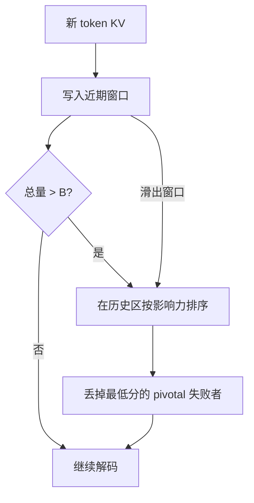

# Scissorhands

若某个 token 在某一步已经产生过实质影响，它在未来步骤里仍可能重要；利用这种重要性的持久性，就可以在固定预算下剪 KV，而不微调模型。

<footer>—— Liu, Desai, Liao 等，Scissorhands，NeurIPS 2023</footer>

KV 可以长过权重。Liu、Desai、Shrivastava 等人的 Scissorhands 与 [H2O](/llm/h2o-kv) 同期，同属「生成时压缩缓存、不改参数」这一支。它把观察收成一条假设——**persistence of importance**：只有在过去某步已经产生过显著影响的 pivotal token，才会在将来继续显著影响。算法在预定预算 $B$ 内优先留下这些位置，并用最近窗口保护尚未被充分观察的新 token。本篇写假设、预算算法与和 H2O 的差别，不把 4-bit 权重量化当成缓存压缩本身。

## 问题

完整注意力每步读 $t$ 个键。$t$ 大时，显存限制 batch，带宽限制 decode。若重要性在时间上完全重洗牌，任何基于历史的驱逐都会在下一步失效。作者可视化注意力后发现：不同查询步常常盯着**同一组**历史位置，模式重复率在多数层超过九成量级。于是可以赌：曾经 pivotal 的，以后还 pivotal；从未高分的，以后也大概率可以丢。

这条假设一旦成立，缓存就不必随 $t$ 涨，而可以钉在 $B$。问题变成在线维护：新 token 刚写入时没有历史，不能立刻判死刑；预算满时必须在「看起来一直不重要」的旧 token 里下手。还要证明压缩后的注意力输出与全缓存足够近，否则只是又一种伤质量的滑窗。

### 持久性不是不可驱逐

持久性说的是统计倾向，不是某个实体名永远不能删。预算极小时，次要 H2 仍会被剪。假设失败的典型场景是：重要性在生成后期突然转向早先被判为不重要的段落——例如长文档最后才问一个冷门小节。Scissorhands 与 H2O 一样会失忆。论文的主张是在语言模型常见的重复注意力模式下，这种转向不够频繁，固定 $B$ 仍能把质量维持到约 2–5× 压缩。

「不微调」指推理期剪缓存，不是指该方法对所有下游任务零损失。压缩比要按任务验收。针检索、多跳问答比语言建模困惑度更能暴露误杀。

## 方法

缓存分成近期窗口与历史区。近期窗口里的 KV 一律保留，因为还没有足够步数估计其重要性。历史区每个位置维护影响力统计（历史注意力分数的聚合）。当 $|{\mathrm{cache}}|>B$，从历史区丢掉影响力最低的，直到回到预算。新 token 先进入近期窗口；滑出窗口后才开始参与淘汰竞争。作者将此与水库抽样、LRU 一类缓存替换做类比：最近的受保护，长期低使用的被替换。

### 用历史分数近似注意力输出

令未被保留的位置在后续 softmax 中缺席。若这些位置的质量本身就接近 0，配分函数与加权和变化都小。持久性假设保证「现在接近 0」与「将来接近 0」相关，于是过去低分成为驱逐的依据。论文给出理论论证：在该假设下，压缩缓存的注意力输出可以近似全缓存。实现上分数应对头聚合到实际存储的 KV 头（GQA 尤其如此），并与 [SDPA](/llm/sdpa) 的尺度一致。

预算 $B$ 按层、按头可以不同。浅层有时更 dense（后来 [QUEST](/llm/quest-kv) 也观察到前几层可稀疏度低），一刀切的全局 $B$ 可能过度压缩底层。工程上常先统一 $B$，再对质量敏感层放宽。

## 机制

机制是「用过去的高分当作未来高分的预测器，并用保护窗口避免冷启动误杀」。与 H2O 的累积和相比，Scissorhands 更强调假设本身与「pivotal token 应以更高概率被保留」的算法叙事；H2O 更强调 H2 ∪ recent 的两段预算和子模形式。实践上两者都会留下最近 token 与历史高分 token，超参映射后行为接近。差异更多在分数聚合、是否允许同一位置稍后被救回（通常不能）、以及论文评测的模型族（Scissorhands 在 OPT 大模型上展示约 5× 压缩仍无明显掉点）。

和量化正交。作者把 4-bit 量化叠在剪过的 KV 或权重上，报告可到约 20× 的复合压缩。那是两条轴相乘：驱逐减少条数，量化减少每条位数。复合数字不要直接当成「剪枝 20× 仍无损」。

持久性在层间不均。有的头专门做局部移位，recent 窗口已经够；有的头盯着远处名字。按头设 $B$ 更跟假设，按层共享 $B$ 更好实现。服务系统里按头不同长度的 KV 会让分页核变复杂。

### 与窗口加汇点的关系

StreamingLLM 钉文首、滑窗口，不看内容分数。Scissorhands 看内容，不保证文首还在——若 BOS 累积了高分它会留下，若实现没有单独的 sink 规则，极短预算下也可能把汇点剪掉导致配分函数失真。生产配方往往是 **sink + recent + 持久高分**，而不是只实现论文伪代码里的一种。评测对比时应写清有没有额外钉汇点，否则数字不可比。

## 边界与工程取舍

FlashAttention 不输出完整权重，分数维护要在核内做或另开一条统计路径，开销同 H2O。压缩发生在生成过程中，预填充很长时，若等到 decode 才剪，预填充的 KV 峰值仍然在。可以对预填充结果先按重要性做一次截断，再进入 decode；那已经靠近 [SnapKV](/llm/snapkv) 的「生成前压缩提示」。Scissorhands 原文的主线仍是逐步生成时维持 $B$。

不要在安全或合规场景把淘汰当成「模型没看见那段话」的保证：注意力近似不等于可审计的隔离。也不要把论文里 OPT-66B 的 5× 直接写进 Llama 3 长上下文 SLA。模型、长度、任务三项都要重测。高温度采样会改变注意力分布，持久性统计应在目标采样设置下收集，而不是用贪心分数去服务采样流量。

预算 $B$ 是质量旋钮，不是显存旋钮的精确刻度。分页、对齐、每层独立缓冲都会让实际占用高于 $B\times$ 单 token 理论值。容量规划用测得的峰值，不要用 $B/t$ 心算。

## 小结

- Scissorhands 利用重要性持久性假设，在固定预算下保留 pivotal 与近期 token，推理期压缩 KV、不微调。
- 新 token 先受窗口保护，再凭历史注意力参与淘汰；误杀不可恢复。
- 与 H2O 同族：都是历史分数加最近窗口；叙事与分析不同，配方常收敛到 sink+recent+H2。
- 论文报告最高约 5× KV 内存下降且质量接近；可与 4-bit 量化叠乘。
- 假设在查询突然转向冷段落时失败；分数维护须兼容融合注意力核。
- 出处：Liu et al., *Scissorhands: Exploiting the Persistence of Importance Hypothesis for LLM KV Cache Compression at Test Time*，NeurIPS 2023；arXiv:2305.17118。
