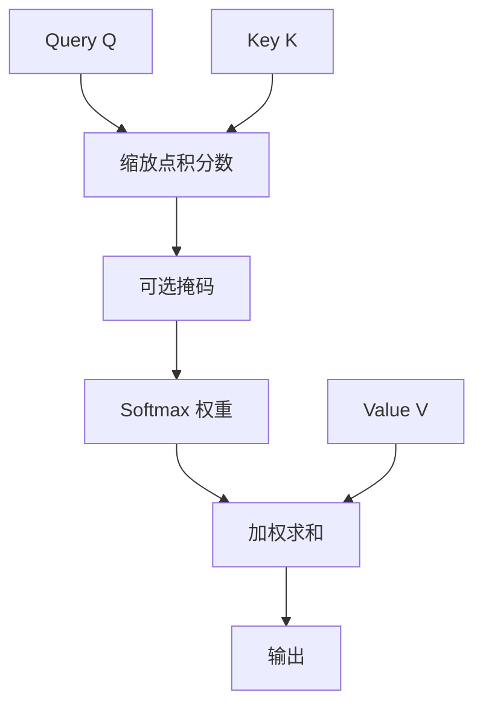

# Scaled Dot-Product Attention

我们将点积除以键向量维度的平方根，以免点积量级随维度膨胀、把 softmax 推入梯度几乎为零的饱和区。

<footer>—— Vaswani et al., Attention Is All You Need, NeurIPS 2017</footer>

注意力要回答的问题很朴素：给定一条查询，当前上下文里哪些位置值得读、该以多大权重去读。2017 年 Transformer 把这个问题收成一个可并行的矩阵运算——缩放点积注意力（Scaled Dot-Product Attention, SDPA）。它是后续多头、因果掩码、交叉注意力共用的计算内核：先打分，再归一化，最后对值加权。Bahdanau 等人更早的加性注意力在效果上并非不能用，但点积能直接走密集矩阵乘，更适合当时已经成熟的 GPU 原语；Vaswani 等人要补的，只是点积随维度放大这一条数值缺陷。

## 问题

序列模型需要一种内容寻址：不是按固定偏移去取邻居，而是按查询与键的相容性去取。循环网络靠隐状态逐步传递，远距离依赖要穿过许多时间步；卷积的感受野随层数线性或指数扩张，但仍是局部的。注意力把任意两个位置的交互变成一次打分，理论上是全连接的。

相容性函数有两条主流路。加性注意力把查询与键拼起来，过一层非线性再投影成标量，表达力强，却多一次仿射与激活，难以与大矩阵乘融合。点积注意力直接算 $q^\top k$，硬件友好，但当键的维度 $d_k$ 增大时，若各分量近似独立，点积的方差大约按 $d_k$ 增长。方差一大，softmax 的输入就极易两极分化：最大值对应的权重接近 1，其余接近 0，梯度几乎为零。训练初期若再叠加深层，优化会变得很脆。

### 点积方差随维度膨胀

设 $q, k \in \mathbb{R}^{d_k}$ 的分量独立、均值为 0、方差为 1，则

$$
\mathbb{E}[q^\top k] = 0, \qquad \mathrm{Var}(q^\top k) = d_k.
$$

标准差是 $\sqrt{d_k}$。$d_k=64$ 时已经把 logits 拉到大约 8 的量级；$d_k=128$ 更夸张。softmax 对这种尺度极为敏感。SDPA 要解决的，不是「要不要注意力」，而是「点积作为打分函数时，如何让尺度与 $d_k$ 解耦」。

很多人把 $1/\sqrt{d_k}$ 理解成「除一个常数让数变小」。更准确的说法是：它把点积的标准差从 $\sqrt{d_k}$ 拉回到大约 1，使 softmax 工作在梯度尚存的区间。温度、学习率、初始化方差都会改变同一件事的数值表现。

## 方法

SDPA 的输入是三个矩阵：查询 $Q \in \mathbb{R}^{n \times d_k}$、键 $K \in \mathbb{R}^{m \times d_k}$、值 $V \in \mathbb{R}^{m \times d_v}$。自注意力里通常 $n=m$ 且三者来自同一组表示；交叉注意力里 $n$ 与 $m$ 可以不同。公式是

$$
\mathrm{Attention}(Q, K, V) = \mathrm{softmax}\left(\frac{QK^\top}{\sqrt{d_k}}\right) V.
$$

先算分数矩阵 $S = QK^\top / \sqrt{d_k} \in \mathbb{R}^{n \times m}$，再沿键的那一维做 softmax，得到权重 $A$，最后 $AV$ 把值混成每条查询的输出。缩放只作用于分数，不改变值向量本身。

### 一次前向里的三个线性代数步骤

实现上几乎总是先做查询与键转置的乘，再除 $\sqrt{d_k}$ 或乘预先算好的倒数，然后 softmax，再拿权重乘值。掩码——因果或 padding——加在 softmax 之前，通常是把无效位置写成一个很大的负数，以免归一化时分到质量。这一内核后来被 FlashAttention 在片上存储里分块重算，但数学对象没有变：仍然是缩放点积加 softmax 加权。

## 机制

缩放的作用可以从 softmax 的 Jacobian 看。对向量 $z$，softmax 输出 $p_i = e^{z_i} / \sum_j e^{z_j}$，对角元约为 $p_i(1-p_i)$。当某个 $z_i$ 远大于其余，$p$ 接近 one-hot，Jacobian 接近零。除以 $\sqrt{d_k}$ 等价于把 logits 的典型幅度固定下来，避免「维度越大越接近硬选择」。

与温度的关系是直接的。若定义

$$
p = \mathrm{softmax}(s / \tau),
$$

SDPA 相当于取 $\tau = \sqrt{d_k}$。训练时这个温度通常不作为可学习参数，而是由宽度决定的常数；推理时有人会另设温度，那是在已经训练好的分数上再调锋利程度，和训练稳定性不是同一件事。

缩放不能替代正确的初始化。若查询、键的投影把表示放到过大的尺度，除 $\sqrt{d_k}$ 之后 logits 仍然可能饱和。反过来，过小的初始化会让注意力接近均匀，模型短期看起来什么都在看，有效上下文被稀释。

### 与加性注意力的计算差异

加性注意力的分数是 $v^\top \tanh(W_q q + W_k k)$，每个查询-键对都要走一遍非线性；点积是一次 $n \times d$ 与 $d \times m$ 的乘。序列一长，前者的元素级开销会压过矩阵乘的吞吐优势。Transformer 选点积，是把能走通用矩阵乘当成一等约束，再用缩放把数值补回来。

## 边界与工程取舍

SDPA 假定键、查询处在同一点积空间，维度必须一致；值的维度可以不同，但现代实现几乎总取 $d_v=d_k$ 以便拼头。它对长度没有结构先验：两个位置只要分数高就可以强耦合，这也是二次复杂度的根源——分数矩阵是 $n \times m$ 的稠密表。

数值上，softmax 应在较高精度里做，或先减行最大值再指数。半精度训练时 $QK^\top$ 的中间结果容易溢出，这不是缩放公式的问题，而是浮点动态范围的问题。长度外推、稀疏模式、线性注意力，都是在 SDPA 之外改连通性或核函数，并不替换「缩放点积加 softmax」这一默认内核。

不要把 SDPA 和已经算完的注意力权重可视化混为一谈。权重是 softmax 之后的行随机矩阵；真正参与残差流的是加权后的值。只看权重会高估某些高分但值向量近零的位置，也会低估分数平庸但值很大的位置。

## 小结

- 缩放点积注意力用 $QK^\top/\sqrt{d_k}$ 作为相容性，再用 softmax 对值加权，是 Transformer 注意力的计算内核。
- 除 $\sqrt{d_k}$ 是为了对消点积方差随维度线性增长，避免 softmax 饱和。
- 相对加性注意力，点积能整段落成矩阵乘，更适合 GPU；缩放是为此付出的数值代价的补偿。
- 掩码加在 softmax 之前；值的混合发生在权重之后，可视化权重不等于可视化贡献。
- 公式不包含长度先验，故分数矩阵随序列长度二次增长。
- 半精度下的溢出、温度调节、后续的多头与因果约束，都建立在这一内核之上，而不是改写它。
- 出处：Vaswani et al., *Attention Is All You Need*, NeurIPS 2017。
