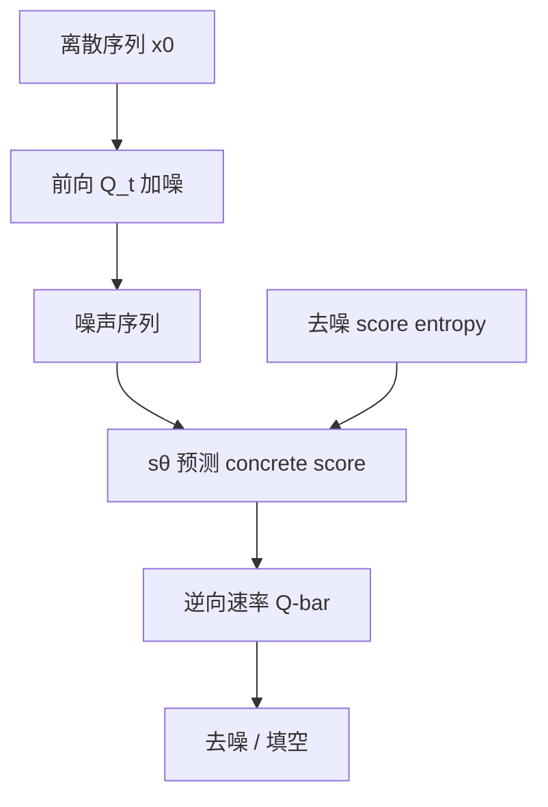

# SEDD

    
Score entropy 把分数匹配接到离散空间：稳定、构成似然下界，并能用去噪变体高效优化。

    <footer>—— Lou, Meng, Ermon, Discrete Diffusion Modeling by Estimating the Ratios of the Data Distribution, ICML 2024</footer>

连续扩散靠分数匹配学 $\nabla\log p_t$。离散状态上，逆向过程需要的是概率比 $p_t(y)/p_t(x)$，即 concrete score。平方损失的 concrete score matching 会把预测打到负数或零，零比率对应无穷 KL。Lou、Meng 与 Ermon 提出 score entropy，用带对数势垒的损失学这些比率，再放进连续时间马尔可夫链的逆向速率矩阵，得到 Score Entropy Discrete Diffusion（SEDD）。在 GPT-2 同档实验里，吸收态 SEDD 的困惑度上界常落在 GPT-2 的约 $10\%$ 以内，部分零样本集上更好；生成侧可用更少网络评估接近 GPT-2，并支持任意位置填空。论文 ICML 2024，arXiv:2310.16834。相对 [Diffusion-LM](/llm/diffusion-lm) 的连续嵌入，这里状态始终是 token。

## 问题

离散扩散的前向是 $\dot p_t=Q_t p_t$，$Q_t$ 非对角非负、列和为零。逆向速率用 $\overline{Q}_t(y,x)=\frac{p_t(y)}{p_t(x)}Q_t(x,y)$（$x\neq y$）。未知量正是这些比率。Meng 等的 concrete score matching 用 $\ell^2$ 拟合 $s_\theta(x)_y\approx p(y)/p(x)$，但比率非负，$\ell^2$ 对 $s=0$ 与略偏的正值惩罚对称，而 $s=0$ 会删掉数据支撑。

先前离散扩散（D3PM）与连续嵌入扩散在似然上落后自回归一大截。若没有一个既对应分数、又构成 ELBO、又能在序列上因式分解的损失，离散扩散很难在 GPT-2 小/中档上正面比较。SEDD 要填的就是这条目标函数。

### 序列上只需「差一个位置」的比率

词表大小为 $n$、长度为 $d$ 时，完整状态空间是 $n^d$。前向对每个位置独立作用 token 级 $Q_t^{\mathrm{token}}$，则 $Q^{\mathrm{seq}}$ 只在恰好差一个位置的序列对上非零。Score 网络输出 $\mathbb{R}^{d\times n}$，第 $i$ 位、候选 $y$ 的分量逼近「只改第 $i$ 个 token」的比率。这与非自回归语言模型的输出形状相同，但训练的是比率而不是下一词。

v1 摘要写 $32\times$ 更少评估匹配 GPT-2，v3 HTML 摘要写 $16\times$。以 ICML 正式文本与文内实验为准：采样 $32$ 到 $2048$ 步，吸收模型用 $32\times$ 更少 NFE 匹配 GPT-2 质量，满 $2048$ 步生成困惑度好约 $6$–$8$ 倍（相对未退火的 GPT-2）。不要混用两个摘要数字。

## 方法

Score entropy 对正值比率写交叉熵式损失：

$$
\mathcal{L}_{\mathrm{SE}}=\mathbb{E}_{x\sim p}\Big[\sum_{y\neq x}w_{xy}\big(s_\theta(x)_y-\tfrac{p(y)}{p(x)}\log s_\theta(x)_y+K(\tfrac{p(y)}{p(x)})\big)\Big],
$$

其中 $K(a)=a(\log a-1)$。最优时 $s_{\theta^*}(x)_y=p(y)/p(x)$ 且损失为零。梯度相对 CSM 多因子 $1/s$，形成对数势垒，把 $s$ 推离零。未知比率用去噪形式去掉：在 $x_0\sim p_{\mathrm{data}}$、$x\sim p(\cdot\mid x_0)$ 上，用转移核 $p(y\mid x_0)/p(x\mid x_0)$ 代替 $p(y)/p(x)$，只需一次 $s_\theta(x)$。隐式形式要对所有 $y$ 评 $s(y)$，高维不可用。

把 $w_{xy}$ 取成扩散矩阵元素 $Q_t(x,y)$ 并对时间积分，得到 diffusion-weighted denoising score entropy，这就是负对数似然的上界（另加终点与先验的 KL）。训练因此既是分数学习，也是似然训练。实现上吸收（MASK）与均匀两种 $Q$ 都做了；吸收在语言上更强。

### 采样与填空

学到的 $s_\theta$ 代入 $\overline{Q}^\theta$，用欧拉或基于 Tweedie 的解析采样从噪声走到数据。填空：把已知位置的 token 钉住，只在未知位置按逆向过程更新，不必左到右。计算—质量可交换：步数越多，生成分布越接近学到的 $p_0^\theta$。架构按 GPT-2 档缩放，并配合适合比率输出的网络改进。

## 机制

text8 上 SEDD Absorb 的 BPC 上界 $\leq 1.39$，与自回归 $1.23$ 接近，优于 D3PM Absorb 的 $\leq 1.45$。LM1B 上 Absorb $\leq 32.79$，Uniform $\leq 40.25$，对照自回归 Transformer $31.98$、D3PM Absorb $\leq 77.50$、Diffusion-LM $\leq 118.62$。零样本无条件困惑度：Small 档 Absorb 在 WikiText2 / PTB / WikiText103 上优于 GPT-2（例如 WikiText2 $\leq 41.84$ 对 $42.43$），LAMBADA 与 1BW 略差；Medium 档同样在多数集上更好或接近。这是原文声称的首次：非自回归模型在现代、同规模、广为人知的自回归模型上把困惑度打到同一档。

吸收过程把质量送进 MASK，逆向是解除掩码，和 BERT 式填空同构，但对时间积分的 ELBO 与固定 $15\%$ 掩码不是一回事。均匀过程可跳到任意 token，表达力理论上更宽，语言似然与生成 Pareto 曲线都更差。解析采样通常优于朴素欧拉，对均匀模型尤其关键。

SEDD 报告的是似然上界，自回归是精确似然。写「超过 GPT-2」时必须带 $\leq$。MDLM 后来在 LM1B 用 $33$B token 把上界收到 $\leq 27.04$，对照的是 Lou 等报告的 $\leq 32.79$，训练配方与分词要对齐再比。

### 与自回归 KV 缓存的成本不可直接用 NFE 比

自回归一步一个 token，但 KV 缓存让后续步便宜。SEDD 每步是整句双向前向，NFE 少不等于墙钟少。原文在讨论里写出这一权衡。服务场景要用延迟与吞吐重测，不能只引用「$32\times$ 更少 NFE」。无温度退火时生成更忠实，是因为训练直接对序列分布做似然，而不是依赖核采样修正暴露偏差。

## 边界与工程取舍

规模停在 GPT-2 小/中与 OpenWebText 训练、若干零样本语料，不是 7B 对话模型。[LLaDA](/llm/llada) 才把掩码扩散做到 8B。[MDLM](/llm/mdlm) 证明在只做吸收时，Rao–Blackwell 化的掩码交叉熵可以更简单、方差更低。SEDD 的一般比率框架仍覆盖均匀等非吸收核，那是 MDLM 故意收窄的部分。

实现要处理大词表上的比率数值；损失对 $Q_t$ 与时间加权敏感。填空质量依赖已知位置是否与前向过程一致。不要把 score entropy 写成普通交叉熵：它作用在正值比率上，不是词表单纯形上的概率向量。

吸收与均匀两条线不要混用检查点。吸收模型从 MASK 出发，提示可以是任意子集的已观测位置；均匀模型的噪声是随机 token，钉住已知位置的数学仍成立，但原文生成 Pareto 曲线显示均匀更难用步数换质量。OpenWebText 上训、在 LAMBADA 等上做无条件困惑度时，必须关掉自回归常用的「用前文条件」协议，否则与 GPT-2 原文数字不对齐——Lou 等为此重算了基线。工程上若要用 SEDD 做补全产品，应先固定核类型、采样器（解析或欧拉）与步数，再谈与核采样 GPT-2 的观感对比。

出处：Aaron Lou, Chenlin Meng, Stefano Ermon，*Discrete Diffusion Modeling by Estimating the Ratios of the Data Distribution*，ICML 2024（arXiv:2310.16834）。Concrete score matching 引用 Meng et al. 2022；离散 CTMC 扩散引用 Campbell et al. 2022 与 Austin 等 D3PM。

## 小结

- SEDD 用 score entropy 学习离散 concrete score，去噪变体可训练，加权后构成似然 ELBO。
- 吸收核在语言上优于均匀核；网络输出是「改一个位置」的比率。
- GPT-2 同档上困惑度上界进入约 $10\%$ 相对差距，部分零样本更好；步数可换质量，并支持任意填空。
- 报告值是上界；NFE 优势不等于推理延迟优势。
- 后续掩码扩散（MDLM、LLaDA）在吸收这条线上继续简化目标并放大模型。
- 出处：Lou, Meng, Ermon，ICML 2024（arXiv:2310.16834）。
