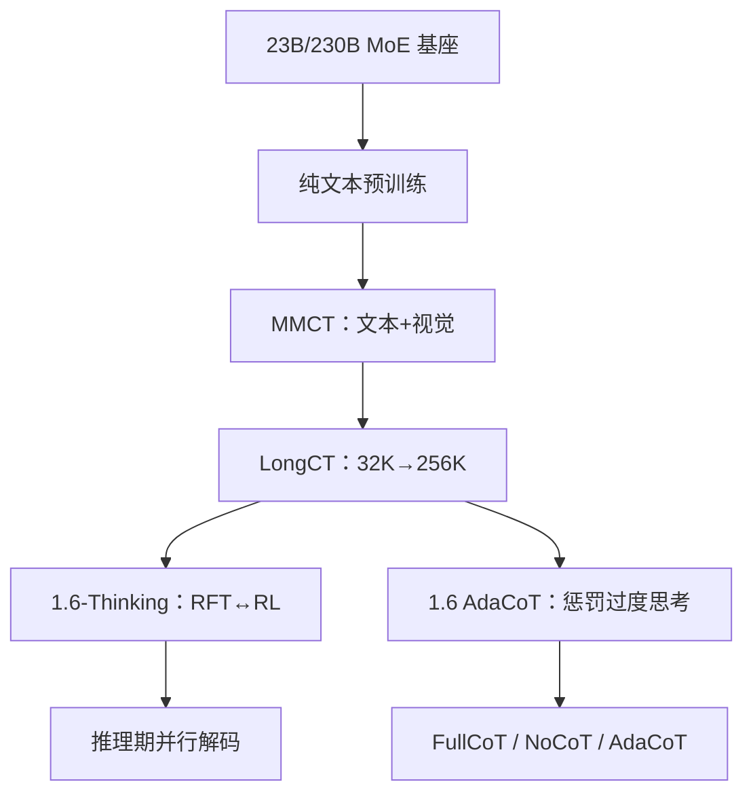

# Seed-1.6

    
AdaCoT 按题目难度决定要不要想；RL 里用新的奖励惩罚过度思考、奖励恰如其分的思考，而不是把每道题都写成数万 token。

    <footer>—— ByteDance Seed，Introduction to Techniques Used in Seed1.6，2025-06-25</footer>

[Seed / 豆包](/llm/seed-doubao) 专文按产品线把 Thinking-v1.5、1.5-VL、1.6 博客与 OSS-36B 列在同一张地图上。本篇只写 **Seed1.6**：官方技术博客（不是完整 arXiv 总报告）里已经钉死的稀疏 MoE 规格、三段续预训练、以及后训练拆成的 **Thinking / Adaptive CoT** 两条。不要用 1.6 的 230B 去填未披露的 Seed2.0，也不要把方舟 API 名写成可下载权重。

## 问题

R1 类模型证明长链能买竞赛分，也证明**过度思考**会把简单题变成延迟税。Seed 要同时做通用助手、视觉理解、GUI 与 256K 文档，不能把「永远 FullCoT」当成默认产品。需要一种后训练，让策略按题决定是否展开思维，并且让用户仍能用提示钉死 FullCoT 或 NoCoT。

第二条约束是模态。1.5 的 VL 是另一份报告；1.6 要把视觉能力做进**同一条预训练课程**，而不是只在对话期加投影。否则高考卷、JEE 卷上的图题会变成「纯文本推理模型假装看见图」。

### 博客不是层表

1.6 未公开专家数、路由公式、RL 系数与 AdaCoT 奖励的精确式。能写的是博客给出的阶段名、激活/总参、窗口、三种推理模式，以及团队自己报的触发率与高考 / JEE 实验设定。缺的数字保持「未公开」。

体验入口博客写明 `doubao-seed-1-6-250615` 与 thinking 变体。集成必须钉日期后缀；「豆包最新」不可复现。

## 方法

**预训练。** 沿用 Seed1.5 的稀疏 MoE 结论：**23B 激活、230B 总参**。三段续训：（1）纯文本：网页、书、论文、代码；规则 + 模型清洗、过滤、去重、采样。（2）**MMCT**（Multimodal Mixed Continual Training）：提高学科、代码、推理密度，并混入高质量视觉，与文本联合训。（3）**LongCT**：按长度区间把最大序列从 32K 抬到 **256K**。博客称同参数量级上 Base 相对 Seed1.5 Base 明显抬升，具体格以文中表为准（外部对照取自 Qwen 技术报告口径）。

**后训练两条。** Seed1.6-Thinking：工序类似 Seed1.5-Thinking，多阶段拒绝采样微调（RFT）与 RL 交替，每一轮 RL 从上一轮 RFT 结束处接着训，用多维奖励模型在 RFT 过滤后的候选里选最优。数据含数学、代码、谜题与非推理样本，并并入 VLM 能力。相对 1.5-Thinking，公开叙事是更大训练算力与更高质量集。Seed1.6（Adaptive CoT）在此之上用 **AdaCoT** 压思维长度。

**AdaCoT 三模式。** FullCoT：每题先想，效果对齐 Thinking，但链更短。NoCoT：直接答。AdaCoT：按提示自动决定是否想。实现靠 RL 中的奖励：**惩罚过度思考、奖励适当思考**。用户可用提示配置模式。博客报 AdaCoT 在简单任务 MMLU 上触发率约 **37%**，中等 MMLU-Pro 约 **70%**，AIME / BeyondAIME 约 **90%–100%**，难任务上与 FullCoT 效果相当。多模态场景同样有效。

### 无训练的并行解码与两场考试

Thinking 在推理期用**并行解码**（training-free）在作答前展开更多思维 token。博客称在超难集 BeyondAIME 上约 +8 分，代码任务也有增益。这是测试时计算，不是改 MoE。

泛化评测用 2025 山东高考（国标语文数学英语 + 省卷其它科，满分 750）与 JEE Advanced。高考：客观题机评后人工复核，开放题两名高中阅卷教师匿名多轮；**无 prompt 工程**，题面来自网上原卷。DeepSeek R1 只吃文本，其它模型吃图文。英语听力一律满分假设。理科 Seed1.6-Thinking 648（后用更高清生物化学图复测到 676），文科 683。JEE：题面以图像输入，每题采样 5 次，按官方正误与倒扣。团队称 Gemini-2.5-Pro 与 Seed1.6-Thinking 若当作考生可进入印度前十量级；Seed 数学五次采样全对。这些是**内部评测协议**，不是高考官方成绩。

## 机制

AdaCoT 把「思考开关」从产品按钮部分内化成**条件策略**。触发率随难度上升，说明奖励没有把长度本身当成目标，而是把「该想的题想够、不该想的题缩短」写进标量。这与 R1-Zero 只优化终点正确率、因而长度单调涨，是相反的产品约束。FullCoT 仍保留长链能力，证明压缩不是把教师搜到的程序删掉，而是学会何时调用。

MMCT 把视觉放进续预训练，使图文题与文本题共享同一套表示更新，而不是后加适配器。高考化学生物对模糊图敏感、提高分辨率后理科再涨约 30 分，是这条机制的存在性证据：缺像素时「多模态」名不副实。

BeyondAIME 是 Seed-Thinking-v1.5 起就用的内部超难集。外部复现若没有该集，不能声称复现了 1.6 的数学配方，只能对公开 AIME / GPQA 说话。

### 并行解码不是 AdaCoT

并行解码在已经会想的 Thinking 模型上加测试时宽度；AdaCoT 在训练期教策略**少想**。二者可以叠，但博客把它们分给不同变体。服务上 FullCoT 与 AdaCoT 是不同 API 行为，不要用 Thinking 的 BeyondAIME +8 去宣传 AdaCoT 的省 token。

## 边界与工程取舍

闭源。路由、共享专家、RL 超参、AdaCoT 奖励公式均未公开。方舟上的 `doubao-seed-1-6-*` 与 C 端豆包还有检索与安全层，API 裸模型对不上 App。Seed-OSS-36B 是另一条 Apache 稠密 512K 线，与 1.6 的 256K MoE **不是**同一检查点。

高考 / JEE 数字绑定题源、是否喂图、听力满分假设与人工阅卷；换一套扫描件会动。不要把 648/683 写成「官方高考分数」。R1-0528 在该内部设定里吃纯文本，与多模态对照不公平，博客已注明。

写 Seed 只引用 seed.bytedance.com 与官方方舟文档。聚合站上的单价与 Elo 不是本篇出处。

### 何时不必用 1.6

只要开源可复现 RL，走 R1 / DAPO 权重与论文。只要纯文本竞赛、且能接受永远长链，0528 的公开表更硬。需要 512K 本地稠密，用 OSS-36B，不要幻想 1.6 会开源 230B。

## 小结

- Seed1.6：公开规格 23B 激活 / 230B 总参，预训练经 MMCT 与 LongCT 到 256K，全周期融合视觉。
- 后训练拆 Thinking（长链 + 可选并行解码）与 AdaCoT（Full / No / 自适应三模式）。
- AdaCoT 用 RL 奖励抑制过度思考；触发率随难度从约 37% 升到 90%+。
- 高考与 JEE 是团队内部泛化实验，协议与是否喂图必须一起引用。
- 出处：ByteDance Seed，*Introduction to Techniques Used in Seed1.6*，2025-06-25；产品地图见 [Seed / 豆包](/llm/seed-doubao)。
