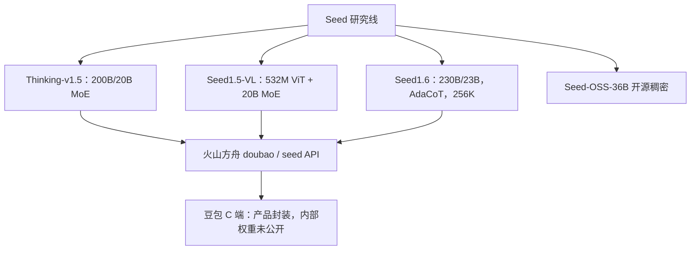

# Seed / Doubao 公开信息

    
豆包是产品名，Seed 是字节跳动的模型研究团队；能核对的结构数字来自 Seed 自己发表的思考模型报告、多模态论文与 1.6 技术博客，而不是豆包 App 的宣传句。

    <footer>—— ByteDance Seed，Seed-Thinking-v1.5 技术说明（2025）；Seed1.5-VL Technical Report；Seed1.6 官方博客</footer>

字节跳动对外有三块牌子：**豆包**（C 端助手）、**火山引擎 / 方舟**（MaaS API）、**Seed**（研究与部分开源）。闭源通用对话模型的层数、专家数、预训练配比长期不进 arXiv；本篇只写团队已经公开的材料。已经落到纸面的包括：Seed-Thinking-v1.5（MoE **200B 总 / 20B 激活**）、Seed1.5-VL（视觉编码器 532M + MoE LLM **20B 激活**）、Seed1.6 博客（沿用稀疏 MoE，**230B 总 / 23B 激活**，256K，AdaCoT），以及后来开源的 Seed-OSS-36B。不要把 OSS-36B 的 512K 稠密检查点写成豆包 Pro 的内部结构。

## 问题

消费级助手要同时做中文闲聊、搜索增强、代码与推理，还要控延迟与单价。稠密放大激活参数会直接打爆 decode；字节在公开材料里把路线说成 **稀疏 MoE**：总参数撑知识，激活参数撑吞吐。问题是：哪些数字是 Seed 自己写的，哪些只是第三方「等效 4050 亿」之类的聚合站口径。后者一律不采用。

第二条分叉是 **思考 / 不思考**。可验证题（数学、代码）可以用结果奖励做 RL；写作等不可验证题要用成对比较。Seed-Thinking-v1.5 报告把这条数据与奖励分流写清楚了；豆包 App 里用户看到的「深度思考」开关，没有对应的开源 RL 配方，不能从 v1.5 报告反推 App 日更权重。

### 产品名不等于检查点

火山方舟上的 `doubao-*`、`doubao-seed-*` 是 API 标识，随日期后缀换代。Seed1.6 博客给出的体验入口是 `doubao-seed-1-6-250615` 与 thinking 变体。写集成要钉模型 ID 与日期，不要写「豆包最新」这种不可复现的句子。

Seed1.6 博客写明：沿用 Seed1.5 稀疏 MoE 结论，预训练用 23B 激活、230B 总参数。这是 1.6 **基座**公开规格，不是对所有历史豆包版本的追溯。

## 方法

**Seed-Thinking-v1.5**（2025 年 4 月前后技术说明）：智能推理模型，MoE 总 200B、激活 20B。可验证数据经人工筛选 → 模型过滤 → 多模型验证，保留约 10 万高难度题，并用答案整数化、离线沙箱等约束真实推理；不可验证数据从豆包 1.5 Pro 训练集剔除低价值样本，两两对比奖励。评测上团队另建超难数学集 BeyondAIME。基础设施公开 HybridFlow、流式推理系统 SRS（称训练速度约 3×）、张量/专家/序列三层并行。接口经火山引擎开放，权重未开源。

**Seed1.5-VL**：视觉语言基座。532M 视觉编码器（SeedViT）+ MLP 适配器 + 激活 20B 的 MoE LLM。公开主张在 60 个公开基准中 38 项领先，并报 GUI / 游戏类智能体任务。方舟 ID 示例为 `doubao-1-5-thinking-vision-pro-250428`。本篇不把 VL 的视觉栈写成纯文本豆包。

### Seed1.6：三阶段预训练与 AdaCoT

Seed1.6 官方博客（而非完整 arXiv 总报告）给出可引用工序：预训练分三段。第一段纯文本，网页、书、论文、代码，规则加模型清洗、过滤、去重与采样。第二段 **MMCT**（Multimodal Mixed Continual Training）：提高学科、代码、推理密度，并混入视觉。第三段 **LongCT**：按长度区间把最大序列从 32K 抬到 **256K**。推理侧引入 **AdaCoT**（Adaptive Chain-of-Thought）：按题目难度自适应是否展开长思考，在效果与延迟之间折中。系列强调全生命周期融合多模态，而不只是后加一个投影层。

### 开源 Seed-OSS 与闭源 API 分列

2025 年 8 月 Seed 开源 **Seed-OSS-36B**（Base 含「含合成 / 无合成」两档，以及 Instruct），Apache 2.0。公开卡片：稠密 36B、GQA、SwiGLU、64 层、词表约 155K、上下文 **512K**、训练约 **12T**。这是另一条可本地下载的线，服务栈与方舟上的 Doubao-Seed 闭源 MoE **不是**同一权重。Seed2.0 模型卡（若引用）以评测方法与业务分布为主，官方仍不披露 2.0 的参数量与 RL 细节——缺数字就写「未公开」，不要用 1.6 的 230B 去填 2.0。

## 机制

公开 MoE 数字的机制含义很直接：激活 20B–23B 决定单 token 的矩阵乘与 KV 增长（再乘 GQA 等未在 1.6 博客展开的实现）；总 200B–230B 决定专家里能塞多少长尾知识。没有路由公式、没有共享专家个数，就不能把 DeepSeek-V3 的 loss-free 或混元的 recycle 安到 Seed 头上。

AdaCoT 把「是否思考」从用户开关部分内化成难度条件策略：简单问短答，难问才烧生成长度。机制上这是推理期计算分配，不是新的注意力核。LongCT 把窗口从 32K 堆到 256K，与 [位置外推](/llm/position-extrapolation) 同类，但 Seed **未**公开 YaRN / NTK 的具体基数表。

Thinking-v1.5 把可验证 RL 与成对奖励拆开，是为了避免用数学 verifier 去打写作、或用偏好模型去打竞赛题。BeyondAIME 的存在说明内部认为 AIME 已不够分档；外部复现时若没有该集，不能宣称「复现了 Seed 的数学配方」。

豆包 1.5 Pro 在 Thinking-v1.5 报告里只作为不可验证数据的来源被点名。这不构成对 Doubao-1.5-Pro 架构的披露。

## 边界与工程取舍

禁止写入的内容：未公开的豆包总参数、专家数、预训练 token 精确配比、RLHF 系数、以及聚合站上的「4050 亿」一类来源不明数字。GUI 智能体分数属于 Seed1.5-VL 报告，不属于纯文本豆包。OSS-36B 的 512K 与 1.6 的 256K 不可混用。

接入以火山方舟当时模型列表为准；C 端豆包还有检索、安全过滤与产品编排，API 裸模型对不上 App 截图。安全与拒答策略未在本篇引用的技术说明里展开。Seed 博客把 Trae 等代码产品与豆包助手分列优化目标：前者偏代码推理与前端生成，后者偏指令稳健、长尾知识与长窗稳定——同一套 MoE 数字在不同后训练下会变成不同 API 名，不能互相替代评测。

写 Seed 只引用 seed.bytedance.com、官方 GitHub 与 arXiv。第三方「豆包参数量」表格默认不可信，除非能回溯到 Seed 自己的句子。

## 小结

- 豆包是产品，Seed 是研究团队；闭源通用模型只写已发表报告与博客。
- 已公开：Thinking-v1.5 为 200B/20B MoE；1.5-VL 为 532M 视觉 + 20B 激活；1.6 为 230B/23B、256K、AdaCoT。
- Seed-OSS-36B 是开源稠密 512K 线，与方舟 Doubao-Seed 闭源 MoE 不是同一检查点。
- 出处：ByteDance Seed，*Seed-Thinking-v1.5* 技术说明；*Seed1.5-VL Technical Report*；Seed1.6 官方博客；Seed-OSS-36B 模型卡。
