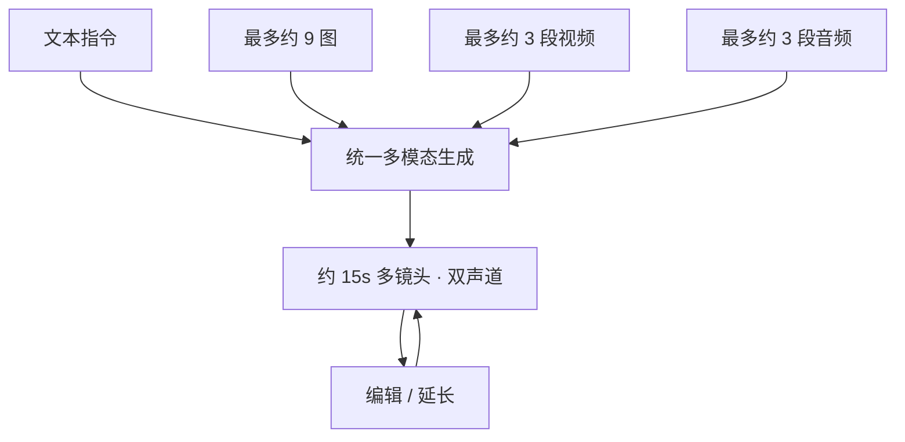

# Seedance 2.0

    
统一的多模态音视频联合生成：文字、图片、音频、视频四种输入，把参考与编辑收进同一套创作模型。

    <footer>—— 字节跳动 Seed，《Seedance 2.0 正式发布》，2026-02-12</footer>

字节跳动 Seed 团队于 2026 年 2 月 12 日发布 **Seedance 2.0**。相对 1.5 的「同步视听生成」，2.0 写成**统一多模态音视频联合生成**：同一架构吃文本、图像、音频、视频，并强调参考与编辑。官方要点：复杂交互与运动场景可用率更高；混合输入最多约 **9 张图、3 段视频、3 段音频** 加自然语言；指令遵从与主体一致性提升，支持延长与编辑；输出约 **15 秒** 高质量多镜头音视频，并带**双声道**音频。入口写在即梦（Dreamina）、豆包、火山方舟体验（Doubao-Seedance-2.0）等。闭源视频模型只引 Seed 中英文公告与项目页，不引用非官方网络图或「稀疏架构」的层层参数——公告虽提到稀疏与联合训练作为叙事，但没有可复现的层表。

## 问题

到 2025–2026 年，文生视频与图生视频已成默认接口，创作者的真实约束却是：**镜头语言、角色、道具、参考声、分镜稿**往往已经存在，需要被引用而不是每次从纯文本重想。多模型接力（先图后视频再配音）造成主体漂移与声画缝。Seedance 1.5 把同步音频推进产品；2.0 要解决的是把四种模态的参考放进同一次生成，并在复杂运动（多人、冰上、衣物与重力）上提高「能用」而不是「能出片」。工业场景（广告、电商、短剧）还要求可编辑、可延长，而不是一次性抽卡。

评测方面，团队写与专家共建覆盖生成、参考、编辑的集，维度包括多模态参考、复杂指令、运动稳定性、视听表现与声画协同。公告配有 T2V / I2V / 多模态任务的定性领先叙述，并承认细节稳定性、超写实、动态活力、偶发音频失真、多主体一致性与文字渲染仍需改进。没有把第三方 Arena 名次写进本篇作为 Seed 的合同；若外部榜单出现，须另标日期与是否计音频。

### 参考不是条件注入公式的别名

「参考构图、动作、运镜、特效、声音」是产品语义：模型应从用户提交的素材里借用这些因素。公告不说明是 token 拼接、适配器还是潜空间对齐。因此方法节只写输入输出合同：多素材 + 指令 → 带双声道的短视频，可按指令改片段或延长。把参考写成已公开的 ControlNet 配方，会越过官方文本。分镜图、剧本截图作为图像输入，属于同一参考接口的特例。

中文公告与英文 Seed News 同日。项目页 https://seed.bytedance.com/seedance2_0。体验路径以公告列举为准，区域与是否进剪辑工具后续可能变，写复现日期。

## 方法

生成模式按官方示例分：T2V（纯文本，可含镜头与对白要求）；I2V（图像驱动动作）；R2V（多模态参考：图、视频、音频、分镜 + 文本）。编辑：对指定片段、角色、动作、情节做定向修改；延长：在已有视频后续写镜头。音频：双声道，背景、环境、对白可并行并对齐节奏；示例强调拟音细节与中文方言/戏曲/歌唱类指令相对前代改进。时长与「多镜头」是产品规格：约 15 秒内完成一场带剪辑感的段落，而不是无限长片。

人物参考在公告注记：演示角色为生成或已授权素材；真实人像参考需核验或合法授权。这是产品合规，不是模型结构。与 [Sora 2](/llm/sora-2)、Veo 3 并列写时：各方都走原生音频短片；Seedance 2.0 把「最多九图三视频三音频」写成明确配额，便于当输入合同引用。

### 可用率是运动与交互合同，不是 FID

公告反复出现「复杂交互和运动场景可用率」。它量的是：多人同步、高难动作、物理观感是否达到可交付，而不是单帧锐度。花样滑冰样片被写成从失误到纠正的叙事与落地，用于主张时序物理，仍是定性。引用时应说「官方样片与专家集上的主张」，不要换成未公开的百分比表。音频「可用」包括是否失真、是否对得上剪辑点；公告自己把偶发失真列为剩余问题。

## 机制

能写的机制只有联合生成叙事：视听不再是视频模型外挂 TTS，而是统一框架里的并行轨。多模态联合训练被写成提高对参考元素的理解与泛化；「世界知识」与「稀疏架构」出现在展望段，**无**可核对的专家数或路由图，故只作团队自我描述，不作实现断言。可控性升级意味着同一主体在编辑与延长后仍应可认——失败模式是多主体缠绕与文字。提示驱动的运镜规划：模型根据文本安排镜头模板，属于指令遵从，不是公开的相机参数回归头。

与交互世界模型不同：Seedance 输出固定时长成片，用户不在 24 fps 环里用键盘改未来。与实时通话视频流也不同。它站在「导演式短片生产」一侧：参考素材进、成片出，再剪一刀。工业成本下降是公告的产品主张，取决于版权合规与修改轮次，不是单次推理报价。

不要把 Seedance 1.0/1.5 的旧时长或无声设定写进 2.0。1.5→2.0 的官方差是统一四模态参考 + 更强运动/编辑 + 双声道 15 秒档。英文稿的 SOTA 可用率是团队评测口径。

### 声画协同是独立维度

联合生成把对白、音效、BGM 与画面节奏绑在一起评。公告分视频维与音频维报改进，并单列协同。做对照实验若只看无声画面，会漏掉 2.0 的主卖点，也会对仍存在的音频失真盲视。方言与歌唱被单独点名，说明语音条件是中文内容生产的一等需求，而不是英文样片的附属。

## 边界与工程取舍

### 闭源短片模型没有可复现训练节

数据、损失、采样步数均未公开。工程集成只能走官方入口与当时开放的 API 名称（公告未把内部 checkpoint 字符串当作稳定 ABI）。版权与肖像：好莱坞与行业协会的争议若见诸公开报道，属于政策环境，不改变本篇对算法公告的转述纪律。输出应用于商业前须遵守各平台条款与授权注记。

比较时冻结日期：2026-02-12 的 Seedance 2.0 对 2025-09 的 Sora 2、2025-05 的 Veo 3，输入模态配额与 15 秒双声道是可引用差；画质主观分不是。失败项应原样保留：文字、多主体、超写实、音频毛刺。

出处：ByteDance Seed，*Seedance 2.0 Official Launch* / 《Seedance 2.0 正式发布》，2026-02-12。仅官方博客与项目页。对照 Seedance 1.5 的同步视听叙事，不引入非官方架构。

## 小结

- Seedance 2.0 是统一四模态输入的音视频联合生成模型，官方强调参考、编辑与复杂运动可用率。
- 输入配额约 9 图 / 3 视频 / 3 音频；输出约 15 秒多镜头双声道。
- 机制仅有联合生成与产品级可控性，无公开骨干细节。
- 剩余问题（文字、多主体、音频失真等）是规格的一部分。
- 出处：Seed 2026-02-12 公告。
