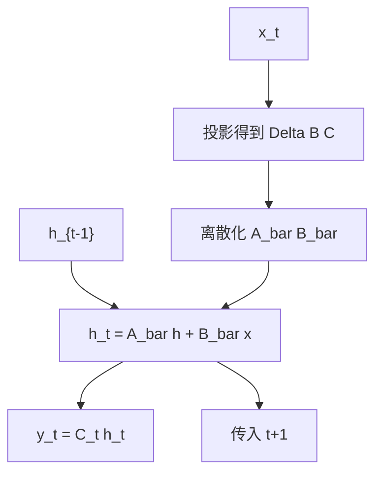

# 选择性扫描

让 $\Delta,B,C$ 随当前 token 变化，状态更新就变成内容选择：该记的写入，该忘的滤掉。

<footer>—— Gu &amp; Dao, Mamba: Linear-Time Sequence Modeling with Selective State Spaces, 2023</footer>

[上一课](/llm/hippo-s4)的 $A,B,C,\Delta$ 对所有时间步共享。[Mamba](/llm/mamba) 课已经陈述过「要选择」，本课把选择收成可引用的算子：**选择性扫描**——沿长度做依赖于输入的状态更新，而不能再预计算一条卷积核。后课硬件感知扫描解决它怎么在 GPU 上算；本课只钉动力学与为何卷积路断了。

## 问题

时不变卷积核 $K_k=C\overline{A}^k\overline{B}$ 与 $x$ 无关，能 FFT 或预计算。语言模型需要按内容忽略或记住。若 $\overline{B}_t$、$\Delta_t$ 依赖 $x_t$，则每步的 $\overline{A}_t$ 不同，不存在与输入无关的 $K$，S4 的卷积算法失效。缺口是：在放弃全局卷积之后，仍用一条**沿序列的扫描**计算 $h_t=\overline{A}_t h_{t-1}+\overline{B}_t x_t$，并保持线性时间。

选择放在 $\Delta$ 与 $B,C$ 上、保持 $A$ 结构化（常对角），是 Mamba 的具体选择，不是唯一可能。本课以这条为默认，后课 GLA、delta rule 会换更新规则。

扫描是前缀式结合：先左后右累积。它不是注意力分数矩阵。不要把 selective scan 说成「另一种 softmax」。

## 方法

从输入 $x_t$ 投影得到 $\Delta_t,B_t,C_t$（以及可选的门）。$A$ 仍是按通道的对角或近对角，离散化

$$
\overline{A}_t=\exp(\Delta_t A),\qquad \overline{B}_t=\Delta_t B_t
$$

（连续到离散的具体公式以实现为准，课序只保留「$\Delta_t$ 调制衰减与写入」）。然后

$$
h_t=\overline{A}_t h_{t-1}+\overline{B}_t x_t,\qquad y_t=C_t h_t.
$$

沿 $t=1..n$ 扫描。因果语言模型与这条方向一致；双向要做两次扫描或改掩码，不是默认。

因为 $\overline{A}_t$ 可乘，扫描在代数上是结合的，这才允许后课的分块并行：块内串行、块间利用结合律。本课先承认逐步定义。

### 选择做了什么

$\Delta_t$ 大：当前 $x_t$ 强写入、旧状态快衰减，相当于重置。$\Delta_t$ 小：跳过当前 token，状态近似拷贝。$B_t$ 决定写进哪些状态维，$C_t$ 决定读出。这与注意力的「对哪些过去位置加权」不同：过去已经被压进 $h$，读的是摘要不是表。

## 机制

固定大小的 $h\in\mathbb{R}^{N}$ 是有损压缩。选择决定压缩器的编码表随 token 变，因此对噪声 token 可以近似恒等传递，对关键 token 可以覆盖旧内容。这解释了为何同样 $N$，选择性 SSM 比 S4 更像语言模型：容量仍小，编码策略变聪明。

梯度沿扫描反传，是线性 RNN 的反向扫描，数值上依赖 $\overline{A}_t$ 不要长期大于 1。$\exp(\Delta A)$ 在 $A$ 的对角为负时是衰减，这是稳定性来源。把 $A$ 学成正会炸，初始化与参数化（把对角写在负实部）属于实现契约。

$N$ 与 $d_{\mathrm{model}}$ 的关系后课「状态大小对上下文」再定量。本课只需要：选择不能凭空增加状态维，它只改善怎么用已有维。

## 边界

扫描按定义是串行的，朴素实现喂不饱 GPU——下一课的主题。无卷积意味着不能用 S4 那套 FFT 当训练主核。精确逐 token 召回仍受 $N$ 限制，线性召回瓶颈课会用基准说明。不要在已经写成卷积的 S4 检查点上只把 $B$ 改成依赖 $x$ 却仍调 FFT，那条路在数学上已经断了。

## 小结

- 选择性扫描让 $\Delta,B,C$ 随 token 变，卷积核不再存在，改用沿长度的状态扫描。
- $\Delta$ 控制写与忘，$B,C$ 控制写进哪维、读出哪维；过去在 $h$ 里而不是 KV 表里。
- $A$ 保持结构化衰减，以稳住线性 RNN 的谱。
- 代数结合律留给分块并行；朴素扫描的硬件问题留给下一课。
- 出处：Gu & Dao, 2023。
