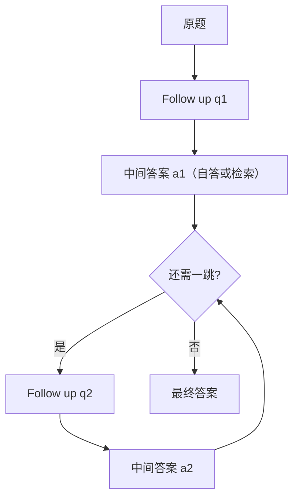

# Self-Ask

组合性缺口是：模型能分别回答子问题，却答不对由这些子问题拼成的整题；让它显式提出并回答后续问题，可以缩小这一缺口。

<footer>—— Press et al., Measuring and Narrowing the Compositionality Gap in Language Models, Findings of EMNLP 2023</footer>

多跳问题要求把若干事实按依赖顺序接起来。模型有时在单独问「A 的首都是哪」时能答对，一旦问「A 的首都的市长是谁」就编造或张冠李戴。Press 等人把这种落差叫做组合性缺口（compositionality gap），并提出 Self-Ask：模型先写出后续问题（follow-up），自答或检索后再写下一问，最后给原题答案。它看起来像极简版的[分解](/llm/least-to-most)加可选检索，但子问题的类型是 *补全缺失事实*，不是同一技能上更短的习题。本篇写这一提示形态，以及它与 [ReAct 提示](/llm/react-prompting) 在问句槽位上的差别。

## 问题

标准问答把多跳压成一次 $p(y\mid x)$。中间实体没有被问出来，也没有被钉住，第二跳在错误实体上继续。CoT 会写「首先…然后…」，但中间句不一定是可独立核对的问句，检索器也难以从一段推理里抽出干净的查询。需要一种强制形态：中间量必须表现为问句—答案对，使每一跳都可以单独评估，也都可以单独送给搜索引擎。

组合性缺口要被 *量出来* 才有意义。Press 等人的测法是：对组合题的各子问题分别提问，若子问题都会、组合题不会，则记入缺口。Self-Ask 针对的是这一结构性失败，而不是一般的算术能力。算术更该走 [PAL](/llm/pal-pot)；这里缺的是事实图上的边。

### 会答子问题不等于会组合

设 $q_1,q_2$ 为子问题，$q$ 为用 $q_2$ 的答案填进模板后的组合题。缺口存在说明失败不在单跳知识，而在把 $a_1$ 当作 $q_2$ 的绑定。直接 CoT 不保证 $a_1$ 以可解析形式出现。Self-Ask 把绑定写成显式：先输出 `Follow up: $q_1$`，得到 $a_1$ 后再构造 $q_2$。宿主若介入检索，则 $a_1$ 来自外部，组合错误与幻觉单跳被分开。

没有检索的 Self-Ask 仍然有用：它强迫中间答案占用独立行，便于核对与自洽投票。但单跳幻觉不会因为换了问句格式而消失。要缩缺口里「事实错误」那一部分，需要搜索或其他工具。

## 方法

少样本示范一条多跳题：若干 `Follow up:` 问句，每个后面接 `Intermediate answer:`（自答或「由搜索填入」），最后 `So the final answer is:`。测试时用同样标记。两种部署。纯自答：模型连写 follow-up 与中间答案，宿主只解析最终行。带搜索：解码在每个 follow-up 处停止，宿主把问句送给检索，把片段写成中间答案再继续——形态上接近 ReAct，但动作几乎总是「问一个完整的自然语言问题」，而不是多样工具名。Press 等人展示了与搜索交错的版本，作为缩缺口的主手段之一。

Follow-up 必须是自包含问句，不要写「那个人呢？」这类指代。示范里应把实体名写全，否则检索查询无法独立。跳数应有上限；模型会把单跳题拆出无用的后续问。系统段写清：不需要后续问时直接给最终答案。最终答案抽取与 CoT 相同，要有固定收束句，以便与中间行分开评测。

### 后续问是给检索器的接口

把 follow-up 当搜索查询时，写法要从「对模型友好」改成「对检索器友好」：完整实体、少代词、一问一事。示范应展示「先确认桥接实体，再问属性」，而不是一次 follow-up 里塞两跳。中间答案应截断为可绑定的短跨度（实体名、日期），不要贴整篇网页，否则下一 follow-up 会在噪声里生成。这与 RAG 切分是同一约束。解析失败的 follow-up（不像问句、空字符串）应回填错误并要求重写，不要调用搜索浪费配额。

与 Least-to-Most 共用「先问后答」外壳，但示范内容不同。Least-to-Most 的子问题是原题的缩小版（更短的符号串、更少的运算）。Self-Ask 的子问题是世界知识上的单跳事实。不要用 Least-to-Most 的 SCAN 示范去跑多跳维基题，也不要反过来。需要两者时，应分阶段：先拆技能深度，再在每个技能节点上 Self-Ask 补事实——那是组合系统，不是原文方法。

## 机制

Self-Ask 把组合从一次条件生成拆成绑定明确的跳。每跳的答案成为下一跳提示里的常数，作用与 Least-to-Most 的子答案回填相同，对象是实体与事实而非子习题。组合性缺口因此被拆成可观测的两类错误：中间答案错（知识或检索），以及中间对了但最终绑定错（真正的组合失败）。评测若只报终局 EM，看不出缺口有没有被缩在哪一类。

相对 ReAct：ReAct 的 Action 是工具表上的符号，Thought 是自由推理；Self-Ask 把「下一步」规定为问句，推理被压进选什么 follow-up。工具多样时 ReAct 更合适；只需检索、且查询本就是自然语言问题时，Self-Ask 更短、解析更简单。相对 CoT：中间量可被独立问、独立搜、独立评。相对自洽：可对最终答案投票，也可对每一跳的中间答案分别投票，后者能更早截断错误绑定。

组合性缺口不是「模型笨」的同义词。它是一项对照实验设计：先测子问题再测组合。不上这套对照，就不要把任何多跳增益都宣传成缩了缺口。

### 指代与绑定是主要断裂点

第二跳问句若写成「他的出生年」，检索器不知道他是谁。Self-Ask 的收益大量来自示范把 $a_1$ 的字符串复制进 $q_2$。宿主可以规则化这一步：用槽位模板 `q2 = template.replace(bridge, a1)`，模型只负责选模板与填第一跳。完全交给模型写 $q_2$ 更灵活，也更常丢绑定。工程上对高价值流程应用模板；对开放域用模型写问句，但做实体覆盖检查（$a_1$ 的主串是否出现在 $q_2$ 里）。

无检索时，模型可能对 follow-up 答对、对最终题仍用另一套记忆，等于没用中间行。提示应要求最终答案必须使用已写出的中间答案，评测可检查最终行是否包含中间实体。这是形态约束，不是真值约束。

## 边界与工程取舍

Self-Ask 适合桥接实体清晰、跳数少、单跳可检索或可自答的问题。跳数很多时，错误仍会沿绑定传播，需要 ToT 式分叉或更好的检索。不适合计算密集型题，除非 follow-up 变成「这一步的数值是多少」且后端是解释器——那已经是 PAL 的外壳。不要和内部独白式 CoT 争「谁更像思考」：它是为了可检索、可核对的问句边界。

少样本会泄漏跳数与题型（总是两跳名人）。评测应用示范未覆盖的跳数与关系类型。线上若每跳都搜，延迟随跳数线性涨，应对单跳题走直答旁路。安全上，follow-up 可能把用户隐私编进搜索查询；宿主要做查询过滤。出处是 Press 等人关于组合性缺口的工作；引用时用他们测量缺口与提出 Self-Ask 的论文，不要写成匿名博客技巧。

Follow-up 标记只是表面语法。若模型在 CoT 里已经写出可解析的「问：…答：…」且宿主按跳检索，机制上就是 Self-Ask，不必迷信英文标签。评测要对齐解析规则。

## 小结

- Self-Ask 强迫中间量以后续问句与中间答案的形式出现，以缩小组合性缺口。
- 子问题是补全事实，不是同一技能的更短习题；与 Least-to-Most 外壳相似、对象不同。
- 可与检索交错：follow-up 当查询，中间答案由宿主回填。
- 绑定必须把上一跳实体写进下一问；指代会把检索打空。
- 应分开报单跳错误与组合错误；不要把一切多跳增益都叫做缩缺口。
- 出处：Press et al., *Measuring and Narrowing the Compositionality Gap in Language Models*, Findings of EMNLP 2023。
