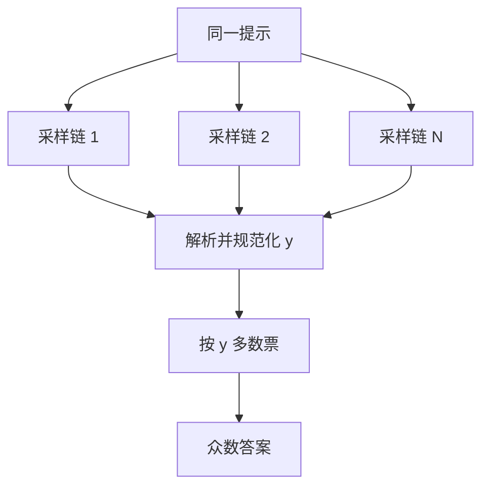

# Self-Consistency

不要贪婪地解码一条「最优」推理路径，而是采样多条多样的思维链，再选取其中最一致的答案。

<footer>—— Wang et al., Self-Consistency Improves Chain of Thought Reasoning in Language Models, ICLR 2023</footer>

[思维链](/llm/chain-of-thought)把中间步骤写出来，但单次解码仍是一条路径。贪婪或低温度下，模型会锁定早期的某个中间量，把后续步骤写成对该中间量的圆场。Wang 等人把解码从「找一条最可能的链」改成「找一个被许多链共同指向的答案」：独立采样 $N$ 条 $(z_i, y_i)$，对解析后的 $y$ 做多数票。这就是自洽解码（Self-Consistency）。它是测试时用计算换准确率的窄方法，是 [Best-of-N](/llm/best-of-n) 在「无需外部打分器、只认答案一致性」时的特例。

## 问题

CoT 的似然与正确性不对齐。一条写得很流畅、局部连贯的错误链，token 概率可以高于一条笨拙但算对的链。贪婪解码最大化的是前缀似然，不是答案正确。复杂题上正确解往往对应多条不同的 $z$（换序、换写法、换中间变量名），错误解则各错各的。若这个不对称成立，那么对 $y$ 投票会把分散的错误摊薄，把汇聚的正确留下。

自洽要回答的不是「要不要采样」，而是「在没有验证器的时候，用什么当选择函数」。若用 $\log\pi(z,y\mid x)$ 选一条，仍在奖励流畅；若用外部奖励模型，则变成完整 BoN，依赖额外模型。多数票只使用答案等价类，假设 *正确类的边际质量高于任一错误类*。当模型有系统性偏差（总把某类单位换算错），这个假设失败，自洽会把错的选稳。

### 贪婪链把早期错误写圆

设第 2 步把 37 写成 73，后续步骤在错误前提下完全自洽，最终 $y$ 错得非常「有道理」。单链方法看不到反事实路径。升高温度可以跳出该盆地，但单次采样只是换一条可能同样错的链。必须保留多条完整路径，并在 *答案空间* 而不是 *字符串空间* 上聚合。字符串级聚类会把「12」和「12.0」当成不同答案，也会把等价的分数形式拆开。

自洽的 $N$ 不是越大越好。边际收益在中等 $N$ 后变平，费用线性涨。报告准确率时必须同时报 $N$、温度与解析规则，否则无法与单链 CoT 公平对照。

## 方法

对同一提示（少样本 CoT 或[零样本触发](/llm/zero-shot-cot)）独立采样 $N$ 条输出，温度通常明显高于贪婪（Wang 等人常用 $T=0.5$–$0.7$ 量级，并可用 nucleus）。每条用与单链相同的解析器抽出规范化答案 $y_i$（数字去格式、选项字母、等价表达式）。以 $y$ 为键计数，取众数；平局可用该桶内的平均 $\log\pi$、或再采若干条打破。返回的是该桶中任意一条完整 $(z,y)$，或只返回 $y$。不要对 $z$ 做多数票：$z$ 几乎不会字面重复。

解析器是方法的一部分。数学题要处理分数、千分位、单位；选择题要处理「答案是 C」与「C. …」。解析失败的样本应丢弃或单列，不要把失败当成一个额外的答案类，否则「未解析」可能意外成为众数。若任务没有离散答案（开放生成），自洽没有自然的等价类，应改用外部打分或人工核对，不要假装对整段文本投票。

### 答案空间上的多数票

形式化：从 $\pi(\cdot\mid x)$ 抽 $\{y_i\}_{i=1}^N$，输出 $\arg\max_y \sum_i \mathbf{1}[y_i \equiv y]$，其中 $\equiv$ 是任务定义的等价。这与用奖励模型打分的 BoN 不同：没有 $s(x,y)$ 的连续值，平票时信息量低。优点是不引入第二个模型的偏差；缺点是无法在「两个答案票数接近」时表达不确定度——工程上可以把票数熵当作拒答或转人工的信号，论文主结果通常不这么做。

多样来自温度与独立采样，不来自提示改写。把提示改写成 $N$ 种说法再各贪心一条，是另一种集成，不是原文的自洽。原文强调的是 *同一条件分布上的多条推理路径*。实现时注意：有的解码器在 batch 内共享 RNG 或 KV 前缀优化不当，会导致 $N$ 条并不独立。服务上 $N$ 条 decode 的 KV 与墙钟近似线性，应与[测试时计算](/llm/test-time-scaling)的预算一起算，而不是当成免费的提示技巧。

## 机制

机制依赖错误的分散性。若正确 $y^\star$ 对应许多不同的 $z$，每条 $z$ 以中等概率出现，则 $N$ 增大时 $y^\star$ 的计数期望领先。若某一错误 $y^\text{err}$ 由一种高频捷径产生（看错题、套错公式），它会形成大桶，自洽放大捷径。因此自洽不是真值发现器，而是 *众数发现器*。它在「模型偶尔能做对、且做错的方式不唯一」时最有效；在「模型稳定地犯同一类错」时有害。

相对束搜索：束在共享前缀上扩展，多样性受前缀瓶颈限制，见 [Beam vs Sampling](/llm/beam-vs-sample)。自洽要的是完整路径级的多样性，独立采样更合适。相对带验证器的 BoN：验证器能在票数分散时仍选出对的；自洽不能。有过程奖励时，通常应用 PRM 做搜索或对候选重排，而不是只用多数票——多数票丢弃了 $z$ 内部的逐步信息。

加权投票（按 $\log\pi$ 或长度归一化似然加权）看起来更「贝叶斯」，但对齐的仍是流畅度。Wang 等人主结果是无加权多数票。加权重前应先看它是否只是在奖励更长的 $z$。

### 一致性不是正确性

「多条链给出同一答案」只说明该答案在模型的条件分布里是众数。外部世界可以与众数相反。用户界面若把高票写成「模型很有把握」，是在把内部一致性卖成校准。校准需要在真实标签上看票数与准确率的关系；没有这条曲线，票数只是调试信号。对需要引用证据的任务，还应检查众数桶内的 $z$ 是否引用了同一条虚构事实——一致的幻觉会被自洽加固。

## 边界与工程取舍

自洽适合最终答案离散、可规范化、且单链已有不可忽略正确率的任务。单链正确率接近 0 时，加大 $N$ 只是在错误类之间投票。单链已经极高时，边际收益买不回 $N$ 倍费用。开放式写作、代码（除非用测试当等价类）、多解问题，等价关系难定义。代码更自然的核对是执行测试，那是执行器监督，不是自洽。

与 PAL 结合时，应先执行再对 *程序输出* 投票，而不是对源代码投票。与工具调用结合时，独立 $N$ 条会把工具费用乘上去，通常先对无工具的 $z$ 做自洽，或把自洽只放在最后的答案聚合。不要把自洽写成训练算法：它可以过滤 SFT 数据（只保留众数一致的样本），但原文是推理期方法。

解析规则一变，众数就变。复现实验必须冻结抽取器。线上更换模型时，旧的 $N$ 与温度要重扫，不能把 PaLM 上的超参原封不动搬到当前聊天模型。

## 小结

- 自洽对同一 CoT 提示采样多条链，在规范化后的答案上多数票。
- 选择函数是一致性，不是似然，也不是外部奖励模型。
- 有效前提是正确解汇聚、错误解分散；系统性偏差会被放大。
- $N$、温度、解析器与费用必须一起报；它是测试时计算，不是免费提示。
- 开放生成没有自然等价类；有验证器或执行器时应优先用它们。
- 出处：Wang et al., *Self-Consistency Improves Chain of Thought Reasoning in Language Models*, ICLR 2023。
