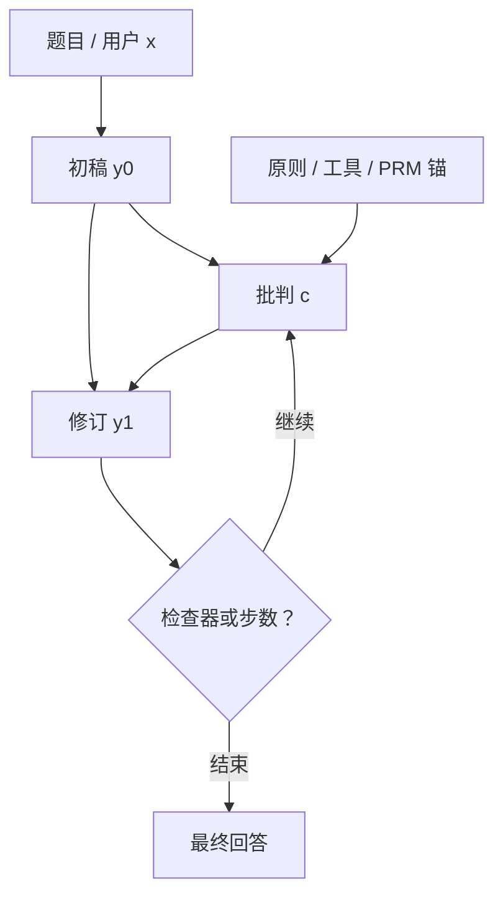

# 自我批判与修订

先写一稿，再按规则或自问找出毛病，再只改那些毛病；批判若不可靠，修订就是用同一套盲点把错稿润色得更像对。

<footer>—— 接到 Lightman 等把验证与生成分开的结论；对照 Bai 等 Constitutional AI（2022）与 Madaan 等 Self-Refine（2023）</footer>

[逐步验证与搜索](/llm/step-level-verify) 把打分交给另一份 PRM 或检查器。自我批判把打分写成同一模型的一段文本：列出错误、违反的原则、缺的步骤，然后以批判为条件再生成修订稿。Bai 等人的 Constitutional AI 用宪章原则让模型批评自己的有害回复并改写；Madaan 等人的 Self-Refine 在多种任务上迭代「反馈–修改」，反馈来自同一模型。它与过程监督的关系是：批判相当于临时的、自然语言形式的过程标签，修订相当于一次被引导的重写。本篇写这条环何时有效、何时只是把幻觉说得更圆。

## 问题

单次解码没有「看完自己的答案再改」的通道。错误一旦写进前缀，条件分布就站在错误上。外部验证器能拒绝这条前缀，但部署未必负担得起第二份模型。自我批判试图用额外的生成步骤模拟验证：模型被要求输出对已有 $y^{(0)}$ 的意见 $c$，再输出 $y^{(1)}=f(y^{(0)},c)$。若 $c$ 能指出真实缺陷，$y^{(1)}$ 有机会修好；若 $c$ 是空洞套话（「可以更清晰」）或错误指控，修订会改坏或只改文风。

核心困难与 PRM 相同：验证需要相对生成的余量。同一组权重既当作者又当审稿人，余量来自提示造成的角色差、来自宪章提供的外置原则、来自可调用的工具，而不是来自神秘的第二人格。没有这些，自我批判常退化成礼貌性复述。

### 批判必须可执行

「写得更好」不是可执行反馈。可执行指修订模型能定位到要改的跨度：哪一步等式不成立、哪条原则被违反、哪个测试会失败。Constitutional AI 把原则写成明确禁令与改写指令；Self-Refine 要求反馈具体到可改的点。接到数学与代码时，更好的批判是「第 3 步把符号用反了」或「函数在空列表上会抛异常」，并尽量让工具复验。不可执行的 $c$ 会让修订变成另一次独立采样，失去「在旧稿上改」的条件优势。

把批判和修订写在同一次续写里、中间没有停止符，模型往往会先把批判写成与 $y^{(0)}$ 一致的辩护，再「修订」成几乎原文。应分角色、分轮次，或至少插入明确的分隔 token，并在修订轮掩掉「必须维持原文」的惯性提示。

## 方法

一轮自我修订的数据流是

$$
y^{(0)}\sim\pi(\cdot\mid x),\quad
c\sim\pi(\cdot\mid x,y^{(0)},p_{\mathrm{crit}}),\quad
y^{(1)}\sim\pi(\cdot\mid x,y^{(0)},c,p_{\mathrm{rev}}).
$$

$p_{\mathrm{crit}}$、$p_{\mathrm{rev}}$ 是批判与修订的指令（或宪章条款）。可以迭代到 $y^{(k)}$，用停止规则：检查器通过、批判说无误、或达到步数上限。训练有三条常见路，不要混用名字。

**只在推理时循环。** 权重不变，靠提示完成批判–修订。Self-Refine 的主设定接近这条：展示的是测试时计算。便宜，上限是模型已经具备的发现错误能力。

**用宪章做 AI 反馈再对齐。** Constitutional AI：模型按原则批评有害输出、改写，再用这些成对或偏好数据做对齐。批判在离线造数据，线上可以是普通策略，不必每轮都自评。

**用修订轨迹做 SFT。** 把 $(x,y^{(0)},c,y^{(1)})$ 中质量上升的修订当示范，让模型学会「看到批判就会改」。若 $y^{(1)}$ 的质量由人、PRM 或硬检查器把门，这条路是在蒸馏外部验证；若门控仍是自我打分，会蒸馏自夸。

与过程标签的接口：可以把 PRM 低分的步骤自动写成 $c$ 的模板（「步骤 $t$ 可能错误」），再让模型修订——此时自我批判有外部锚，余量来自 PRM，而不是来自自言自语。Lightman 的方向是验证与生成分开；自我批判在没有分开模型时，应用外部锚去补余量。

### 停止规则比再开一轮更重要

多一轮就会多一轮延迟与多一轮跑偏。没有硬检查器时，模型倾向于永远能挑出「还可改进」，迭代变成改写文风。应优先：工具通过则停；批判为空或「无问题」则停；最大轮数 1–2。开放聊天不要套数学题那种五轮证明打磨。修订应约束为编辑而不是重写全文，否则 $y^{(1)}$ 丢掉 $y^{(0)}$ 里已经对的部分，环的意义只剩重新采样。

## 机制

### 角色差从哪来

同一 $\pi$ 下，条件前缀不同，预测的头也不同。批判提示把模型放到「找错」的模式，可能提高对矛盾、规范、用户约束的注意力；修订提示把 $c$ 当作必须满足的规格。这能工作，是因为预训练与指令数据里存在大量「审稿–修改」文本，角色差是学来的先验，不是运行时新长出的能力。领域越远离审稿语料（冷门定理、私有 API），角色差越小，$c$ 越空。

外部原则（宪章）把找错的坐标系钉在文本条款上，减少「自己发明标准」的漂移。工具把找错变成执行。PRM 把找错变成独立模型的分数。三者提供的余量从弱到强通常是：纯提示 < 宪章 < 工具 / 独立 PRM。自我批判论文展示的增益，往往混进了任务本身已经容易被语言化检查的那些（文风、有害、明显矛盾），不能外推到所有推理。

批判文本会进入修订条件，因此也能泄漏错误目标：若 $c$ 编造了一个不存在的约束， $y^{(1)}$ 会努力满足它。应对 $c$ 做过滤或长度限制，并在有检查器时以检查器为准，而不是以批判为准。

### 为何它修不好系统误差

生成器在某类代数上系统性算错，批判头通常用同一套表示，看不到错。修订会换一种说法把同样的错写得更自信。这与 ORM 被蒙对欺骗同类：终点看起来更流畅，过程仍错。Lightman 用独立逐步标注的验证器，就是为了躲开这种共盲。自我批判不能替代 [PRM](/llm/process-supervision)；它是在不能部署验证器、或任务以规范和文风为主时的便宜近似。

## 边界与工程取舍

延迟按轮数线性涨，还要把 $y^{(0)}$ 与 $c$ 放进上下文，吃窗口。产品上应只对高风险或可检查任务开环。安全场景用宪章离线造数据再对齐，比线上每条都自评更可控——线上自评可能被用户提示劫持，变成「批判」出如何绕过策略。开放域事实问题，自我批判不引入检索就不会变真，只会变圆。

评估必须看修订前后的硬指标，以及「改坏率」。只报「模型说自己改好了」无效。数学与代码用检查器；对话用独立评审或独立 RM，不要用同一模型给自己的 $c$ 打分。与搜索的选择：算力给独立 PRM 树，还是给同模型两轮生成，取决于有没有过程标注与延迟预算。有标注，优先外部分开的验证；没有，自我批判是弱验证，应限制轮数并加工具。

不要把思维链里的「让我再检查一遍」当成已经做了自我批判。那只是同一条轨迹上的续写，没有独立的 $c$ 条件，也没有机会丢掉错误前缀。真正的修订需要把 $y^{(0)}$ 当作已完成对象再写 $c$。

### 何时不必上自我批判

有硬检查器且延迟允许，用检查器循环改（测失败再改代码）比自然语言自评干净。有 PRM 与搜索预算，用逐步搜索。任务是一次性短答、改稿没有空间。模型在该域上批判准确率接近零，开环只会增加延迟与改坏。已经用 Constitutional AI 把原则训进策略，线上不必每条再念一遍宪章，除非要可审计的批判日志。

## 小结

- 自我批判与修订是同模型上的「初稿 → 可执行反馈 → 编辑」，用测试时计算模拟验证。
- 余量来自角色提示、宪章、工具或外部 PRM，不来自第二人格。
- Bai 等用原则造 AI 反馈再对齐；Madaan 等展示推理时迭代 refine。
- 不可执行的套话批判等于重新采样；停止规则与改坏率是一等指标。
- 系统性推理错误难以靠自评修好，这与独立过程验证器的动机一致。
- 延迟与上下文随轮数增长；安全上要防批判被提示劫持。
- 出处：Lightman 等，*Let's Verify Step by Step*（生成与验证分离）；Bai 等，*Constitutional AI: Harmlessness from AI Feedback*，2022；Madaan 等，*Self-Refine: Iterative Refinement with Self-Feedback*，2023。
