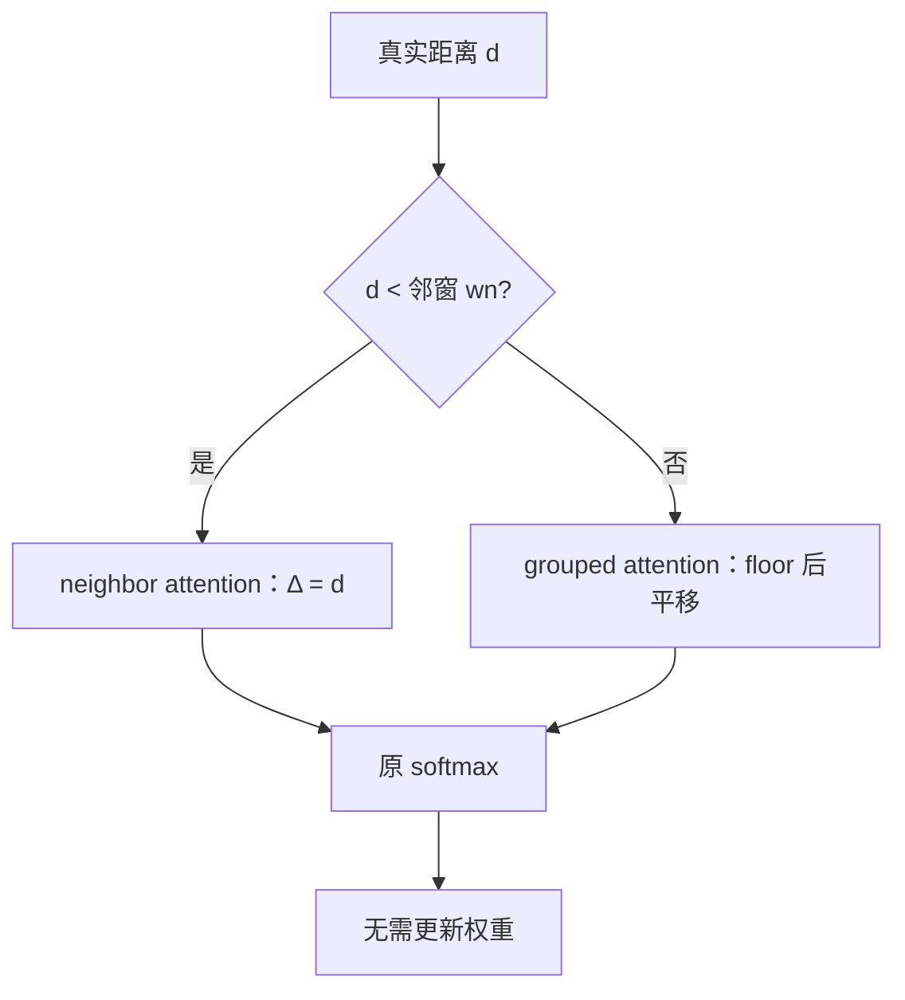

# Self-Extend 原文

    
或许现成的语言模型已经是长语言模型：不必调权重，只要在推理时构造分组注意力与邻域注意力，短窗里学到的几何就能覆盖更长输入。

    <footer>—— Jin 等，LLM Maybe LongLM: Self-Extend LLM Context Window Without Tuning，ICML 2024</footer>

Hongye Jin、Xiaotian Han、Jingfeng Yang、Zhimeng Jiang、Zirui Liu、Chia-Yuan Chang、Huiyuan Chen 与 Xia Hu 的 ICML 2024 论文标题先抛主张：LLM Maybe LongLM——长程能力有一部分已经写在短窗权重里，缺的是推理时把未见过的相对位置映回预训练见过的网格。方法名 Self-Extend：邻域窗口内用真实相对位置（neighbor attention），远处按组取整（grouped attention），两段仍走原模型的自注意力，改动是位置编号与把 logits 拼回。无需微调。本篇按原文的双层注意力与实验主张写；工程直觉与超参扫描见已有的 [Self-Extend](/llm/self-extend) 篇。

## 问题

RoPE 点积只看见 $\Delta=p_q-p_k$。预训练 $\Delta\in\{0,\ldots,L-1\}$。推理长度 $L'\gg L$ 时，中间与文首的 $\Delta$ 出界，分数近乎噪声。PI 把所有 $\Delta$ 除以 $s$，要短续训，且伤高频邻域。StreamingLLM、LM-Infinite 假设模型不能泛化，于是丢掉中间键，PPL 可以低，长程依赖没了。Jin 等人要同时保住两件事：中间 token 仍参加 softmax；所有送进 RoPE 的相对位置仍小于 $L$。约束是零微调——分组大小与邻窗是推理超参，不是学出来的压缩器。

「Maybe LongLM」针对的对象是已经训好的解码器（LLaMA-2、Mistral、SOLAR 等），不是从零设计长窗架构。若主张成立，开源侧可以在检查点发布的当天就吃更长提示，而不等一次 32k 续训。

### 未见相对位置是主因

原文把失败主要归因于相对位置矩阵里出现预训练未见的 $\Delta$，而不是「注意力一定无法处理更多键」。因此补丁打在位置重映射，而不是改 $W_q$ 或加记忆。这与 Dual Chunk Attention 同族，差别在映射是一条全局阶梯，还是按块三套坐标。

训练免费是能力声明也是限制：超参选错会要么仍然 OOD，要么把整篇折成太粗的几格。论文用多套基准说明「有一组能用的 $G,w_n$」，不是证明对所有任务存在万能默认值。

## 方法

### 邻域注意力与分组注意力

设组大小 $G$、邻窗 $w_n$。对查询位置 $p$ 与键 $k\le p$，真实距离 $d=p-k$。邻域内 $d<w_n$ 时，$\Delta'=d$，与短窗训练同构。邻域外，相对位置取 $\lfloor d/G\rfloor$ 一类分组，再平移 $w_n-\lfloor w_n/G\rfloor$，使阶梯在邻窗边界上与真实 $\Delta$ 衔接，避免出现「窗内是 1023、窗外突然是 5」的裂缝。只要

$$
w_n+\bigl\lfloor(L'-w_n)/G\bigr\rfloor < L,
$$

所有 $\Delta'$ 仍落在支撑集内。$G$ 越大，能覆盖的 $L'$ 越长，远端分辨率越差。实现上对同一对 $(q,k)$ 不算两次完整注意力：邻域用正常 RoPE，远处用分组后的位置 id 替换，再在 softmax 前把远处 logits 写进对应列。

### 只改位置，不改掩码形状

默认仍允许看见全部过去键。Self-Extend 不是稀疏论文，计算仍可到 $O(n^2)$。FlashAttention 需支持自定义位置 id。代码改动被作者称为 minor：替换 RoPE 的 position 张量，按距离分支。实验在语言建模、LongBench 类理解、以及 Hugging Face Open LLM 短任务上进行：长窗 PPL 下降，理解任务常高于未扩展底座，短任务几乎不掉——因为邻窗内几何未动。

## 机制

机制是相对位置轴上的分段不可逆压缩：近端斜率 1，远端斜率 $1/G$。RoPE 每一维 $\cos(\theta_i\Delta')$ 在远端变慢，等价于只对远距做了位置插值，近距完全没插。中间键的**内容**仍在，只是共享组内相位，组内竞争靠 $q^\top k$ 的内容部分。标题里的「已经是 LongLM」指：短窗训练已经教会模型如何对 $\Delta<L$ 的键分配质量；Self-Extend 负责不要把 $\Delta\ge L$ 送进这套已经学会的函数。

与 YaRN 分工：YaRN 改 $\theta_i$ 与温度，通常配合续训；Self-Extend 改整数 $\Delta$，权重冻结。与 DCA 分工：Self-Extend 一条全局阶梯；DCA 保证当前块完整 $L$ 分辨率，并单独处理相邻块。原文实验含与微调长窗模型的比较：在部分理解任务上，无训练的 Self-Extend 可以接近甚至超过昂贵续训，这被用来支撑「能力已在权重里」；同时短基准不掉，用来支撑「邻域没被分组污染」。

平滑平移项 $w_n-\lfloor w_n/G\rfloor$ 很容易在实现里丢掉。丢掉则邻窗边界出现相位跳变，症状是局部重复或接缝处丢词，而远端 PPL 仍然好看。复现应先画 $\Delta'(d)$ 是否在 $d=w_n$ 连续。

## 边界与工程取舍

不降低二次复杂度，128k 全注意力照样贵。分组引入对齐噪声：针落在组内何处，位置通道无法指示，只能靠内容。$G$ 很大时退化为「一个很粗的远处桶」。已经 YaRN 到 $L'$ 的模型再套 Self-Extend，相位会被折两次。ALiBi、NoPE 没有可折叠的 $\Delta$ 旋转。

评测诚实是原文用任务集在做、读者仍要自己补的部分：PPL 因 $\Delta'$ 落回支撑集而容易好看；RULER 多跳与全书问答仍可能失败，因为模型从未在那种距离上做过推理，只是现在「算得动」。Self-Extend 延长的是几何覆盖。论文里相对微调模型「有时更好」不能理解成永远不必续训——那是 2024 年初若干 7B/13B 设定下的表。

最常见的实现 bug 是对绝对位置做 $p//G$ 再相减，导致近邻也被分组。必须先分支 $d<w_n$，再对超出部分 floor。

### 超参与模型族

$G$ 与 $w_n$ 要用中间深度的检索来扫，不能只看 PPL——PPL 偏好更大的 $w_n$。换 Mistral 与换 LLaMA-2，舒适邻窗不同，因为原 $L$ 与 RoPE 基数不同。原文「轻微代码修改即可」假设你能改注意力位置接口；闭源 API 做不到 Self-Extend。组边界对齐词或句会引入不可复现的预处理，论文用固定 $G$ 个 token，工程上应保持这一选择以便对照。

## 小结

- Self-Extend 论文主张短窗 LLM 已具备长程几何，缺的是推理时把远 $\Delta$ 映回支撑集。
- 方法：邻域真实相对位置 + 远处分组位置，零微调，仍为稠密注意力。
- 覆盖长度由 $w_n$、$G$、$L$ 约束；$G$ 换远端分辨率。
- 短任务几乎不掉；长 PPL 与部分理解任务改善；不降低 $O(n^2)$。
- 出处：Jin 等，*LLM Maybe LongLM: Self-Extend LLM Context Window Without Tuning*，ICML 2024，arXiv:2401.01325。对照 Chen 等 PI（2023）、Han 等 LM-Infinite、An 等 DCA（2024）。
