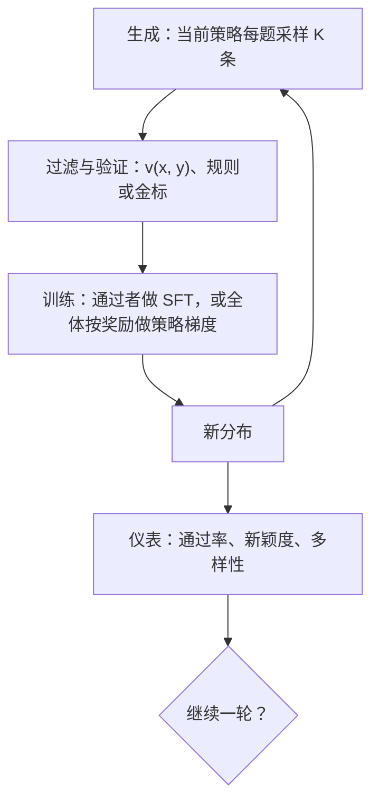

# 自改进回路的解剖

自训练不是没有数据，而是把数据的来源从人换成模型自己的输出；回路每转一圈都是一次再采样，资产与损耗必须分开记账。

<footer>—— 据 Zelikman 等 STaR；Gulcehre 等 ReST-EM 整理</footer>

[上一课](/llm/reasoning-faithfulness)把链的可信性问题收在「强化学习进阶」课末：测量要靠偏置测试与链干预，可监视性、必要性、忠实性三件不同，监视器进了奖励还会混淆链。监督信号本身不可靠，正是本课程「自训练与数据闭环」的出发点：与其继续加重人类标注，不如让模型的输出直接进入训练——生成、过滤或验证、训练、再生成。本课解剖这条回路：每一站什么是资产、什么是损耗。[RLVR](/llm/rlvr)与[自博弈](/llm/self-play-lm)已把单点机制讲过，[拒绝采样数据循环](/llm/rft-data-loop)给过单轮版本，这里只立全回路的骨架。本单元后面的停止条件、坍缩实证、验证器瓶颈、RLVR 设计与合成课程，都默认已经读完本课。

## 问题

人类示范与标注有三条硬上限：预算、覆盖、以及天花板——超过示范者的能力无法被示范。可验证域（数学、代码）里，模型的输出自带可核对的候选，于是「训练数据」可以自产：每题采样多条，留下通过验证的那些。缺口不在会不会调用生成接口，而在回路本身：把输出变成信号要四个环节接力，任何一环的系统性偏差都不会被下一环抵消，只会被再生成环节放大。单轮 RFT 是一次过滤采样；多轮闭环是把同一个选择算子反复作用在策略分布上——两者性质不同：前者近似「换一批更好的离线数据」，后者是分布的迭代映射，收敛到哪、变窄到什么程度，都由回路结构决定。

## 方法

生成站要多样性而非一致性：温度、提示变体、多路径采样。过滤验证站是选择算子，$v(x,y)$ 来自程序或金标比对。训练站两种接法：对通过者做 SFT（STaR、RFT、ReST-EM 一族），或对全体样本按奖励做策略梯度——[RLVR](/llm/rlvr) 把四站焊进一个训练步，SFT 循环则摊成多个迭代。再生成站的关键事实：新策略的分布移了，上一轮的数据不再 on-policy。

资产三项：on-policy 覆盖——训练分布与当前策略的失败模式对齐，这是相对静态示范的根本优势；通过验证的解法是可复用的确定性资产；失败样本在策略梯度下是负信号来源。损耗三项：过滤是收缩算子，多样性逐轮下降；验证误差会被优化压力放大；覆盖收缩到「会一半」的题上，全对与全错组都没有梯度（[群体相对基线](/llm/group-relative-baseline)课的结论）。

ReST-EM 的实证口径：迭代两三轮后收益已显著递减——回路不是永动机，每轮的边际增量在缩小（Gulcehre 等 2023）。这为下一课的停止条件埋下伏笔。

## 机制

把回路写成分布的迭代：设第 $t$ 轮策略为 $\pi_t$，选择算子为 $\mathcal{F}$（过滤与验证），训练数据测度 $\mu_{t+1}=\mathcal{F}\,\pi_{t+1}$，训练把下一轮策略拉向 $\mathcal{F}$ 的支撑。回路里没有独立外部参照时，$\pi$ 既是数据的生产者又是消费者，$\mathcal{F}$ 的每一处系统性误差都会被反复写进权重——这是本单元坍缩课与验证器瓶颈课的共同起点。与[自博弈](/llm/self-play-lm)的关系：自博弈是把「对手」也换成旧策略的闭环特例，支付来自对弈或校验；与 [RLVR](/llm/rlvr) 的关系：在线 RL 用即时推理集群换流程紧凑，SFT 循环用离线批次换工程简单。记账口径：每轮新增「通过且新颖」的样本数是毛收入，多样性收缩与验证误差是两项折旧；只看通过率不看新颖度，会把复读当进步。

## 边界

本课只立结构：回路何时该停是下一课；不停轮会发生什么（尾部丢失、熵收缩）是坍缩课；选择算子自身的误差如何变成策略偏移是验证器瓶颈课；域与判据的设计权衡是 RLVR 设计空间课；出题侧的合成与自举收在本单元末课。裁判与选手同一模型的自奖励属于下一单元；预训练配比里的合成（[教科书式合成](/llm/textbook-synthetic)、[合成数据在预训练中的位置](/llm/synthetic-pretrain)）已有专课，这里不重复。

## 小结

- 自训练回路四站：生成、过滤与验证、训练、再生成；单轮 RFT 与多轮闭环性质不同。
- 资产：on-policy 覆盖、可复用的已验证解法、失败样本的负梯度；损耗：多样性收缩、验证误差放大、覆盖向中间难度集中。
- 闭环是分布的迭代映射，选择算子的系统性误差会被再生成放大。
- 记账要看「通过且新颖」的增量，不能只看通过率。
- 出处：Zelikman 等 STaR；Gulcehre 等 ReST-EM；单点机制见 RLVR 与自博弈各课。
