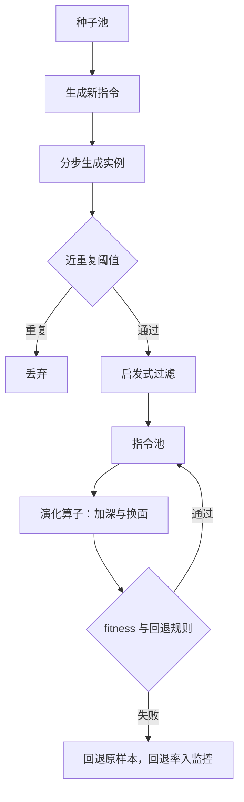
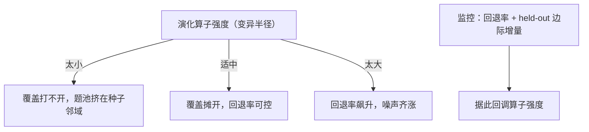

# 自指令与指令演化

    
自举把种子变成题池，演化把题池推向更难；两者都没有凭空造出分布，只是沿着种子所在的邻域把覆盖摊开。

    <footer>—— 据 Wang 等 Self-Instruct 2022；Xu 等 Evol-Instruct 整理</footer>

[上一课](/llm/synthetic-taxonomy)把生产线切成来源、真值、用途三轴，其中「有源改写」是成本最低、最常用的一条：不要求教师会做新题，只要求它围绕种子受控地变异。本课写这条线的两个原型——Self-Instruct 的自举与 Evol-Instruct 的演化。[自指令课](/llm/self-instruct)与 [Evol-Instruct](/llm/evol-instruct)已讲过它们的机制与谱系地位，本课的增量是工程视角：管线参数怎么定、每一步在控制什么、变异打开覆盖的同时把什么风险放了进来。

## 问题

自举的原型管线是：一百多条种子指令 → 生成新指令 → 为每条指令生成实例 → 过滤 → 入库。工程问题藏在四步之间的参数里：新指令从哪个池子采样（种子池还是已生成池）决定多样性收敛还是发散；近重复用什么阈值；指令与实例分开生成还是一起生成。演化的原型管线是：对种子施加变异算子——加深（加约束、多步化）或换面（换领域、换问法）——再用过滤器决定去留。共同的问题是：变异的方向不受你控制，教师偏爱变异到自己会做的区域，题池会整体漂向「可出可解」的浅水区。

「自举」（bootstrap）来自「拽着自己的靴带把自己提起来」：用模型生成的题再喂回给模型，滚雪球式扩大题池。好处是几乎不要人工标注；风险是近亲繁殖——池子滚得越大，越像教师自己口味的回音。

## 方法

自举管线四个旋钮。指令与实例分步生成：先抽指令再补实例，任务分布由指令层控制；一起生成会让实例风格反绑指令分布，题池塌向教师高频任务族。近重复控制用 ROUGE-L 或嵌入相似度阈值，$0.7$ 是 Self-Instruct 的原口径——阈值低了近重复涌入，高了多样性还没长出来就被掐掉，阈值要用池内多样性曲线校，不是常数。启发式过滤拦格式坏样本：答案缺失、拒答开头、过长过短。最后是生成环内去重：每生成一批先与池内比对再决定入库；事后清洗挡不住已经污染多样性统计的批次。

阈值 $0.7$ 怎么理解：ROUGE-L 取值 0 到 1，越接近 1 两句话越像。0.7 意味着「最长公共子序列重合约七成就算近重复、拦下」。它是一道闸门：调松了近亲涌入，调紧了多样性还没长出来就被掐掉。

演化管线三个部件。算子表：加深与换面要成对配置，只加深会让题池整体右移到没人会做，只换面会停在浅层。回退规则：变异产物生成失败、答案缺失或自相矛盾时回退到原样本；回退率本身是监控指标，回退率飙升说明算子步子迈过了教师能力。fitness 过滤：Evol-Instruct 用一个判别器分辨「演化指令」与「平庸指令」——这一步就是上一课谱系里的裁判打分档，裁判偏置照例要单独管。

## 机制

为什么分步生成能控制分布：指令层的采样分布是显式参数，实例只是条件补全；一起生成时任务分布隐在教师的自发倾向里，人无法再对它配比。为什么演化能打开覆盖：对种子施加小变异等价于在种子邻域做受控探索，比自由采样命中率高，但探索半径由算子强度决定——半径小则覆盖不开，半径大则回退率与噪声齐升。自举与演化共享一个更深的机制：池子越滚越大，新生成样本的边际多样性在掉，因为池内高频模式会被采样进来再被加强。这是数据飞轮的早期形态，[数据飞轮的停止条件](/llm/data-flywheel-stop)的仪表——held-out 边际增量与生成分布熵——在自举管线上从第一轮就该挂上，而不是等闭环成型。

Self-Instruct 用约 175 条种子滚出 5.2 万指令；Alpaca 换强教师重跑同一条管线。种子量级与产出并不同比例放大——瓶颈在「生成加过滤」的循环质量，不在种子的绝对数量。

## 边界

自举与演化只解决指令侧的扩张，不解决回答侧的质量：指令对了，答案可以是错的，实例级验证留给本课程后面的质量过滤课。多样性上限被种子池锁死——种子不含的任务族，演化算子变不出来，覆盖审计要相对真实任务分布做，不能只在池内比较。此外，演化的「更难」与「更好」不等价：加深算子制造的约束可能只是啰嗦，难度要留给后面的难度分级课用通过率重标，不能听教师自评的。

可以类比一个题库编辑团队：自举负责「照着样题再出五万道」，演化负责「把简单题往难里改」。但出题再勤快也不保证标准答案是对的——出题与判卷必须分开验收，这正是「指令侧扩张不等于回答侧质量」的日常版本。

## 小结

- 自举四旋钮：指令实例分步、近重复阈值、启发式过滤、环内去重。
- 演化三部件：算子表成对配、回退规则、fitness 裁判。
- 回退率与 held-out 边际增量从第一轮就是监控项。
- 指令侧扩张不等于回答侧质量；种子池锁死多样性上限。
- 「更难」要用通过率重标，不听教师自评。
- 出处：Wang 等 Self-Instruct 2022；Xu 等 WizardLM 2023；Taori 等 Alpaca 2023。
