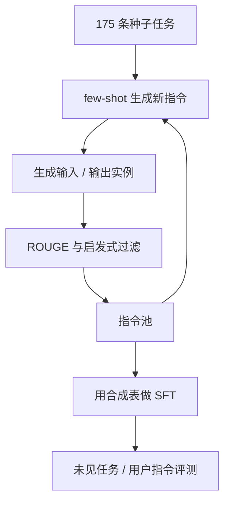

# Self-Instruct

从少量种子任务出发，让语言模型自己写新指令、再为指令生成输入-输出实例，经过滤后用于微调，从而在几乎没有大规模标注的情况下提升指令遵循。

<footer>—— Wang et al., Self-Instruct: Aligning Language Models with Self-Generated Instructions, ACL 2023</footer>

Wang、Kordi、Mishra 等人 2023 年的 Self-Instruct 针对指令微调的数据瓶颈：Super-NaturalInstructions 一类基准覆盖很广，但人写示范仍然贵，而且种子任务无法穷尽用户动词。作者用 GPT-3（davinci）做自举：175 条种子任务进提示，模型写出新指令，再写出实例，用启发式过滤近重复和明显坏样本，得到约 5.2 万条指令、约 8.2 万实例，再拿去微调同一个（或同族）语言模型。Alpaca 随后用更强的 text-davinci-003 复现这条配方，把方法从论文变成开源默认。本篇写自举管线、过滤在做什么、以及它相对人写示范（InstructGPT、LIMA）解决的是覆盖而不是金标准。对照见 [人写 vs 合成指令](/llm/human-vs-synthetic-instruct)。

## 问题

只在种子任务上 SFT，模型会把指令遵循学成「那 175 种题型」。用户真正会问的动词、领域、约束组合要大几个数量级。雇人按网格写题，成本随网格膨胀；爬取论坛又脏、又缺标准答案。需要一种能把种子的多样性外推出去的生成器。最便宜的生成器就是正在对齐的那个语言模型自己——它已经见过大量网页里的题面与教程，缺的是把这些模式采样成「指令-实例」表。

自举的风险是崩溃：新指令只是种子的换槽，实例是模型已经能背的模板，过滤若不砍近重复，微调等于把种子背得更熟。Wang 等人必须同时证明两件事：生成的指令在 ROUGE 一类重叠度量上足够远离种子；微调后在未见过的 SuperNI 任务和面向用户的指令上，遵循率相对原 GPT-3 上升。若只有条数没有远离度，论文主张不成立。

### 指令、输入、输出要分步生成

一条训练样本不是自由文本，而是可解析的三元组。先生成指令（动词与约束），再决定是分类任务还是开放生成，再生成输入，再生成输出——或对某些任务先生成输出再倒推输入。分步是为了减少「指令与实例互相矛盾」。论文对分类任务用输出先行，避免输入生成完才发现标签集对不上。把 Self-Instruct 理解成「让模型写很多 ShareGPT 对话」是后话；原文是任务型指令表，多轮对话不是主产出。

175 条种子来自已有指令数据集的手工筛选，不是随机网页。自举放大的是种子所代表的任务族。种子若全是英语短问答，生成器很难自己长出多语言法律意见。配方不能代替种子设计。

## 方法

循环如下。从种子与已接受的指令里抽若干条当 few-shot，提示模型写新指令。对新指令生成一个或多个实例。过滤包括：与现有指令的 ROUGE-L 过高则丢；过短、明显非文本任务（画图、视频）则丢；输入输出与指令冲突则丢。存活者加入池，进入下一轮 few-shot。直到达到目标规模。然后在该表上对 GPT-3 做 SFT（原文设定），评测时用未见任务，而不是用生成池自己测。

生成器用的是当时的 GPT-3 完成接口，不是已经指令对齐的 ChatGPT。这很重要：自举依赖的是预训练里的「题-答」模式，加上种子 few-shot，而不是依赖一个已经会当助手的教师。Alpaca 把生成器换成 text-davinci-003，质量上升，但方法仍是 Self-Instruct：变的是教师强度。学生若小于教师，变成蒸馏；原文学生与生成器同族，更接近真自举，上限也更紧。

### 过滤决定有效覆盖，不决定事实正确

ROUGE 砍的是表面复述，砍不掉「换领域但仍是同一道改写题」。启发式砍的是空样本和明确不支持的模态。事实错误、过时知识、有害遵从，可以整表存活。Self-Instruct 原文的评测重点是指令遵循与任务准确率代理，不是安全。把合成表直接当产品 SFT 的全部数据，等于把生成器的幻觉写成金标准。InstructGPT 坚持示范由人按指南写，正是为了挡住这一层。两条线后来在开源里被混用：用 Self-Instruct 扩覆盖，用少量人写或 LIMA 式精选定口吻。

## 机制

few-shot 生成指令，是在预训练见过的模板空间里做组合：把「翻译 / 分类 / 改写 / 抽取」乘到种子里没有出现的名词短语上。模型并没有外推到真正的新算法，它外推的是槽位。有效多样性取决于种子的动词集合、过滤阈值、以及生成温度。温度太低，池子塌成种子复述；太高，指令不可执行，过滤会丢掉大部分，有效条数远小于名义 5.2 万。

实例生成是第二次采样。开放生成任务上，输出质量受生成器能力硬上限约束；分类任务上，标签错误会直接变成监督噪声。微调把这些实例的 token 分布写进学生。若学生就是生成器，SFT 强化的是模型自己愿意采样的那种回答腔——流畅、模板化、中等难度。这能提高「像在完成指令」的观感，对难推理、工具使用、忠实于长文档的帮助有限。原文在 SuperNI 未见任务上的增益，测的主要是格式与任务识别，要把数字读成这一层。

Alpaca 52k 常被当成 Self-Instruct 的同义词。条数相近，教师更强，学生是 LLaMA 7B，评测是用户展示而非 SuperNI 为主。引用时应分开：方法来自 Wang 等人，工程放大来自 Stanford 那次复现。

### 与 Evol-Instruct 的分工

Self-Instruct 横向扩：更多指令，复杂度大致停在种子水平。WizardLM 的 Evol-Instruct 纵向挖：对已有指令加约束、加深推理、具体化。先 Self-Instruct 再演化，是后来常见的串联。只用 Self-Instruct，复杂指令上会不够难；只用演化、种子又窄，会把同一道题越改越绕，覆盖仍然差。论文本身没有做演化，停在过滤后的一次池。

## 边界与工程取舍

生成器能力定天花板。2022–2023 的 GPT-3 写不好的数学与代码，表里也会写不好；后来用更强教师可以抬高，但那已经是蒸馏。多语言、多轮、工具调用需要改提示模板与种子，不能指望英文任务型 few-shot 自己长出来。过滤阈值是超参：太严，池子小、像种子；太松，微调学噪声。应报告过滤前后的规模和重叠分布，而不是只报最终条数。

安全与拒答几乎不在原文管线里。合成指令会包含危险请求，合成输出会包含遵从。产品使用必须另接安全数据或宪法式过滤。评测若只用模型自生成的测试指令，会高估遵循——测试与训练同分布。应用人写的、产品日志里的题面做持有集。LIMA 随后表明，若基座已经很强，一千条精选人写也可以当助手；Self-Instruct 不与之互斥，一个扩覆盖，一个定质量下限。

不要用「52k」当数据质量单位。同一规模下，种子、教师、过滤、是否演化，会得到完全不同的有效任务族。报告配方时应写这四项，而不是只写条数。

## 小结

- Self-Instruct 从 175 条种子自举出约 5.2 万指令，用过滤后的实例对 LM 做 SFT。
- 分步生成指令与实例，用 ROUGE 和启发式控制近重复与坏样本。
- 解决的是覆盖，不是金标准；事实与安全不过滤就不存在。
- 原文生成器是 GPT-3 完成模型；Alpaca 换成更强教师，方法仍是这条管线。
- 评测应在未见任务和人写题面上，而不是在合成池内部。
- 与 Evol-Instruct 是横纵关系，与 LIMA / InstructGPT 示范是质量定义关系。
- 出处：Wang et al., *Self-Instruct: Aligning Language Models with Self-Generated Instructions*, ACL 2023。
