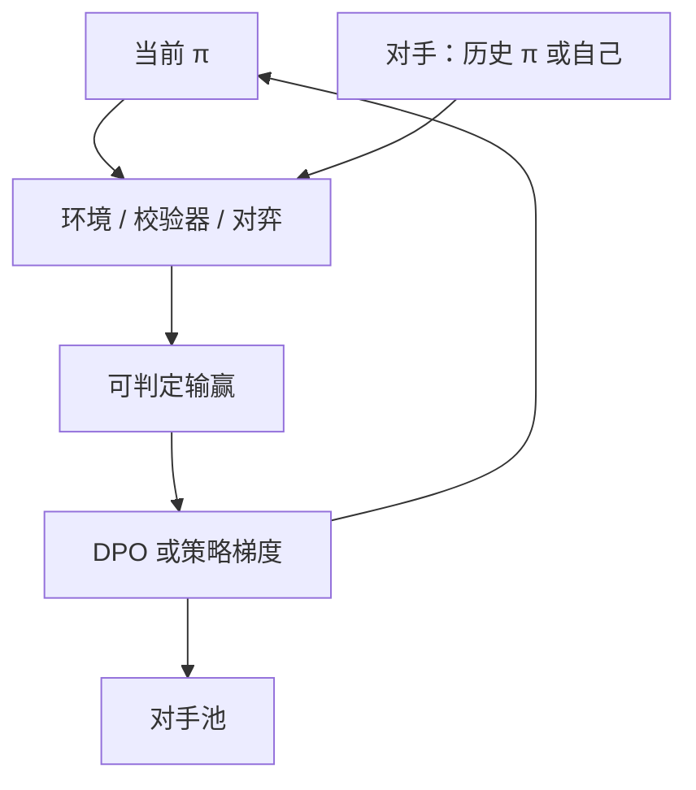

# 自博弈

没有人类示范的走子，两个副本对弈，用谁赢了当奖励；语言上的自博弈要把「赢」定义成可检验的事件。

<footer>—— Silver 等 AlphaZero；Chen 等 SPIN；语言模型上的自博弈偏好优化</footer>

[上一课](/llm/nash-learning-hf)在偏好支付下求均衡。缺口是：很多任务的胜负不必经过偏好模型——棋、代码测试、数学对错。自博弈让当前策略与自己（或历史）对阵，用环境输赢更新。AlphaZero 是原型；SPIN 把「对手」写成上一轮策略，用 DPO 式损失让当前模型打赢旧自己。本课写 LM 自博弈，不重写 [GRPO](/llm/grpo)。

## 问题

人类比较覆盖不到的能力（超人类棋力、长证明）无法从示范模仿。自博弈的条件是：**对称、可判定的输赢。** 棋满足；开放聊天不满足——两个助手互评「谁更有用」会退化成自奖励。LM 上合法的自博弈：(1) 双人游戏或辩论（下一课）；(2) 对同一可验证题，当前 $\pi$ 对历史 $\pi_{\mathrm{old}}$ 比谁的 $R$ 高，再造成对；(3) SPIN：把 SFT 当对手，迭代让新模型的完成被分类器判赢。

没有判定器的自博弈，只是两个模型互相吹捧。本课把判定器当一等公民，与 [可验证奖励](/llm/verifiable-reward) 对齐。对手若永远是当前 $\pi$ 的瞬时副本，梯度对称、进步慢；混入落后 checkpoint 才能提供可打赢的负例。

### SPIN 不是 AlphaZero

AlphaZero 有 MCTS 与精确规则。SPIN 没有搜索树，用偏好损失打赢旧策略。能力上限受裁判（往往是模型自己）限制。不要把指令模型的 SPIN 曲线写成「达到超人类」。

历史对手池（PFSP）防止循环克制：只打赢昨天的自己，可能遗忘前天会的策略。

## 方法

可验证：对每个 $x$，当前与对手各采样，比较 $R$，构 $(y_w,y_l)$，DPO 或直接对赢家做 REINFORCE。游戏：在环境里对弈，终局 $\pm 1$，PPO。SPIN：用当前 $\pi$ 生成 $y$，与旧数据 $y_{\mathrm{old}}$ 组成对，训练使 $\pi$ 判赢自己的新样本。对手更新频率是超参：太快不稳定，太慢过拟合一个对手。

## 机制

自博弈提供无限新对局，覆盖随 $\pi$ 移动。非传递游戏会循环；语言偏好更非传递，所以开放域自博弈危险。可验证域传递性较好（对就是对），自博弈近似「用旧策略当负例的 RFT」，与拒绝采样数据循环近亲。真正的新能力来自探索是否找到校验器仍接受的新解法。

与 Nash 学习的差别：自博弈的支付是环境，Nash 的支付是偏好模型。可以嵌套：环境赢 + 偏好做平局打破。

## 边界与工程取舍

辩论把「赢」交给人类或弱裁判看论证，下一课专门写监督含义。安全自博弈（红队 vs 蓝队）需要小心：攻击策略可能外溢到产品。代码 / 数学是主场。下一课辩论把自博弈接到可扩展监督。

对手池要混入落后 checkpoint，避免只打赢瞬时自己。没有判定器的互评会退化成自奖励，本课不覆盖。

## 小结

- LM 自博弈要求对称且可判定的赢；开放互评会退化成自奖励。
- SPIN 打赢旧自己，不是 AlphaZero；上限受裁判限制。
- 对手池防止循环克制与遗忘。
- 可验证 $R$ 是最干净的支付。
- 出处：Silver 等 AlphaZero；Chen 等 SPIN；对照 Munos NLHF。
