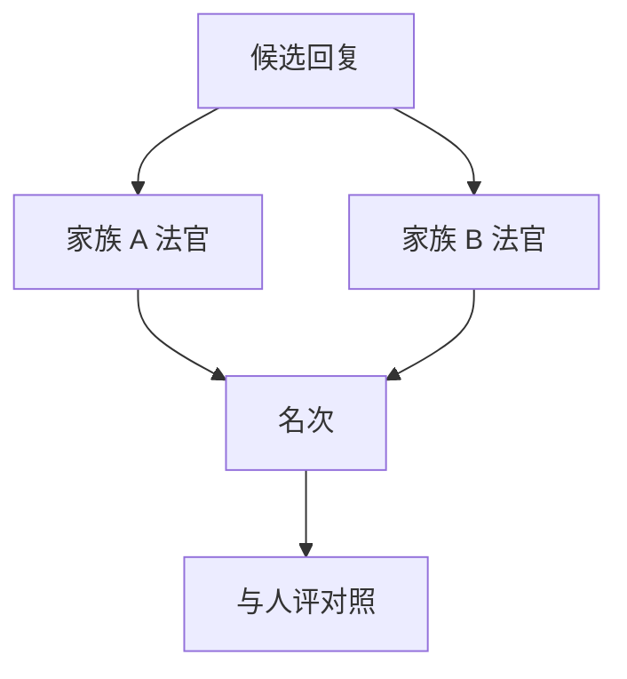

# 自我偏好

法官更常把「写得像我」判成更好。同族模型互评会把风格重叠写成能力差。

<footer>—— Zheng 等的 self-enhancement；Panickssery 等对「认出并偏爱自己生成」的测量</footer>

[上一课](/llm/style-control)去掉长度等可观测混淆。还剩更难观测的一种：生成器与法官共享解码先验。本课写自我偏好。缺口是：用 GPT-4 评所有人，或用自家 70B 评自家 7B，名次里含族谱。后课人评协议是为了给这条偏差一个不共享族谱的金标。

## 问题

Zheng 等人报告法官偏爱自己的回答。Panickssery 等人进一步表明，LLM 评委能在一定条件下认出谁是自己的生成，并给予更高分。结果是：闭源法官定义的自动榜会系统性压低文风不同的开源模型，即使人评并不如此。

这与训练泄漏不同。即使题没见过，**文风见过**。换法官家族，榜会转——这是诊断，应写成稳定性报告，而不是只换到对自己有利的法官。

自我偏好在奖励模型同源时更危险：RL 对学生的奖励若由同族教师给，学生会模仿教师腔，评测再由教师打分，闭环。应至少换一族法官做敏感性分析。

## 方法

最小检测：同一批成对样本，用两个不同家族的法官，看 Kendall 名次相关；再与人评相关。相关在人–法官之间低、在同族法官之间高，则自我偏好主导。缓解：交叉法官、多数投票跨家族、或把评测法官与训练 RM 隔离。不要用「我不是那个模型」的提示禁令当缓解——证据不足。

## 机制

同族模型共享分词、预训域与对齐配方，输出在 n-gram、列表习惯、拒答套话上更近。法官的「质量」分类器部分是密度估计：更像自己的分布就被当成更规范。认出自身还可以走更浅的捷径（特殊标记、固定签名句），评测应打乱这些表面线索，否则测到的是水印而不是能力。

## 边界

本课不写如何伪造他族文风以骗法官。下一课把金标拉回人类协议：招募、盲评、金题、疲劳。

## 小结

- 同族法官会把文风重叠写成胜率。
- 跨家族敏感性与人评相关是最低披露。
- 训练 RM 与评测法官应隔离。
- 出处：Zheng 等 LLM-as-a-Judge；Panickssery 等自我偏好测量。
