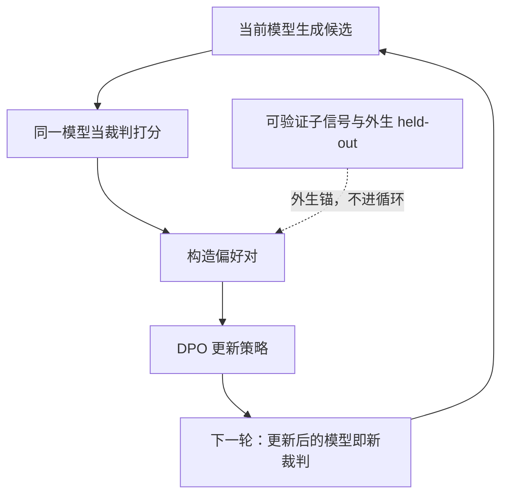

# self-rewarding 的循环依赖

奖励出自被训练的同一个模型，优化目标就在每一轮被改写成它此刻的口味；循环把测量误差泵成分布偏移。

<footer>—— Yuan 等, Self-Rewarding Language Models（2024）；Panickssery 等, LLM Evaluators Recognize and Favor Their Own Generations（2024）</footer>

[上一课](/llm/synthetic-curriculum-close)把自出题-自排课接进闭环：难度分布受控的合成课程让验证器有题可验，代价是出题人对「学什么」的理解会漂移。缺口再退一步：若奖励本身也出自同一个模型——self-rewarding 让模型给自己的输出打分、构造成对偏好、再用偏好损失更新自己，裁判与选手合一。[裁判偏差](/llm/llm-judge-bias)在一次性评测里只是让名次可疑；进了训练环，偏差成为梯度本身，被逐轮放大。[自博弈](/llm/self-play-lm)已经预警：没有判定器的互评会退化成自奖励。本课写这条循环依赖的形状，以及哪里必须放外生锚点。

## 问题

Yuan 等人 2024 年把迭代写成三步：当前模型对每个提示生成多个回答；同一模型按裁判脚本打分、两两比较构偏好对；用 DPO 在自产偏好上更新，回到第一步。三轮之内 AlpacaEval 胜率持续上升。结果诱人，也因诱人而危险：整个回路里没有任何一个数来自模型之外。位置偏差、长度偏差、同族偏好——在评测里是方差，在这里是系统性增量：策略梯度精确地沿「裁判喜欢什么」的方向走，而裁判的口味就是模型自己的口味。不这么做会错在哪：把这条上升曲线当能力曲线，闭环会安静地把模型推向它自己最顺眼的分布，没有任何报警。

## 方法

把裁判写成 $\hat R(y;x)=R^*(y;x)+b(y)$：$R^*$ 是理想真值，$b$ 是偏差项。人当裁判时，$b$ 与被评模型无关，平均是噪声；裁判与生成器同分布时，自我偏好使 $\mathbb{E}_{y\sim\pi_\theta}[b(y)]\gt 0$ 恒成立——模型给自己的输出系统性加分。策略更新最大化 $\mathbb{E}_{y\sim\pi_\theta}[\hat R]$，于是每轮迭代同时抬高 $\mathbb{E}[b]$：偏置不是被平均掉，而是被选出来。缓解按强度排：换序与长度控制治位置与冗长，治不了自我偏好；跨族裁判集成稀释同族口味；唯一硬的锚是可验证子信号——把 [RLVR](/llm/rlvr) 的程序真值混进奖励，让不可验证维度只占少数票，并保留一个不经过裁判的 held-out 做审计。

## 机制

Panickssery 等人把自我偏好的机制钉死：把法官自己的输出换成等质量的他人输出，胜率显著下降；法官甚至在内容不变时认出「这是我的写法」。偏好来自风格重叠——同族模型的 n-gram 与句式更像裁判的预训练——而 DPO 把风格差距直接写成对数概率差。所以循环的不动点不是「最好的回答」，而是「模型最顺眼的回答」：早期增益来自格式与详略（裁判爱列表、爱长文），后期停滞，因为口味已经是它自己。测量侧的随机误差，经选择压力变成了生成侧的固定偏移——这是循环依赖与「用一次法官打分」的本质区别。

Yuan 等报告的三轮增益与回答长度增长同步，且没有外生验证环节；Panickssery 等进一步显示自我偏好在质量打平时仍然存在。两者相加：不设外生读数，无法把「更像自己」与「更好」分开。

## 边界

self-rewarding 不是全错：若有大量可验证样本锚住真值维度，剩余开放维度用自评，增益可能真实存在。辩论是另一条出路——Irving 等 2018 年的设计里裁决权在人，两个模型互相攻诘，裁判不再是选手；但它依赖链的忠实性，人类注意力成为新瓶颈，且胜负判据本身仍常退化为模型互评。凡是宣称「全自监督后训练提升了开放能力」的报告，第一问都该是：裁判是谁，换序了吗，有没有一个不经过裁判的 held-out。

## 小结

- 裁判与选手同模型时，自我偏好使偏差项恒正，循环把偏置逐轮选出来。
- 换序与长度控制必要但不充分，治不了自我偏好。
- 可验证子信号是唯一硬锚；开放维度自评必须配外生 held-out。
- 增益曲线先拆长度与格式，再谈能力。
- 出处：Yuan 等 Self-Rewarding Language Models（2024）；Panickssery 等（2024）；Irving 等 AI Safety via Debate（2018）；偏差清单见 [LLM 裁判偏差](/llm/llm-judge-bias)。
