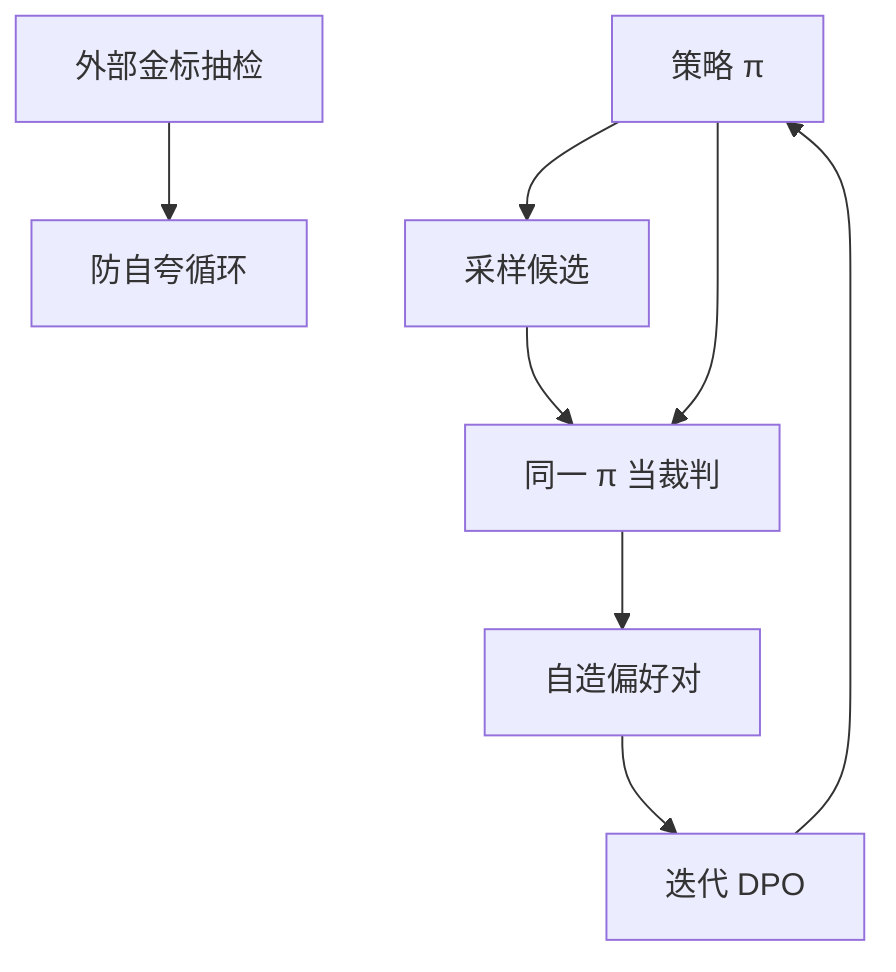

# 自奖励语言模型

同一模型既生成候选，又给候选打分，用自己的序做迭代 DPO——监督闭环，偏见也闭环。

<footer>—— Yuan 等，Self-Rewarding Language Models</footer>

[上一课](/llm/iterative-online-dpo)用外部裁判造新对。缺口是：**外部 GPT-4 / 人类仍然贵，规模化会停。** Yuan 等人让模型扮演 LLM-as-judge 给自己的完成打分，再用这些对做迭代 DPO，称为自奖励语言模型。本课写闭环，对照 [LLM 裁判](/llm/llm-judge-reward) 的偏差在自指时如何放大。

## 问题

迭代 DPO 的瓶颈是每轮标注。若模型已经能按原则打分（宪法式、细则），可以把 JUD 换成 $\pi$ 自己。希望是：能力上升 → 裁判也变好 → 数据变好，正循环。风险是：自偏爱（Zheng 等已量过）让模型给自己的风格打高分，正循环变成自夸循环。没有外部金标，曲线无法区分两种。

Yuan 等用 Llama-2-70B 一类指令模型，提示它输出分数，造对，多轮 DPO，报告指令遵循提升。这是存在性结果，不是「可以去掉所有人类」。人类仍写原则、做抽检。

### 生成器与裁判权是否分离

同一套权重、同一提示族，裁判不是独立证据。最低限度：打分时用固定的评判提示、禁止看见「这是我生成的」身份；更好：用稍旧的 checkpoint 当裁判，减少即时自夸。完全独立的裁判模型回到上一课。

自奖励不是可验证奖励。数学对错仍应走校验器，不要让模型给自己的证明打 5 分。

## 方法

每轮：当前 $\pi$ 采样 $K$ 条 → 同一 $\pi$（或上一轮）按评判提示打分 → 选 $y_w,y_l$ → DPO → 可选更新评判提示。监控：外部 Arena / 人类胜率、长度、自偏爱探针（把别人的完成伪装成自己）。分数校准（本课程 RM 校准课）对口头打分几乎不做数，应用成对胜负而不是绝对分。

与 [过程监督](/llm/process-supervision) 结合：自奖励只打过程评语，终点仍校验器，可部分打破闭环。

## 机制

闭环改变数据分布的速度比固定 RM 更快，因为裁判与策略共移。共移在「真变好」与「共同黑客细则」上不可辨。外部金标是唯一辨识器。长度偏爱在自奖励里往往更强：模型既爱写长也爱给长打高分。必须控长评测。

宪法式 CAI 的比较器通常是固定教师，不是正在被 RL 的那份权。自奖励把教师也放开。

## 边界与工程取舍

安全轴不宜自奖励：有害完成可能被自我开脱。有用轴可试，必须抽检。可验证域用 GRPO，不要用自评分代替 $R$。下一课 Nash 学习从另一方向处理「谁当最优」：不是自己给自己打分，而是两人博弈的均衡。

## 小结

- 自奖励用当前模型当裁判造对，做迭代 DPO，去掉外部标注吞吐瓶颈。
- 自偏爱与共移黑客无法从代理分上区分，必须外部金标。
- 生成器与裁判至少用旧 checkpoint 或固定评判提示弱分离。
- 可验证域不要用自评分代替校验器。
- 出处：Yuan 等 Self-Rewarding Language Models；裁判偏差见 Zheng 等；CAI 对照 Bai 等。
