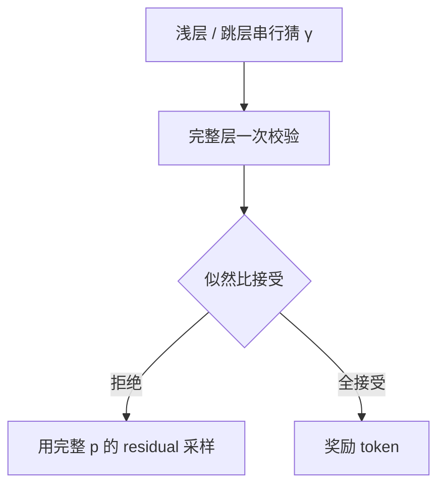

# 自投机解码

草稿不必是另一个模型：让目标网络提前退出，用浅层的猜测交给深层一次并行校验，接受规则仍可以对准原分布。

<footer>—— Zhang et al., Draft & Verify: Lossless Large Language Model Acceleration via Self-Speculative Decoding, ACL 2024；层跳过见 Elhoushi et al., LayerSkip, 2024</footer>

[上一课](/llm/temperature-reasoning)把温度接到推理路径。加速不能靠把 $T$ 调到 0：贪心只减少随机性，不减少逐步前向次数。[投机解码](/llm/speculative-decoding)用第二模型串行猜、目标一次验，无损但要养草稿、要对齐词表与采样。本课补「没有合格小模型」时的路：自投机（self-speculative）让 *同一套权重* 既当草稿又当目标——典型是浅层提前退出当 $q$，深层当 $p$。后课的 Jacobi 连「浅层草稿」也不要，改并行猜未来位置。

## 问题

独立草稿的运维成本是真实的：要训、要跟版本、要占显存、还要在连续批里各管一份 KV。很多部署只有一个检查点。缺口是：能否从目标 Transformer 内部挖出一个更快的 $q$，使 Leviathan 的接受–拒绝仍然成立。Zhang 等人的 Draft & Verify 用层跳过：草稿前向只跑一部分层（其余当恒等或旁路），目标再跑完整层并对草稿 token 做并行校验。Elhoushi 等人的 LayerSkip 把早退训练进网络，使浅层本身更像合法草稿。

没有训练过早退时，随便跳层会让 $q$ 与 $p$ 差得很远，接受率接近 0，自投机比普通 decode 更慢。本课把「自」限定为 *共享权重、可证明无损* 的草稿，不把 Medusa 头（另训参数）算进来——那是主干 [Medusa](/llm/medusa) 的课。

无损仍相对完整目标分布。浅层输出不是交付物；被拒绝的位置必须用完整 $p$ 的 residual 重采样，与标准投机相同。

## 方法

选定草稿深度 $d$（或一组可跳过的层）。每轮：用 $d$ 层串行生成 $\gamma$ 个 token，记下 $q$；再用完整 $L$ 层对这 $\gamma$ 个位置一次前向，得到 $p$，按似然比接受。温度、[logit bias](/llm/logit-bias)、核必须同时施加于 $p$ 与 $q$。KV 可以共享：浅层算出的键值对深层往往仍合法，若跳层破坏了残差流，就不能复用，必须分两套缓存——这是自投机相对双模型最容易算错的地方。

$\gamma$ 与 $d$ 一起扫。$d$ 太接近 $L$，草稿不够便宜；$d$ 太小，接受率崩。LayerSkip 用训练把浅层对齐到最终分布，同一 $d$ 下接受率更高，但检查点不再是原预训练权重，评测要声明。

## 机制

墙钟公式与标准投机相同：期望前进长度除以「草稿 $\gamma$ 步 + 一次较胖目标前向」。自投机的 $c_{\mathrm{draft}}$ 不是另一个模型的步时，而是少跑 $L-d$ 层的步时，通常没有 4B vs 70B 那么悬殊，所以更依赖接受率。带宽墙上，浅层仍要搬那一部分权重；跳过的层没搬，这才是省。若跳过的层很小（只省 MLP 的一部分）而校验仍吃满所有 KV，账可能亏。

[FlashAttention](/llm/flashattention) 的 decode 核不关心草稿来自谁，只关心这一拍的查询长度：校验拍 $n_q=\gamma+1$，算术强度略升，与普通投机相同。

## 边界与工程取舍

自投机不是免费午餐：实现复杂度接近双模型投机，还多了「哪些层可跳、KV 能否共用」的正确性证明。训练过的早退改变模型，不能把 LayerSkip 的加速比写回未改权重的 Draft & Verify。高 $T$ 同样打接受率。结构化掩码必须进 $q$，否则草稿净猜非法 token。

出处：Zhang et al., ACL 2024；LayerSkip, Elhoushi et al., 2024。Leviathan et al. ICML 2023 是无损规则的先修，不在本课重推。

## 小结

- 自投机用同一权重的浅层当草稿，完整层当目标，接受规则仍无损。
- 省的是跳过层的计算与搬移，加速比通常小于独立小草稿。
- KV 能否在深浅层之间共享，要看跳层是否破坏残差；错共用会静默错。
- 早退训练提高接受率，但改变检查点。
- 采样与约束必须两侧一致。
- 后课连浅层草稿也不要，用 Jacobi 并行猜。
- 出处：Zhang et al., ACL 2024；Elhoushi et al., LayerSkip, 2024。
