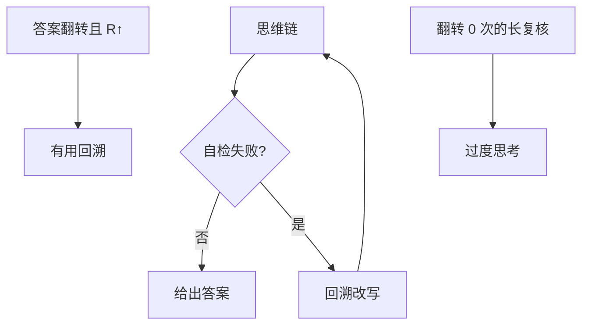

# 自我验证与回溯

链上写出「不对，重来」，并真的改答案：这是搜索，不是把同一句话再说一遍。

<footer>—— DeepSeek-R1 报告中的自检与反思；Weng 等 Self-Verification；对照过度思考的空转复核</footer>

[上一课](/llm/reasoning-length-control)会压掉无用尾部。缺口是：**有用的尾部是验证失败后的回溯，它改变答案。** R1-Zero 在无过程标签下长出这类行为。本课写自我验证与回溯，接到并行思考与 aha。不把 PRM 再讲一遍，只引用 [过程监督](/llm/process-supervision) 作为对照。

## 问题

结果 RL 不监督中间，却观测到「wait / 重新算」后答案纠正。机制假说：组内对的轨迹更常包含纠正，相对优势强化这些标记。它不是保证：同样标记可以空转（过度思考）。判别：纠正前后抽取的答案是否变、变了之后 $R$ 是否从 0 到 1。

Weng 等 Self-Verification 是显式提示或二次前向来验证。R1 是内生写进同一条链。产品可以混合：链内自检 + 链外再跑校验器。二次前向更贵，但验证器不占用思维预算，长度控制更好做。

### 回溯需要工作记忆在 token 里

改主意必须覆盖已写出的错误结论。Transformer 靠继续写否定，而不是修改已生成 token。于是链变长。长度控制若禁止否定句，等于禁止回溯。应惩罚重复、不惩罚答案翻转。

监视器若惩罚「我刚才错了」这类句子，会把回溯赶进激活、链上变清白。见 CoT monitorability。

## 方法

测量：答案翻转次数、翻转后准确率、空转复核率。训练：不直接奖励「wait」词频（会刷词）；终局 $R$ 足够。若要促进验证，用过程标签或中途校验器调用（工具课）。解码：预算内保留一段给复核，但用稳定规则早停空转。PRM 可在步骤级拒绝错误前缀，比自然语言「我觉得错了」更硬。

## 机制

内生自检是强化学习在稀疏 $R$ 下发现的搜索启发式，类似 AlphaZero 的价值回滚，但写在自然语言里。不忠实时，链上写复核、激活里并未重算（后课忠实性）。有用性要以终局 $R$ 为准，不以表面修辞为准。

aha moment（后课）常与回溯同现，但是突然的策略转折，不是每次自检都有 aha。

## 边界与工程取舍

无校验器的开放域，「回溯」无法核对是否真改对，可能只是更长的自信。下一课并行：把串行回溯换成多样本再聚合，用独立样本降低空转。

有用回溯以答案翻转且 R 上升为准。不要把 wait 词频写进奖励；长度控制应罚重复、不罚翻转。

## 小结

- 有用回溯改变答案并使 $R$ 上升；空转复核是过度思考。
- 不要奖励「wait」词频；靠终局 $R$ 或真过程信号。
- 长度控制应罚重复不罚翻转。
- 链外校验器 / PRM 比口头自检硬。
- 出处：DeepSeek-AI R1；Weng 等 Self-Verification；Lightman PRM 作硬验证对照。
