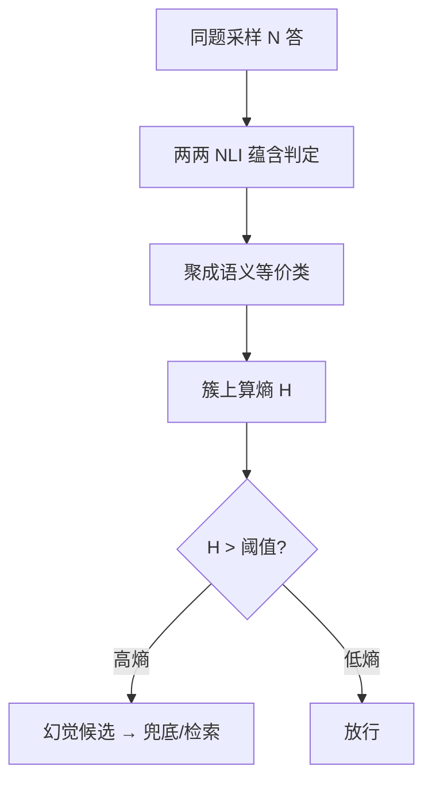
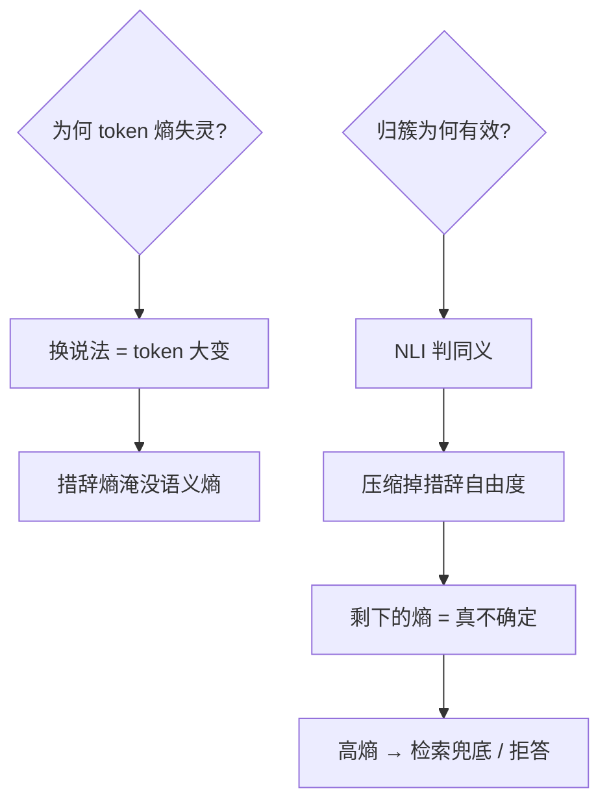

# semantic-uncertainty

模型「知道自己在编」的第一个信号藏在采样方差里：同题多答，说法聚成一团是笃定，散落一片是在猜——语义熵因此而生。

<footer>—— 据 Kuhn–Gal–Farquhar「Semantic Uncertainty」ICLR 2023；Farquhar et al. Nature 2024 幻觉检测</footer>

[能力涌现之争](/llm/emergent-abilities)讲的是测量的尺子，本课的尺子量「模型对自己输出的把握」。缺口是**语义熵**：不用 token 概率，而用**语义等价类**上的熵判断幻觉。它把「模型知道不知道」从玄学变成可测的采样统计量。本课不进信念表示的表征工程。

## 问题

token 级困惑度失灵：「巴黎是法国的首都」与「法国的首都是巴黎」token 分布完全不同、语义同一——模型换一种说法时 token 熵飙升，但明明很笃定；反过来，流畅的胡编 token 概率却很高。缺口：**在语义层面而非词面层面度量不确定性**。要回答：怎么把采样聚成「意思」、怎么算熵、阈值怎么定。

术语翻译：语义熵 = 语义等价类上的熵 $H(\text{意思})$，由 token 熵经「按含义归簇」聚合而来；隐式语义簇 = 用双向蕴含（NLI）判定「两答案是否同一意思」，免人工标注意义类。

数字实例：问「谁是《百年孤独》作者？」采 5 答：「加西亚·马尔克斯」×4、「加博（马尔克斯的笔名）」×1——NLI 判同簇，语义熵 ≈ 0.24 bit，低，判笃定。若采出「马尔克斯 / 马尔克斯？ / 村上春树 / 是加西亚·马尔克斯吗」——「是马尔克斯吗」与「马尔克斯」同簇但疑问式自身是「不确定表述」，簇散开，熵 > 1.5 bit，高，判幻觉候选。

## 方法

四步流水线：采 N 个答案（温度 ≥ 0.5，N=5–10）；两两过 NLI 模型判「蕴含/矛盾」聚成等价类；在簇上算离散熵；与阈值比较。工程增强：对「我不确定/我不懂」类回答单列一簇（它们自己就是不确定性的口头表达）；长答案先抽关键声明再聚簇。全程无需改模型、无需训练——是推理侧的采样统计。

直觉类比：问十个证人同一件事——十人说法一致（哪怕措辞不同）= 语义熵低，可信；十人给出三四个互相矛盾的版本 = 语义熵高，这段证词（哪怕条理最清晰的那份）都别信。词面困惑度在数「用词统一不统一」，语义熵在数「口径统一不统一」。

## 机制

为什么语义熵比 token 熵准：幻觉的典型形态是「模型把低置信的联想流畅地写成事实」——流畅性（token 概率）与真实性脱钩，而**采样多样性**与真实性挂钩：模型内部若有稳定答案，采样只是同一意思的措辞抖动（簇紧）；若在猜，采样会落到不同的语义分支（簇散）。数学上这是「对预测分布做等价类压缩后熵下降」——token 熵把「措辞熵」与「语义熵」混在一起，归簇把前者剥掉。Nature 2024 的扩展用语义熵对**首 token 级**的答案前缀打分，可实时预警而非事后判卷；阈值按任务校准（AUC 0.8+ 常见），检索兜底与「拒答」是高熵的自然后继动作。

常见误区：拿「一次生成的 logprob」判幻觉——单次采样的概率与正确性几乎不相关，必看分布；另一误区是 NLI 模型自身偏置直接透传——NLI 误判「Paris/巴黎」为矛盾会把低熵错算成高熵，跨语任务先测 NLI 自己。

## 边界

语义熵抓「模型内部不一致」型幻觉（瞎编事实、张冠李戴），抓不住「内部一致但全错」型（系统性偏见、训练数据集体错误——采样十次错得整整齐齐，熵为零）。NLI 聚簇的长文本成本：两两比对 $O(N^2)$，答案长需先抽声明。阈值随领域漂移，医疗/法务要用各自校准集。与 RLHF 的互动：对齐后的模型学会「统一口径地说错话」时此法失效加剧——这是「对齐税」在不确定性度量上的体现。与[保形预测](/llm/conformal-prediction-llm)的互补：保形给「错误率上限」的分布无关保证，语义熵给「这一次在不在猜」的即时信号——一个管审计、一个管运行。

直觉类比：语义熵像「多问几个银行柜员确认汇率」——十个柜员报价一致就放心（低熵），报价五花八门说明其中有编造（高熵）；但若全行系统性地用错汇率表（一致性错误），问一百个柜员也白问——这是它的边界。

## 小结

- 语义熵 = 语义等价类上的熵；NLI 归簇剥掉措辞自由度。
- 流畅性 ≠ 可信度，采样多样性才是模型内部把握的信号。
- 抓不一致型幻觉，抓不住一致性错误；阈值须按域校准。
- 出处：Kuhn–Gal–Farquhar ICLR 2023；Farquhar et al. Nature 2024。
