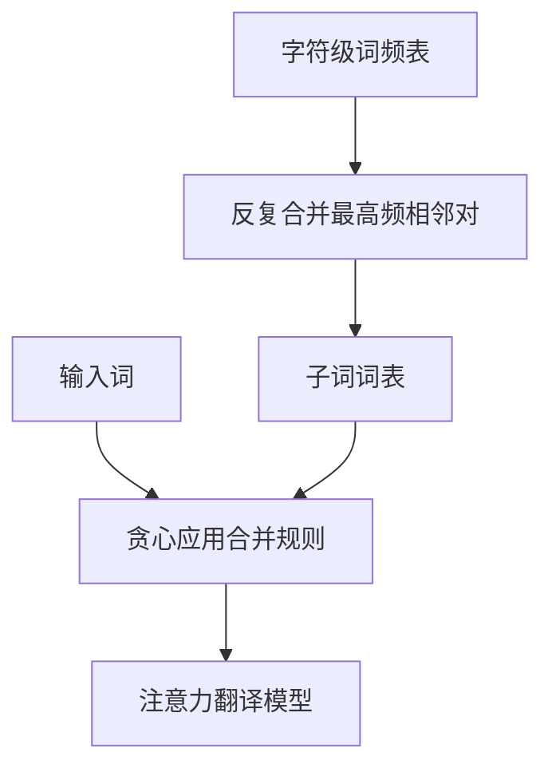

# Sennrich BPE 论文

把稀有词切成训练中反复出现的子词单位，神经翻译就不必为开放词表里每一个未见词准备一套对策。

<footer>—— Sennrich, Haddow, Birch, Neural Machine Translation of Rare Words with Subword Units, ACL 2016</footer>

[上一篇附录](/llm/subword-history) 把 GloVe 之后的子词写成词表史。本篇对照 **Sennrich、Haddow、Birch 的 ACL 2016 原文**：在神经机器翻译上用字节对编码（BPE）学子词。主干课 [Tokenizer 设计](/llm/tokenizer-design) 用当代实现；这里只钉论文问了什么、实验怎么写、边界在哪。不发明编号，出处就是 ACL 2016 这篇。

## 问题

词级 NMT 把未登录词交给拷贝、字符回退或截短词表。德语复合词、形态变化把大量质量送到 UNK。作者要一种**固定大小、对任意词可分解、高频词仍可保留为原子**的符号。BPE 原是数据压缩的合并算法（Gage），他们把它改成词表学习：在词频表上反复合并最常见相邻对，直到达到目标操作数。

相对纯字符模型，子词更短、更易对齐；相对整词，开放词表被覆盖。问题设定是翻译质量与 UNK 率，不是后来 LLM 的压缩率–下游曲线。

### 在词频上合并，不是在整句字节上

他们先按空格与标点得到词，再在词内做 BPE。这保留了词边界先验。SentencePiece 后来可以在无空格生语料上直接学；那是后文，不是 2016 设定。BPE 的学习目标不是似然，是贪心压缩启发式。没有「最优词表」定理。合并次数是超参：太少剩大量 UNK 式稀有词，太多接近字符级。

## 方法

### 合并程序与联合词表

从字符词表出发，统计相邻符号对频率，每次合并全局最高频对，加入词表。编码时对每个词贪心应用同一套合并。源、目标可分开学或联合学；他们讨论了联合 BPE 以共享子词、利于拷贝专名。

系统是当时的注意力 encoder–decoder，不是 Transformer LLM。评测用 BLEU 与 UNK 统计。对照是词级基线与其他切分。

## 机制

高频词很少被切开，梯度集中在稳定原子上；稀有词共享子词参数，形态与词干可以迁移。联合 BPE 让源侧未见专名在目标侧仍有相同碎片，拷贝更容易。这是翻译对齐，不是语言建模的压缩率论证。

解码端任意字符串都可切，理论上消灭 UNK。实际仍受合并规则与预处理（是否把大小写、BPE dropout 当时还没有）约束。Kudo 下一篇会批评「单一切分」的过拟合，本篇默认训练与推理同一套贪心切分。

不要把 2016 BPE 与 GPT-2 / tiktoken 的字节级 BPE 混成一篇。后者在 UTF-8 字节上合并，处理无空格与噪声不同。机制课对照的是算法祖先，不是同一套预处理脚本。

### 与当代词表课的差

当代 LLM 关心 $|V|$ 与压缩率、多语言公平。Sennrich 等人关心 WMT 上的 BLEU 与稀有词翻译。数字不可横向搬到 Llama 词表。对照价值是：开放词表问题被明确写成子词学习问题，并给出可复现的合并程序。

## 边界与工程取舍

贪心合并对语料敏感：多语言拼在一起，高频语言吃掉合并额度。他们主要在双语翻译设定下工作。没有 dropout 式多切分，分词噪声会进模型。字符级语言与无空格语言的空格先验不成立，需要后继工作。

论文不讨论百万级词表的 softmax 费用，也不讨论字节回退。那些是 ByT5、大词表 LM 的问题。引用本篇请钉 NMT 与稀有词，不要写成「LLM tokenizer 的原论文」——它是子词进入神经翻译的关键实验，谱系上的祖先，不是现代训练栈的说明书。

完整题名 *Neural Machine Translation of Rare Words with Subword Units*。作者 Rico Sennrich、Barry Haddow、Alexandra Birch。会议 ACL 2016。

## 小结

- 论文用 BPE 合并在 NMT 上学固定子词词表，覆盖稀有词、降低 UNK。
- 在词频表上贪心合并；可源–目标联合以利专名。
- 切分训练–推理一致；尚未引入子词正则。
- 评测是翻译 BLEU，不是 LLM 压缩率。
- 出处：Sennrich, Haddow, Birch, ACL 2016。
