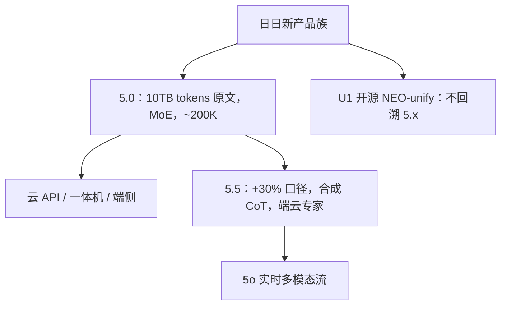

# SenseNova

    
日日新 5.0 用超过 10TB token 与 MoE 把窗口说到约 200K，对标 GPT-4 Turbo；5.5 再加实时多模态 5o 与端云协同。这些是商汤新闻稿，不是开源层表。

    <footer>—— 商汤科技 2024-04-23 日日新 5.0 新闻稿；2024-07 WAIC 日日新 5.5 新闻稿</footer>

商汤 **日日新 SenseNova** 是云、端、边一体的大模型产品族，2023 年 4 月首发，2024 年迭代到 5.0 / 5.5。语言与多模态能力主要通过 **SenseChat** 等 API 与行业一体机交付，权重长期闭源。官方写得比较具体的两代是：5.0（超过 **10TB tokens**、大量合成、**MoE**、推理上下文约 **200K**，知识/数学/推理/代码对标 GPT-4 Turbo）；5.5（综合相对 5.0 平均约 **+30%**，合成思维链，**混合端云协同专家**，并推出实时流式多模态 **5o**）。本篇只引用商汤新闻稿与后续开源 **SenseNova-U1** 论文的公开句；媒体「6000 亿参数」若未出现在官网技术说明中，不作为结构事实。

## 问题

商汤的库存是视觉与城市感知，生成式产品要补语言推理、代码与超长文档，还要把同一套能力拆到云 API、企业一体机和端侧小模型。5.0 的问题是：在自有 AIDC 上用 MoE 把通用语言拉到当时 GPT-4 Turbo 的客观榜附近，并用 200K 窗口承接合同与病历类长上下文。5.5 的问题变成交互形态：对标 GPT-4o 的实时音视频，以及端侧年费低到官方所称 9.9 元的铺量。

开源社区另一条问题是理解/生成分裂（独立 ViT + 独立扩散）。2026 年的 U1 用 NEO-unify 回应，那是后话；写 5.x 不要把「去掉 VE/VAE」安到 2024 年的闭源旗舰上。

### 10TB tokens 不是 10T token 的笔误核对

中文新闻稿写「超过 10TB tokens」。这是官方用词，可能指字节量级的语料规模，也可能是「10T token」的中文混用。没有技术报告澄清时，**原文照引并标明单位未与 OpenAI 的 T token 对齐**，不要擅自改写成 10T token 预训练。

5.0 新闻稿同时强调多模态：MMBench 等视觉榜。SenseNova 是体系名，里面有语言、视觉、文生图、行业模型。本篇主线是语言/交互基座的公开规格，视觉分数不合并进「语言对标 GPT-4 Turbo」。

## 方法

**5.0（2024-04-23，上海 AIDC 技术交流日）**：训练数据超过 10TB tokens，含大量合成；架构 MoE；推理上下文有效到约 200K。升级轴：知识、数学、推理、代码。产品矩阵：端侧大模型、企业一体机（官方称相对同类省约 80% 推理成本）、与昇腾合作的行业模型。应用内嵌秒画、如影、格物、琼宇、大医、小浣熊等。端云协同：复杂或检索走云，部分场景端侧占比超 80%（发布口径）。

**5.5（2024-07 WAIC）**：综合性能相对 5.0 平均提升约 30%，数学推理、英文、指令跟随增强；训练仍基于超过 10TB tokens 高质量数据，并含大量合成 CoT。架构表述改为 **混合端云协同专家**，把专家分摊到云边端以降推理成本。新模型 **日日新 5o**：所见即所得、实时流式多模态，交互对标 GPT-4o。端侧大模型：每台每年低至 9.9 元人民币（官方商务句）。商业上推出「大模型 0 元 Go」迁移包（含赠送 token 额度）。

### 不要用非官网参数量填 MoE 表

部分行业媒体在 5.5 报道中写「参数规模达 6000 亿」。商汤繁体新闻稿正文强调 +30%、5o、端云协同与 10TB tokens，**未在同稿给出可核对的总/激活参数表**。本篇不把 6000 亿写入结构节。专家数、共享专家、GQA、词表均未公开。

### U1：开源统一理解生成，世代不同

SenseNova-U1（arXiv:2605.12500 及开源仓库）基于 **NEO-unify**：去掉预训练视觉编码器与 VAE，像素与文字统一建模；变体包括 8B 稠密 MoT 与 30B-A3B MoE。这是 2026 年的开源统一模型，评测含 X2I 与交错图文。它证明商汤后来愿意开架构，但不能解释 2024 年闭源 5.x 的 MoE 内部。写 SenseNova 家族可以点名 U1 为开源支线，正文机制仍以 5.x 新闻稿为界。

## 机制

5.0 的 MoE + 200K 在公开文本里只有目标没有实现：不知道 CLA 还是稀疏注意力，不知道 RoPE 基数。能确定的产品机制是 **云端边分流**：端侧接短、私、低价请求，云端接长窗与检索。5.5 的「混合端云协同专家」把 MoE 的专家维度扩展到部署位置——部分专家在端、部分在云——这是系统叙事，没有路由论文。合成 CoT 用来抬数学与指令，与行业同期做法一致，比例未知。

5o 的机制是流式多模态交互：音视频与文本同一会话，延迟按「所见即所得」卖。它不改变 5.5 语言 MoE 是否共享骨干这一未披露事实。U1 的机制（统一目标 = 语言 CE + 像素流匹配、原生 MoT）属于另一篇文章的公式，这里只作「闭源 5.x 之后出现了可下载统一模型」的边界。

「全面对标 GPT-4 Turbo / 4o」是商汤新闻稿的对照句。第三方 SuperCLUE 等曾把 SenseChat 5.5 放进国内第一梯队，引用须钉报告期。

## 边界与工程取舍

闭源 5.x 不能本地复现，一体机与 API 的安全过滤、检索增强都在模型外。200K 是「可以有效到达」的产品句，不是针测表。不要把 InternVL 或商汤其他开源视觉骨干偷偷写成 SenseNova 5.0 的视觉编码器。U1 的 VE-free 与 5.0 的「多模态全球领先」可能是完全不同的视觉栈。

许可：5.x 商用合同；U1 以当时 Hugging Face 许可证为准。行业一体机的「省 80%」是相对商汤所指的同类硬件方案，不是相对 GPU 小时的学术 MFU。

SenseChat 是对话产品名，SenseNova 是体系名。评测截图上的 SenseChat 5.5 不等于开源 U1-8B。

## 小结

- SenseNova 5.0：官方超过 10TB tokens、MoE、约 200K 上下文，对标 GPT-4 Turbo；云端边矩阵。
- 5.5：平均约 +30%、合成 CoT、端云协同专家、实时多模态 5o；参数表未在官网同稿给出。
- U1 是后续开源统一理解生成线，不解释 5.x 内部。
- 出处：商汤 2024-04-23 与 WAIC 2024 新闻稿；U1 见 SenseNova-U1 / NEO-unify 公开论文与模型卡。
