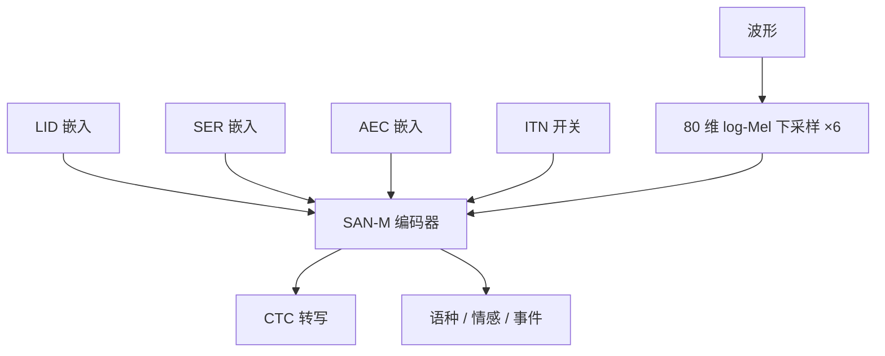

# SenseVoice

    
SenseVoice-Small 用非自回归端到端结构做五语种低延迟识别，速度超过 Whisper-small 五倍、Whisper-large 十五倍以上；SenseVoice-Large 则把高精度 ASR 做到五十种以上语言。

    <footer>—— Tongyi SpeechTeam, FunAudioLLM, arXiv:2407.04051</footer>

FunAudioLLM（阿里通义语音，arXiv:2407.04051）把语音交互拆成理解与生成两块：理解是 **SenseVoice**，生成是 CosyVoice。SenseVoice 要在一次前向里给出转写、语种、情感与音频事件，而不是串四个模型。开源落地的是 **SenseVoice-Small**（ModelScope `iic/SenseVoiceSmall`，Hugging Face `FunAudioLLM/SenseVoiceSmall`），面向中、英、粤、日、韩；Large 做 50+ 语种高精度，报告描述架构但权重策略以当时仓库为准。FunASR 工具包把 Small 标到约 234M，并可与 FSMN-VAD、标点、说话人模型拼接。本篇写 FunAudioLLM 报告与官方仓库已写明的理解模型，不把 Qwen2-Audio 的 LLM 解码器画进来。

## 问题

Whisper 一类自回归 ASR 把音频编码后再逐 token 出字，准确、多语，但延迟随字数涨，且默认不管情绪、掌声、背景乐。对话助手却经常需要：用户是不是在生气、有没有笑声、这句话要不要做 ITN。若外挂情感模型与事件检测，时间戳与标签还要对齐三次。SenseVoice 把问题收成：**同一套语音基础模型，用特殊 token 指定任务，非自回归则保延迟，自回归大号则保语种覆盖。**

数据规模：报告写 SenseVoice 训练超过 30 万小时。Small 的识别延迟陈述为小于 80 ms（报告测试环境），并给出相对 Whisper-small / large 的 5× 与 15× 以上加速。这些是官方吞吐对比，换硬件、换解码器会变。

### Small 是编码器 CTC，Large 是编码器—解码器

Small：只编码器，SAN-M（带记忆的自注意力，Gao et al. 2020）。80 维 log-Mel，连续帧堆叠后时间下采样 6 倍，得到 $\mathbf{X}_{\mathrm{speech}}\in\mathbb{R}^{T\times D}$。输入前拼四个嵌入：语种、情感、音频事件、是否 ITN。输出在对应位置预测标签，ASR 用 CTC。训练时 $\langle\mathrm{LID}\rangle$ 以 0.8 概率换成真值语种，使推理既能自动语种、也能锁语种。Large：类似 Whisper 的自回归编码器—解码器，用解码端 token 序列指定是否预测 LID / SER / 带时间戳的 AED，换准确率与 50+ 语种，放弃 Small 的固定前向延迟。

情感与事件是分类标签，不是开放词汇描述。仓库与博客列出的情绪含 HAPPY / SAD / ANGRY / NEUTRAL / FEARFUL / DISGUSTED / SURPRISED；事件含 Speech / BGM / Applause / Laughter / Cry 等。标签集以卡片为准，不要自行加「讽刺」。

## 方法

前向合同（Small）：波形 → Mel → 下采样 → 拼任务嵌入 → SAN-M → 线性到扩展词表 $V'$（含 ASR 字与任务标签）→ softmax。LID / SER / AEC 走交叉熵；ASR 走 CTC。ITN 开关决定是否输出规范化数字与标点。FunASR `AutoModel` 常与 `fsmn-vad` 组：VAD 切段再送 Small，避免把整小时录音一次性塞进 CTC 对齐。`use_itn=True` 打开逆文本正则。输出里常见前缀标签如 `<|zh|>`、`<|NEUTRAL|>`、`<|BGM|>`，解析时要剥标签再给下游 LLM。

Large 的任务指定在解码器端，可要时间戳事件，适合离线精转写。报告 Table 1 用例子对比 Whisper 与 SenseVoice-S/L 的转写风格：Small 更快但错词更多，Large 更贴标点与完整句。不要用单个例子当 WER 表。官方还强调中文与粤语相对 Whisper 的优势——这是报告主张，应用侧应在自己的 AISHELL / Common Voice 切片上复测。

### 丰富转写是产品，不是四个独立头的论文创新

把 LID、SER、AED、ITN 放进同一词表，训练目标混合 CE 与 CTC，这是多任务学习。好处是共享声学编码器、标签时间对齐自然。坏处是任务互相抢容量：强噪声下事件标签可能对、字错；纯音乐可能仍被 CTC 逼出幻觉字。FunASR 博客用真实网页片段说明：多数带 BGM 的片子被标 BGM，而 Whisper 倾向硬转写并幻觉——这是定性运维观察，不是论文主表。

## 机制

非自回归的延迟机制很简单：输出长度由下采样后的 $T$ 决定，不随字数自回归展开。CTC 允许「blank + 折叠」对齐，不需要音素时长模型。SAN-M 相对纯自注意力，用记忆模块换局部效率，是 FunASR 系 Paraformer 家族的器件，不是 Whisper 的 Transformer 块。下采样 6 把帧率打到可实时；过猛的下采样会伤辅音。四任务嵌入相当于软开关：锁 `<|en|>` 时模型少做语种搜索，类似 Whisper 锁语言 token。

Large 回到自回归是因为 CTC 在 50 语种、复杂语法上的对齐更难，解码器可以吃语言先验。这与 Whisper 同构，但词表与任务 token 是 FunAudioLLM 的丰富转写集。SenseVoice 的监督语义被 CosyVoice 拿去当 tokenizer 老师（插 VQ/FSQ），理解模型本身并不输出 codec；不要在 ASR 服务里调用声码器。

报告写 Small 开源、训练与微调代码在 GitHub。商用许可证以 ModelScope / HF 卡片为准，与 FunASR 工具包的 MIT 可能不是同一份。234M 是工具卡数字，写进容量规划可以，写进论文方法学要标明来源。

### 和 Whisper 比的是任务集合，不只是 WER

Whisper large-v3 强在语种覆盖与翻译；SenseVoice-Small 强在五语种延迟加情感事件。把 Small 换到 50 语种会议上会输给 Large 或 Whisper。把 Whisper 塞进要 80 ms 内出字加情绪的坐席质检，会输给 Small。级联（VAD + Small + LLM）才是 FunAudioLLM 演示里语音翻译、情绪闲聊的形态：理解侧出带标签文本，生成侧交给 CosyVoice。

## 边界与工程取舍

Small 不做翻译、不做开放域音频描述。重叠说话要靠外部分离或 CAM++ 日志，不是 SenseVoice 权重内的能力。情感标签文化与语料偏置明显，不能当心理诊断。CTC 无标点时要另开 ITN；ITN 规则偏中文数字习惯。长音频必须 VAD，否则对齐漂移。Large 的 50+ 语种与 Whisper 的语种表不要当成一一对应。

不要把 SenseVoice 写成 Whisper 蒸馏。不要发明 SAN-M 层数若报告未给。与 [CosyVoice 2](/llm/cosyvoice-2) 的耦合是家族设计：2 的 tokenizer 用 Large 前六层，ASR 服务仍应部署独立的 Small/Large 检查点。

出处：Tongyi SpeechTeam，*FunAudioLLM: Voice Understanding and Generation Foundation Models for Natural Interaction Between Humans and LLMs*，arXiv:2407.04051。仓库 https://github.com/FunAudioLLM/SenseVoice ；FunASR 集成见 modelscope/FunASR。演示 https://fun-audio-llm.github.io。

## 小结

- SenseVoice 是多任务语音理解模型：ASR、LID、情感、音频事件，可选 ITN 与标点。
- Small：SAN-M + CTC，五语种，非自回归低延迟；Large：编码器—解码器，50+ 语种。
- 任务由前置（Small）或解码端（Large）特殊 token 指定。
- 官方称 Small 相对 Whisper-small / large 有 5× / 15× 以上速度，延迟陈述小于 80 ms。
- 开源检查点以 SenseVoice-Small 为主；与 CosyVoice 组成 FunAudioLLM。
- 出处：arXiv:2407.04051。
