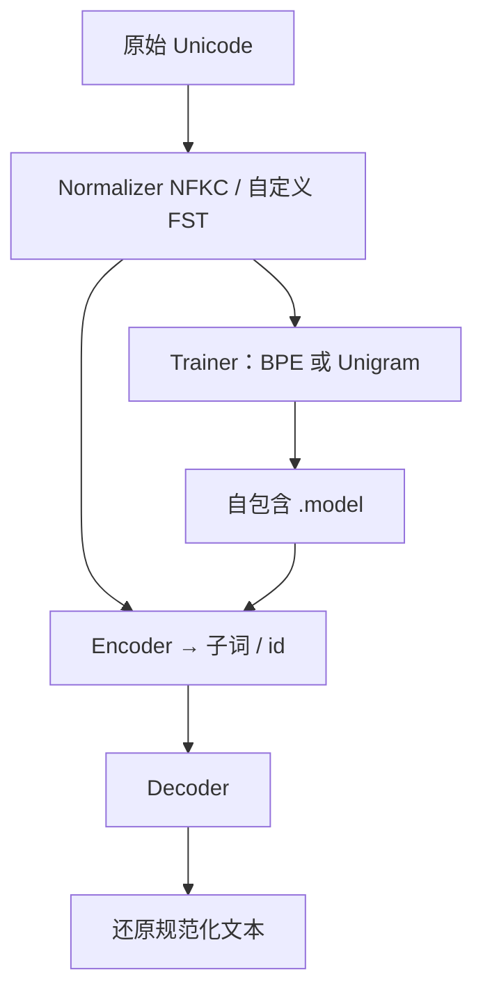

# SentencePiece

现有子词工具假定输入已经按词切开；直接从原始句子训练，才能把分词做成与语言无关、且编码可逆的端到端前处理。

<footer>—— Kudo and Richardson, SentencePiece: A simple and language independent subword tokenizer and detokenizer for Neural Text Processing, EMNLP 2018</footer>

Kudo 与 Richardson 在 Google 把 SentencePiece 做成一套自包含的子词工具：C++/Python、Apache-2.0，同时实现 Sennrich 等人的 BPE 与 Kudo 同年提出的 Unigram 语言模型，并且**不要求** Moses、KyTea 式的预分词。空格被当成普通字符，先转义成 meta 符号 `▁`（U+2581），再与字母一起参与合并或概率切分。解码是编码的逆：`Decode(Encode(Normalize(text))) = Normalize(text)`。这一设计让同一套词表服务中日韩与有空格语言，也让 T5、ALBERT、mT5、Llama 1/2 可以把 tokenizer 文件连同权重一起分发，而不去依赖「当时那版 Moses 的命令行」。今日的大模型词表有的已经换成字节级 BPE 与 tiktoken，但「无损、自包含、从生文本训练」这三条，仍然是 SentencePiece 写进工具史的约束。

## 问题

2018 年的 NMT 口头上是端到端，管道上仍绑着语言相关规则。欧洲语言靠空白切词再跑 subword-nmt；中文要先外挂分词器；多语言系统（Johnson 等人的 Google MNMT）每加一种语言就多一套预/后处理配置，而网络内部其实与语种无关。预分词还有信息损失：`Hello world.` 切成 `[Hello] [world] [.]` 之后，无法知道句点前有没有空格，detokenize 只能靠语言相关启发式。subword-nmt 用 `@@` 标词内边界，连续空格仍表示不了，切分不可逆。

子词算法本身也绑死了工具。BPE 的超参是合并次数；Unigram 的超参是最终词表大小。两套训练程序、两种输入约定，使「换算法」变成「换前处理生态」。Kudo 的子词正则化还要求训练时对同一句采样多种切分，离线预处理无法提供这种随机性。需要一个把规范化、训练、编码、解码收进同一模型文件的库，并且对生语料足够快——朴素 BPE 每轮扫相邻对是 $O(N^2)$，在未切词的长句上不可接受。

### 无损分词是可逆性，不是「不切词」

无损指规范化后的 Unicode 串能从 token 序列唯一还原。它仍切子词，仍丢弃未进入 NFKC（或自定义规则）的等价差异。空白被保留为符号，所以中文「不插空格」与英文「词间空格」用同一套 decode：拼接后再把 `▁` 换回空格。若训练语料里把中文人工插了空格，`▁` 会学成「词边界」而不是「原空白」，中文生成会出现碎空格。语言无关依赖的是「空白即字符」，不是「所有语言都该有空白」。

## 方法

四个模块。Normalizer 默认 Unicode NFKC，用最长匹配与编译好的 FST（Aho–Corasick）做串到串映射；用户可用 TSV 加规则，例如把组合音符收成预组合字符。Trainer 在规范化语料上训 BPE 或 Unigram，命令行给 `--vocab_size` 而不是合并次数，以便两种算法共用同一套「最终词表大小」语义。Encoder 先规范化再切分，可直接输出 id。Decoder 是逆操作。特殊符号 UNK/BOS/EOS/PAD 占住保留 id，也可自定义 `<2ja>` 这类语种符。模型文件是 Protocol Buffer，内含词表、算法参数以及预编译的规范化 FST——行为只依赖这一个文件，与 Unicode 版本、Moses 开关解耦。库 API 支持在线切分，从而在训练步内做子词正则化或 BPE-Dropout，而不必先把语料写成死 token。

BPE 侧用堆维护相邻对频率，把切分降到 $O(N\log N)$。Unigram 侧训练与切分对语料规模线性，并给出每个子词的 $-\log p(x)$，便于采样替代切分（Kudo 2018 的正则化）。默认 NFKC 并不实现完整的 Canonical Combining Class 重排，只覆盖可用 FST 表达的子集；需要完整 Unicode 语义时要自己知道这条边界。

### BPE 与 Unigram 不是两种前端，是两种词表哲学

BPE 自底向上：从字符表出发，反复合并全局最频相邻对，直到词表满。推理确定、实现简单，Llama 一类解码器常用 SentencePiece-BPE。Unigram 自顶向下：先准备一个过大的候选词表，用 EM 估概率，再删掉对似然伤害最小的符号，反复修剪。同一句有多个合法切分，训练时可采样，T5 / mT5 / ALBERT 走这条。SentencePiece 的贡献是让二者共享空白处理、规范化与 id 编解码；它不是第三种切分算法。词表里字符与子词混排，未登录拼写靠更短片段或 UNK——早期配置若不含字节回退，噪声字符会变成 UNK 黑洞，这是后来 GPT-2 字节级 BPE 要补的洞。

比较「32k SentencePiece」与「100k tiktoken」时，先看算法与预分词。T5 的 32k Unigram 与 Llama 的 32k BPE 对中文的碎词程度不同；再叠 NFKC 是否折叠全角，数字会被切成完全不同的 id 序列。只报 vocab_size 没有意义。

## 机制

把空白纳入符号表，等于把「词」从语言学单位降成统计块。有空格语言里，高频词仍会作为带 `▁` 的整词出现；无空格语言里，块边界由共现决定，不必先有一部词典。无损性保证 detokenize 不再是单独一门手艺，这对生成式模型的服务路径至关重要：id 流可以在 CPU 上还原字节，而不调用语言相关规则。自包含模型文件把前处理的可复现性提升到与权重同级——Post 2018 曾指出预处理的微小差异会大幅改 BLEU；把 FST 焊进 `.model` 是对那篇警告的工程回答。

Unigram 的似然是 $\sum_{x\in D}\log \sum_{s\in \mathrm{Seg}(x)} p(s)$，内部切分求和使词表能表达「多种分法」。正则化在训练 NMT 时相当于对分词噪声做数据增强，对后来 LLM 的用处变小，因为因果语言模型多用确定切分以免训练/推理不一致。尽管如此，Unigram 词表本身往往对罕见词更省长度。BPE 则把「语料里常见的粘连」焊死成原子，对代码里的 `for(` 与英文 `'s` 友好，也对词表污染（网页乱码、重复标点）来者不拒——训练数据有多脏，合并就有多脏。

### 与字节级 BPE、tiktoken 的分工

SentencePiece 默认在 Unicode 字符上操作，辅以 NFKC。GPT-2 起的字节级 BPE 先把文本打成 UTF-8 字节，256 个基符号保证永不 UNK。tiktoken 是后者的高速推理实现，几乎不训练词表。Llama 1/2 仍用 SentencePiece-BPE；Llama 3、GPT-4 一类改 tiktoken 式编码。迁移时不能用 SentencePiece 去「近似」cl100k：空白标记、预分词正则、字节回退全不同，同一句的 token 数可差出一截，上下文预算与计费会对不上。正确做法是权重与 tokenizer 绑定，而不是用「都是 BPE」当互换许可证。

## 边界与工程取舍

NFKC 会折叠兼容字符，对想保留全角风格或某些数学字母形状的任务是伤害。FST 子集不等于完整 Unicode 规范化。Unigram 训练要调极大候选表与剪枝节奏，比 BPE 重。在线正则化与推理时的贪心切分若不一致，会在评测上制造幽灵增益。词表若按英语网页训，日文汉字会被切得很碎，这是数据问题不是算法问题——SentencePiece 语言无关，不自动语言公平。服务路径上，纯 Python 绑定不如 tiktoken 的 Rust 核快，这是实现而不是论文范围；但 `.model` 的加载与规范化 FST 仍有一次性成本，应在进程启动时完成。

不要把 spm_train 用在已经 BPE 过的 id 文本上「再训一次」。输入必须是规范化前的生文本。也不要把 `▁` 显示成普通下划线混进训练语料，那会污染空白符号。

## 小结

- SentencePiece 从生文本训练 BPE 或 Unigram，不依赖语言相关预分词。
- 空白视为字符并以 `▁` 转义，编码可逆，detokenize 无语言规则。
- 词表大小、规范化 FST 与算法参数打进同一个 Protocol Buffer 模型文件。
- BPE 确定合并；Unigram 提供概率切分与子词正则化，T5 与 Llama 分属两路。
- 默认 NFKC 是可复现的折中，不是完整 Unicode 语义。
- 与 tiktoken 字节级编码不互换；必须与权重版本绑定。
- 出处：Kudo and Richardson，*SentencePiece*，EMNLP 2018 Demo；算法对照 Sennrich et al. 2016 BPE、Kudo 2018 Unigram；服务实现对照 OpenAI tiktoken。
