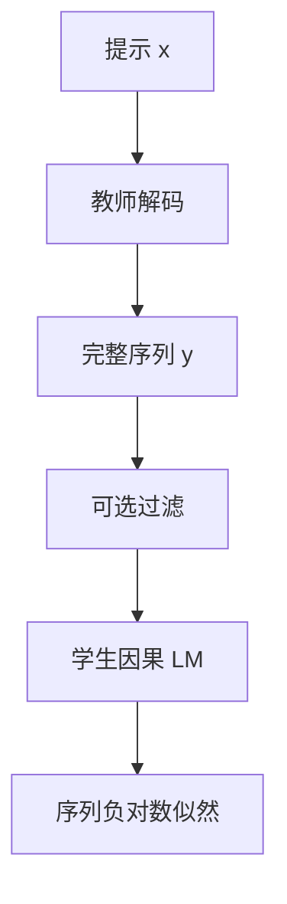

# 序列级蒸馏

学生不必在整张词表上对齐教师的每一步条件分布；它只要学会把教师采样出来的那条完整序列，当成自己的训练目标。

<footer>—— 接到 Kim &amp; Rush, Sequence-Level Knowledge Distillation, EMNLP 2016；对照 Hinton 等人的词表蒸馏</footer>

词表级蒸馏把教师每一步的 softmax 当作软标签，学生用 KL 去贴。序列级蒸馏换了一个对象：先让教师把整段输出写完——束搜索、采样、或温度解码都可以——再让学生在这条完整序列上做普通的因果语言建模。Hinton、Vinyals、Dean 2015 年的配方回答的是「类别分布怎么传」；Kim 与 Rush 在机器翻译里指出，生成任务真正被评的是整句，逐步 KL 最小并不等于 BLEU 最高。今日把大模型压到小模型、把长解答写成可微调语料，用的多半是后一条路：学生跟教师采样序列，而不是跟教师的整表 logits。

## 问题

自回归模型的训练损失是逐步的：每个位置只看见真前缀，预测下一个 token。推理时前缀却来自自己刚才的采样，训练—推理缝合不上，这就是曝光偏差。词表 KL 把缝合问题原样留给学生：它在教师前缀上模仿教师的条件分布，部署时却走自己的前缀。若学生容量远小于教师，它甚至无法在 10 万级词表上同时拟合教师的峰与长尾，KL 下降只说明「在教师前缀上更像」，不说明「自己生成时更对」。

序列级评测（翻译的 BLEU、数学的最终答案、代码的单测）只看完整 $y$，不看中间每一步的交叉熵。教师一条高分序列，逐步看可能并不是逐步最优；学生若被逐步 KL 拉去复现教师的全部质量，会把容量耗在次优 token 的相对排序上。生成式蒸馏要问的是：能否直接在序列空间里模仿教师，让损失与下游度量同构。

### 逐步 KL 无法看见序列终点

对提示 $x$，教师分布是 $p_T(y\mid x)=\prod_t p_T(y_t\mid y_{<t},x)$。词表蒸馏在每个 $t$ 最小化 $\mathrm{KL}\bigl(p_T(\cdot\mid y_{<t},x)\,\|\,p_S(\cdot\mid y_{<t},x)\bigr)$，前缀 $y_{<t}$ 通常来自数据或教师。序列级目标近似最大化 $p_S(y^{(T)}\mid x)$，其中 $y^{(T)}$ 是教师的一条完整样本（或束搜索假设）。两条目标在 $p_S=p_T$ 时一致，学生欠容量时差得很远：逐步 KL 是局部的，序列似然才把「后面那些 token 是否还能接上」算进梯度。

词表蒸馏还要求师生词表可对齐，否则 KL 没有定义。序列蒸馏的接口是文本：教师 decode 成字符串，学生用自己的 tokenizer 再编码。词表不同、字节回退、特殊符号不一致时，序列路往往是唯一能落地的路。见 [端侧蒸馏](/llm/on-device-distill)。

## 方法

固定教师，对每个 $x$ 得到一条或多条 $y^{(T)}$，学生最小化

$$
\mathcal{L}_{\mathrm{seq}} = -\sum_t \log p_S\bigl(y^{(T)}_t \mid y^{(T)}_{<t}, x\bigr).
$$

这就是标准 SFT，标签来自教师而不是人类。Kim 与 Rush 在翻译里用教师的束搜索假设作为序列目标，并讨论用序列级分数（如 BLEU）做进一步的序列级训练；LLM 实践里更常见的是采样多条再过滤，而不是把 BLEU 直接写成强化学习奖励。过滤可以按规则（答案可核对）、按奖励模型、或按格式，那是 [拒绝采样](/llm/rejection-sampling-rft) 与蒸馏的交界，本篇只要求：进入学生损失的是完整序列，不是逐步软标签。

### 教师序列怎么采

解码协议决定学生会模仿哪一种教师行为。贪心或低温度束搜索给出锋利、重复模式少、多样性差的序列；核采样或较高温度给出覆盖更宽、也更吵的序列。若目标是把教师的「会写什么」压进学生，应用域上的采样比在通用网页上的贪心更有用。多条样本可以并存：同一 $x$ 留若干条高分 $y$，学生按序列混合学习，相当于用数据近似教师的序列级分布，而不是只学一条 MAP。

存储与算力上，离线把 $y^{(T)}$ 写成数据集，训练环里不再跑教师，这是 [离线蒸馏](/llm/online-offline-distill) 的默认。教师很大时，这几乎是唯一能按学生吞吐训练的办法。在线则在每个 batch 现采，能跟着学生当前的错误提示再采，贵。

## 机制

序列损失把梯度沿学生自己的因果链回传。被模仿的 token 若落在推理链、公式、代码块里，学生学的是「这种长度的程序怎么往下写」，而不是「在教师的隐空间里次优词的相对质量」。这与 [推理链蒸馏](/llm/cot-distill) 是同一机制的特例：链只是序列的一种写法。

对曝光偏差的修补是间接的。训练前缀来自教师序列，仍不是学生自己的前缀；但教师序列通常比人类标注更接近「模型能生成的语言」，学生的支持集被拉到生成流形上，部署时的前缀更可能曾在训练里出现过。这不是从数学上取消曝光偏差，而是用教师的生成分布当数据，缩小训练与解码的分布缝。

### 容量被花在整段程序上

小学生装不下教师的全部世界知识，序列蒸馏等于用数据选择要印下的程序：解题步骤、工具调用格式、拒绝话术。没出现在 $y^{(T)}$ 里的事实，学生不会从逐步 KL 的长尾里「渗」出来。因此序列桶的覆盖比损失公式更重要。DeepSeek-R1 把长链轨迹蒸馏到稠密小模型时，走的是这条路：只 SFT 轨迹，不再对学生做 RL，报告把「再 RL」留给社区。

不要把序列蒸馏写成「没有温度的蒸馏」。教师采样温度仍在，它决定 $y^{(T)}$ 的锋利程度；学生训练目标里通常不再有 $T^2\mathrm{KL}$。两套温度不要共用一个配置项。

## 边界与工程取舍

### 教师的幻觉会被当成监督

序列蒸馏会放大教师的失败模式：虚假引用、格式漂移、中英混写，只要它们出现在被选中的 $y^{(T)}$ 里，学生就会当正确答案学。可验证域应用规则过滤；开放域只能靠奖励模型或人工抽检，过滤本身又引入奖励黑客的缝。词表 KL 至少还保留「教师也不确定」的软质量；序列路把不确定性压成一条硬轨迹。

教师过强、学生过弱时，长序列会变成容量陷阱：学生学会教师的套话与链的语言模型，中间变量对不齐，最终答案仍错。应截断链、拆成短步骤，或把监督改回「只学答案、链仅作提示」。评测必须含教师没生成过的提示，否则只是在测记忆教师语料。

束搜索假设在翻译里接近「教师的高分句」；在开放生成里束搜索会压多样性、抬重复。LLM 序列蒸馏更常采样而非束搜索。不要把 Kim &amp; Rush 的翻译设定原样抄到对话模型上还声称同构。

## 小结

- 序列级蒸馏让学生在教师给出的完整序列上做因果 LM，而不是逐步对齐整表 softmax。
- 它与下游的序列度量更同构，也避开词表不对齐；代价是丢掉教师的逐步暗知识，并复制教师幻觉。
- 解码协议（贪心、束搜索、采样）决定学生模仿哪一种教师行为；多条过滤后的序列近似教师的序列分布。
- 小模型的容量花在被写出的程序上，覆盖比损失名字更要紧。
- 出处：Kim & Rush, *Sequence-Level Knowledge Distillation*, EMNLP 2016；词表侧对照 Hinton, Vinyals, Dean, 2015。
