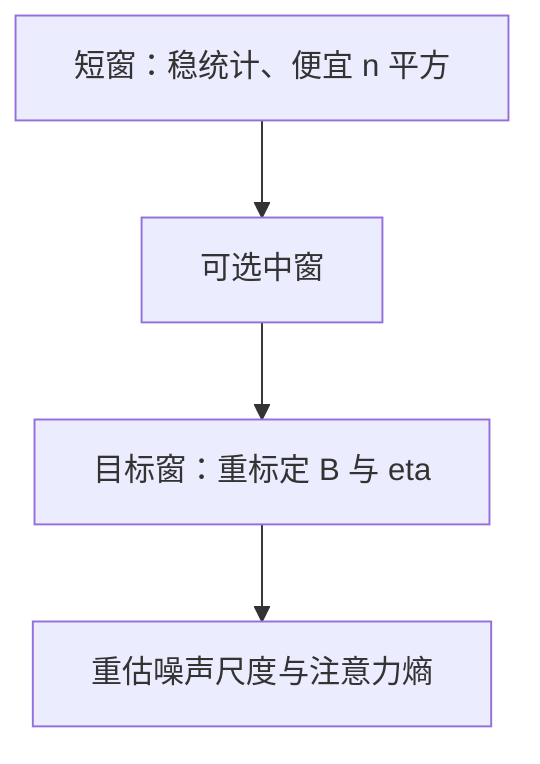

# 序列长度预热

先在短上下文上把统计与优化器状态跑稳，再把窗口拉长；注意力二次项与有效 batch 会一起变，不能只改 $n$ 不改日程。

<footer>—— 课程学习见 Bengio et al., ICML 2009；短序列预训练再长程见 Press, Smith & Lewis, Shortformer, EACL 2021；实现传统见 Megatron-LM 一类配方</footer>

[上一课](/llm/gradient-noise-scale)把 $B$ 与 $B_{\mathrm{noise}}$ 钉成 token batch。缺口是 $B$ 的因子里有序列长度 $n$：许多配方先用短 $n$ 训，再切到目标上下文，以省早期的 $n^2$ 注意力，并避免一开始就面对 [注意力 logit 增长](/llm/attention-logit-growth) 在长行上的极值。Press 等人的 Shortformer 把短上下文训练当成效率工具。本课写预热怎么改 $B$、$\eta$ 与掩码，不重讲 RoPE 外推。

## 问题

目标 $n=8192$，从头就用 8192：前向贵，packing 浪费在尚未学会局部统计的模型上，注意力 row-max 更容易大。先 $n=512$ 或 2048，等进入幂律段再升。Bengio 的课程学习提供动机：先易后难。困难不只是语义长程，也包括数值：键的个数变多，softmax 竞争变烈，熵传感器会跳。

升 $n$ 而不改全局 token $B$，意味着微 batch 行数要降，或累积步要改。升 $n$ 且保持微 batch 行数，则 $B$ 变大，$\eta$ 应按批次定律改，否则悄悄越过 $B_{\mathrm{crit}}$。两种策略都合法，禁止未声明地混用。

位置编码 / RoPE 的频率表按目标 $n$ 还是按当前 $n$ 初始化，必须一开始就选定。按短 $n$ 训死再突然改频率基，等于换位置几何。本课假定几何已按目标上下文备好，只是训练窗口从短切到长。

## 方法

阶段表（示例结构，数字要扫）：

1. 短窗：占预算 10–30% token，$n=n_1$，调好 $\eta$ 与 warmup。
2. 中窗：可选。
3. 目标窗：$n=n_{\mathrm{tgt}}$，按 $B$ 的变化重标定 $\eta$，重估 $B_{\mathrm{noise}}$。

切窗时重置或不重置 Adam 状态要显式。不重置：$v$ 仍是短窗上的尺度，第一步长窗可能尖峰（$\beta_2$ 课的滞后）。可在切窗时对 $\eta$ 做短 warmup，或略降 $\beta_2$ 数 k 步。数据：短窗阶段应仍采样自同一语料，不要只用短文档，否则切到长窗时文档长度分布突变。packing 短文档进长窗会制造虚假长程依赖，评测 BPB 应用真实长文档。

FlashAttention 的因果核在短窗已经正确；切长窗主要是内存与调度，不是换公式。若短窗曾因无 cap 而熵尚可，长窗可能被迫打开 cap——稳定件可以随 $n$ 加，不要假装短窗消融已覆盖长窗。

## 机制

短窗上每行 softmax 的分母项少，路由更易尖，但绝对值 $s$ 的极值通常更小。长窗相反：极值更大、也更需要分散注意力。模型在短窗学到的局部复制与 n-gram，到长窗仍可用；长程回路要在长窗阶段才有监督信号。因此过晚升窗，会把太多预算花在永远见不到长程的模型上；过早升窗，优化器与稳定性还没过压熵段。阶段课的「进入幂律段再升」是折中。

## 边界

本课不是位置外推课：训练窗等于推理窗是默认；外推（YaRN 等）另写。也不处理环形注意力、分块稀疏——那些改连通性。文档 packing 在切窗后应重算「真实长文档占比」，否则 BPB 会把短文拼接当成长程已学会。

切窗当日记一次注意力 row-max 与 $B_{\mathrm{noise}}$，不要等 CE 尖了再回头猜是 $n$ 还是 $\eta$。下一课问数据是否看多遍：多 epoch 与重复，会在任何 $n$ 上改变噪声尺度与过拟合时间。

## 小结

- 序列长度预热是课程学习：先短后长，省早期二次项并推迟极值 logits。
- 改 $n$ 即改 $B$；$\eta$、噪声尺度、$\beta_2$ 滞后都要在切窗点重看。
- 位置几何按目标 $n$ 预备；数据不要只用短文档。
- 短窗上的稳定件结论不能自动覆盖长窗。
- 切窗点要重打注意力 row-max 与噪声尺度，不要等 CE 尖了再归因。
- 出处：Bengio et al., ICML 2009；Press et al., EACL 2021。
