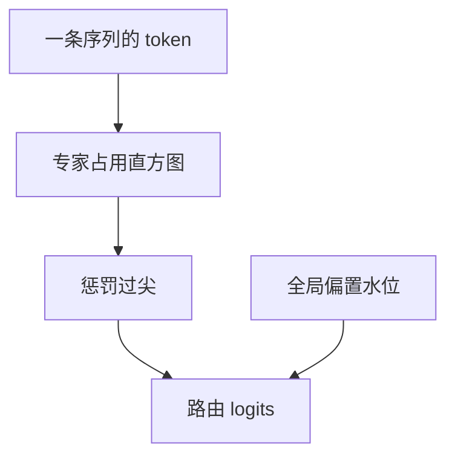

# 序列级均衡

全局 batch 均匀不等于每条序列均匀；一条句子若只进两三个专家，长上下文上的特化与缓存都会歪。

<footer>—— Dai et al., DeepSeekMoE, 2024 中的 sequence-level 均衡；ST-MoE 对稳定性的讨论见 Zoph et al., 2022</footer>

[上一课](/llm/node-limited-routing)约束了 token 能看见哪些设备。[无辅助损失均衡](/llm/aux-loss-free-balancing) 看的是全局水位。一条长度为 $n$ 的序列，其 $n$ 个 token 仍可能扎堆少数专家：全局统计被其它序列填平，这条序列自己的路由却极度稀疏。本课补**序列级**均衡：在单条样本的 token 集合上惩罚或约束专家占用。后课特化分析要先知道「均匀」是哪一级。

## 问题

预训练 MoE 的负载表按 micro-batch 计。语言数据里，代码文件、对话、重复模板会让同一专家在一条序列上被反复选中——对特化也许是对的，对容量与推理缓存是错的：该专家成为热点，其它专家在这条序列上闲置，[MoE 推理缓存](/llm/moe-inference-cache) 若按序列常驻会偏斜。缺口是把均衡指标从 batch 降到 sequence，而不强制每条序列用遍所有专家（那会毁特化）。

DeepSeekMoE 引入序列级辅助损失，鼓励一条序列覆盖更多专家。Zoph 等人的 ST-MoE 从稳定性角度也强调路由不要把局部批量打成极端。本课取「按序列统计占用」这一方法。

序列级与 token 级 drop 不同。Drop 是容量满了丢 token；序列级均衡是希望一条序列的路由直方图别太尖。

## 方法

对序列 $s$，记专家 $i$ 被选中的次数 $c_{s,i}$。目标可以是 $c_{s,\cdot}$ 与均匀的 KL，或惩罚 $\max_i c_{s,i}/n$。损失加在路由 logits 上，权重通常小于语言损失，且可与全局偏置并存：全局管水位，序列管尖峰。无辅助损失体系里，也可以按序列调节临时偏置，但实现少见，课序以可微序列项为主。

$k>1$ 时，覆盖更容易，序列级项更松。$k=1$ 的 Switch 式更需要它，否则一条长句等于一条专家轨迹，轨迹一偏就全程偏。

### 与节点受限叠加

可见专家已经是子集时，序列级均匀应在**可见子集**上定义，否则损失会要求用到不可达专家，与上一课打架。写实现时先 mask 再算直方图。

## 机制

序列级项迫使门在同一上下文里切换专家，增加组合数：主语、动词、数字可能落到不同专家，专家必须在同一篇章的不同片段上协作。这对特化是温和的正则——不允许「这篇文档包给一个专家」。过强则退回哈希式切片，每个 token 换专家，专家看不到连续短语。

推理热点：若服务端按专家做批处理，序列级更均匀能降低单专家队列的长尾延迟。这是系统收益，不一定显示在困惑度上。与全局偏置分工：偏置纠正「这个专家这几天太热」，序列项纠正「这一篇太专一」。只开一个，另一种尖峰仍在。

短序列上直方图噪声大，$n=32$ 时谈「覆盖 64 个专家」无意义。应用序列级项要设最小 $n$ 或按 $n$ 缩放目标覆盖数。

## 边界

不要把序列级均匀当成公平性伦理，它是负载与组合正则。指令微调时一条指令可能确实该主要由代码专家处理，强行覆盖会伤任务。后课 MoE 微调会允许更尖的路由。评测应同时报全局 Gini 与序列内熵，只报一个会误导。下一课用分析工具看专家到底专精了什么，均衡指标只是占用，不是语义。

## 小结

- 全局均匀掩盖单序列扎堆；序列级均衡约束一条样本内的占用尖峰。
- 与节点受限同时用时，均匀定义在可见专家子集上。
- 过强会破坏短语级特化；短序列要缩放目标覆盖。
- 系统上可减热点长尾，困惑度不一定动。
- 出处：Dai et al., DeepSeekMoE, 2024；Zoph et al., ST-MoE, 2022。
