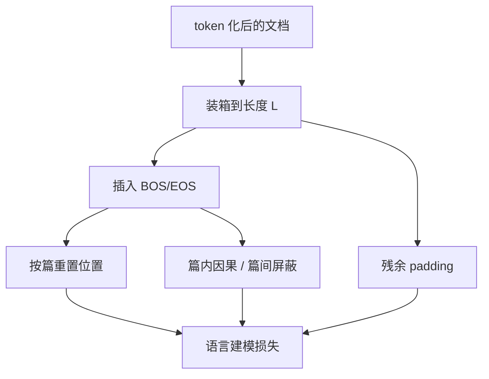

# Packing 与文档边界

把短文档拼进固定上下文窗口，是为了少做 padding；若不在边界上切断注意力与位置，模型会把上一篇的结尾当成下一篇的前文。

<footer>—— 综合 T5 / PaLM 等预训练 packing 实践</footer>

预训练的上下文长度 $L$ 是硬件与算法给定的槽位。网页、书籍章节、代码文件的长度分布却很偏：大量文档远短于 $L$，少数远长于 $L$。若一条样本一篇文档，短篇要用 pad token 填满，$L$ 越大浪费越夸张。Packing 把多篇文档拼接成接近 $L$ 的序列，提高有效 token 占比。Raffel 等人在 T5、后来的 PaLM 与多数 Megatron 式栈都这样做。代价是文档边界变成一等公民：位置编号、注意力掩码、损失掩码必须知道「哪一段属于哪一篇」，否则因果语言模型会在篇与篇之间合法地抄上文。

## 问题

设文档长度（token 计）为 $\ell_i$。独立成批时，一条样本的有效比例是 $\ell_i/L$（截断或填充之后）。$\ell_i\ll L$ 时，注意力与 GEMM 仍按 $L$ 付费，梯度却只来自 $\ell_i$ 个位置。Packing 的目标是构造序列 $x$，使 $|x|\approx L$ 且 $x$ 由若干整篇（或截断后的篇）拼接而成，padding 只出现在拼不齐的残差。这是装箱问题：在线（贪心把下一批文档塞进当前槽）或离线（对长度排序后 best-fit）。

边界问题随拼接出现。标准因果注意力下，位置 $t$ 可以看见 $1\ldots t$。若两篇首尾相接，第二篇的第一个 token 能看见第一篇全文。对语言建模似然，这相当于泄漏了一篇无关文档当条件，既改变训练任务，也可能让模型学到「语料里相邻的文章」这种打包伪影。位置编码若跨篇连续增长，RoPE 的相位会把「篇首」编码成「上下文很深的位置」，与单独训练该篇时不同。因此 packing 不是 `concat` 一行能结束的。

### 截断、残留与浪费

长于 $L$ 的文档必须切段。切段策略：按句子或按 $L$ 硬切、是否保留重叠、是否丢弃短于阈值的尾段。尾段若单独成篇再 pack，会制造大量无开头的残缺文档；若丢弃，浪费尾部监督。装箱残留（最后填不满的几十字）用 padding。报告 packing 效率应同时给：padding 比例、跨篇注意力是否允许、切段丢弃比例。只说「做了 packing」无法复现有效算力。

有的实现故意允许跨文档注意力，把 packing 当成一种廉价的「多文档上下文」，声称有正则效果。这与「文档是独立样本」的假设不同。两种配方都可以，但不能混用同一套评测解释：允许跨篇时，模型在包内相邻域上的条件分布被改写了。

## 方法

常见做法是离线把文档打成长度列表，用 best-fit decreasing 或简单贪心填入容量为 $L$ 的桶，桶内顺序保持原文档顺序或按长度排。每篇前后加 BOS/EOS（或文档分隔 token）。注意力掩码做成块对角因果：篇内下三角，篇间全屏蔽。实现上可用 FlashAttention 的变长接口：传入每篇的 `cu_seqlens`，把一个 packing 序列当成若干独立变长样本在同一核里算，物理上仍是一条 tensor，逻辑上无跨篇边。这比构造稠密 $L\times L$ 掩码更省。

位置编码按篇重置：每篇从位置 0（或从 BOS）计，使 RoPE 相位与单独一篇时一致。损失只在「预测文档 token」的位置上计算：padding、以及有时 BOS 本身不计。有人把 EOS 计入，让模型学结束；有人不计。应固定。指令数据 packing 还要保证：同一条指令-回答不被切断到两个窗口，或切断时回答侧有完整上文。预训练网页相对宽松，但仍应避免在句子中间硬切过多，否则下一窗口没有句级上下文。

### 在线 packing 与动态长度

离线装箱适合静态语料。流式或多源混合时，常用在线：维护一批未满桶，新文档放进第一个能装下的桶，否则开新桶。吞吐稳定，但填充率低于离线排序。动态 $L$（长上下文课程）下，旧的 packed 文件要重切。与 [分布式清洗](/llm/distributed-clean) 的衔接是：packing 是 tokenization 之后的步骤，应使用最终 tokenizer，否则长度估计是错的。多语言混合时，不要把同一桶里的语言随机到失去课程结构——若配方要求语言分批，packing 只在桶内发生。

## 机制

效率机制是算术强度与有效 token 比。Attention 与 FFN 按序列长度计费；padding 位置若仍参与核（未走变长路径），纯属浪费。变长核按实际 token 计费，packing 的收益主要来自「减少 kernel 启动与小序列占用率问题」以及「把许多短篇合成能喂饱 GPU 的长度」。边界机制是条件独立：块对角掩码使 $\log p(x^{(2)})$ 不依赖 $x^{(1)}$，恢复「文档 i.i.d.」的近似。位置重置使相对位置统计与未 packing 时对齐，避免模型把「pack 内偏移」当成语义。

分隔 token 的机制是给模型一个可学习的「话题切换」信号。即使掩码已经切断注意力，EOS 仍帮助生成侧学会结束。若既无掩码又无分隔，packing 就是把语料变成一篇超长乱序书。

FlashAttention 变长接口按真实长度计 FLOPs，但仍可能因桶内长度不一而负载不均。packing 时让同一 batch 内各序列都接近 $L$，比「有的 4k、有的 128」更利于占用率。这是 packing 与 microbatch 组成的联合问题。

### 与损失、优化器的交叉

packing 提高每 step 的有效 token 后，应重标学习率与 token 预算：同样的 step 数不再对应同样的文档覆盖。按 token 计的 cosine 日程比按 step 计更稳。梯度累积时，一个 packed 序列里多篇文档的梯度已经平均在同一条反向里，和「每篇一个样本再平均」的权重不同——长篇在 packed 序列里占更多位置，自然获得更多损失质量。这通常是想要的（按 token 而不是按文档均匀）。若配方要按文档均匀，需在损失里按篇重加权，而不是只 packing。

## 边界与工程取舍

跨篇掩码增加实现复杂度，与某些编译好的 SDPA 后端不兼容，于是有团队在早期用「只 concat 不加掩码」换吞吐。那是明确的配方选择。文档分隔 token 若从未在词表中充分出现（只在 pack 边界），可能学不好；应用足够频率或复用已有 EOS。极端短文档（标题党一行）packing 后仍可能让模型在低信息跨度上浪费损失；应在清洗阶段设最小长度，而不是靠 packing 拯救。

评测与训练的 packing 政策应一致：下游微调若单文档不 pack，而预训练长期跨篇泄漏，领域迁移会怪。长上下文继续预训练时，要决定是否允许把多篇长文拼到 32k：允许则模型见到更多边界，不允许则单篇内部依赖更完整。两种都要在数据卡上写。

Packing 效率接近 100% 并不自动等于更好的模型。把不相关领域硬塞进同一窗口且切断掩码，只是提高了硬件利用率。若发现下游掉点，先查边界掩码是否坏了、位置是否未重置，再查是不是配比被装箱顺序打乱。

## 小结

- Packing 把短文档装进固定窗口，减少 padding，提高有效 token 占比。
- 文档边界需要分隔 token、按篇重置位置、以及篇间注意力屏蔽（除非配方明确允许跨篇）。
- 变长注意力接口用 `cu_seqlens` 实现块对角因果，比稠密掩码更适合融合核。
- 长文档切段与尾部丢弃要记账；装箱算法影响填充率。
- 按 token 计日程；长篇在 packed 损失里天然权重大。
- 效率数字必须与边界政策一起报告，否则不可复现。
- 出处：Raffel et al., T5 / C4 packing；PaLM 与 Megatron 式预训练栈中的样本拼接实践。
