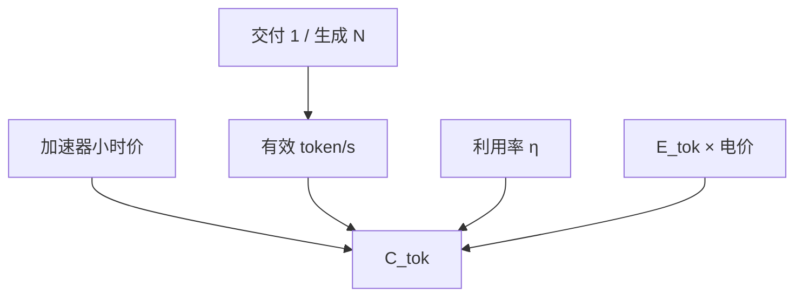

# 服务成本模型

token 价格不是模型质量的函数，而是 GPU 时间除以有效吞吐，再叠上利用率、电与失败重试。

<footer>—— 对照 Pope 等对推理扩展的阶段划分，以及 Splitwise 把 prefill 与 decode 分到不同机器的成本动机（Patel et al.）</footer>

[上一课](/llm/energy-per-token)给出每 token 焦耳。财务账单通常由 *租用的加速器小时* 主导，电是第二项。本课把吞吐、利用率、阶段拆分收成单位 token 成本，使「再开一个 $N=8$ 投票」能写成美元，而不是口号。Splitwise（Patel 等）把 prefill 与 decode 拆机，正是因为两段的屋顶不同、机器单价不同。本课写模型，不写某一云厂商价目表当科学常数。

## 问题

有效成本

$$
C_{\mathrm{tok}}\approx\frac{C_{\mathrm{GPU-h}}/3600}{\eta\cdot \mathrm{TPS}}+C_{\mathrm{energy}}(E_{\mathrm{tok}}),
$$

其中 TPS 是集群级 token/s，$\eta$ 是相对峰值吞吐的利用率（排队、气泡、失败重试、投机拒绝都进 $1-\eta$）。缺口是：产品按提示 token 与生成 token 分开计价，成本也必须分阶段——prefill 算力密、decode 带宽密，混用同一 $C_{\mathrm{GPU-h}}$ 与同一 TPS 会把长提示用户补贴给长生成用户，或反过来。

多样本：$N$ 条生成把分母上的「用户可见 token」变成 $1/N$ 的有效产出（若只交付一条）。自洽的准确率增益要拿 $N\times C_{\mathrm{tok}}$ 比。这是上一课程留下的账，现在可以算。

排队时间消耗租时但不产 token，全部进 $\eta$。只在 GPU busy 时测 TPS 会低估真实 $C_{\mathrm{tok}}$。SLA 拒请求若仍占着 KV 槽，同样进利用率。

## 方法

分两项吞吐：TTFT 路径的 prompt-TPS，TPOT 路径的 gen-TPS。机器池若分离，用各自的 $C_{\mathrm{GPU-h}}$ 与 $\eta$。若混合，用拐点课的工作点：decode 池保持在 $B^\star$ 左侧以满足 TPOT，多余算力才去 prefill。投机：gen-TPS 用 *接受的* token，成本含草稿。KV 容量限制最大 $B$，从而限制 TPS 上限——成本模型必须受[容量公式](/llm/kv-cache-size-math)约束，不能假设线性加机器就线性加 TPS（互连与调度会弯折，后课程通信课再写）。

## 机制

$C_{\mathrm{tok}}$ 对 $\eta$ 极敏感：空闲热备换尾延迟，直接抬成本。预热权重、长上下文常驻 KV，都是用容量换延迟。Splitwise 的逻辑是：prefill 买算力型、decode 买带宽/显存型，避免在贵的机器上跑错屋顶。成本模型若只有一个池，至少要在表上分列两段的边际成本，否则定价与调度无法对齐。

## 边界与工程取舍

不要把公开聊天产品的每百万 token 报价当成你的 $C_{\mathrm{tok}}$：那是含毛利、缓存命中与套餐的价格。不要忽略失败重试与安全拒绝的 token。后课把 $n$ 拉长：成本与显存都变成曲线，而不是一个点。

出处：Pope et al., 2022；Patel et al., Splitwise（高效生成式 LLM 推理的阶段拆分）。云价格只作数量级对照，不列入公式常数。

## 小结

- $C_{\mathrm{tok}}$ 是租时除以有效吞吐，再加电；$\eta$ 含排队与重试。
- 提示与生成必须分列；混池要用工作点约束。
- 多样本把用户可见产出除以 $N$。
- 容量墙给出 TPS 上限，成本模型不得假设无限线性扩展。
- 拆分 prefill/decode 是为了让机器单价对齐屋顶。
- 下一课：长上下文下显存随 $n$ 的曲线。
- 出处：Pope et al., 2022；Patel et al., Splitwise。
