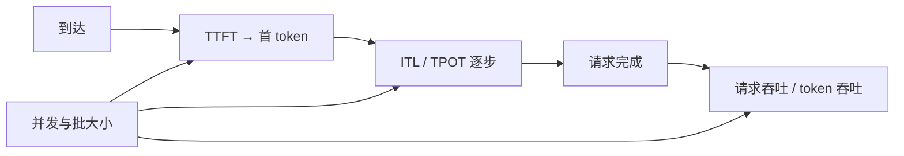

# 服务指标 TTFT / TPOT / 吞吐

生成服务至少要同时报三件事：用户过多久才看到第一个字、字与字之间隔多久、以及系统每秒真正处理多少；用其中一个去优化，另外两个会在报表之外恶化。

<footer>—— 对照 LLM 服务中 prefill / decode 分解与连续批处理下的多目标测量</footer>

语言模型服务的性能不能收成一个「QPS」或一个「tokens/s」。请求先经历排队与前填，才发出第一个生成 token，这段墙钟是 [TTFT](/llm/ttft)；之后每个输出 token 的间隔是 [TPOT / ITL](/llm/tpot-itl)；再之上，系统级还要报吞吐——单位时间完成的请求数或输出 token 数。三者量纲不同、瓶颈不同、随负载的变化方向甚至相反：加大连续批，吞吐上升，TTFT 与 TPOT 通常变差。本篇把这套指标写成一张可对表的尺子，说明如何一起测、如何避免用吞吐冒充体验，细节分解仍指向 TTFT 与 TPOT 专文。

## 问题

自回归把一次请求切成资源画像完全不同的两段。前填对整段提示做高算术强度计算，延迟随提示长度走，接近训练一步；解码每步一条查询，扫权重与 KV，多半是带宽瓶颈。若只报端到端平均延迟，前填很长的文档问答与解码很长的写作会混在同一个数里，调度不知道该切前填、该减并发，还是该加卡。若只报 GPU 利用率或 token 吞吐，可以把延迟藏进队列：引擎很忙，用户在等。

产品语言里的「快」至少对应两个用户可感知点：开始出字、出字流畅。再加一个运营可感知点：这组 GPU 能接多少流量。缺少任一维度，容量规划与 SLA 都会签错。[SLO 与尾延迟](/llm/serving-slo) 建立在这些定义之上；本篇只把原始度量钉死。

### 三个量不要互相代换

TTFT 的单位是时间/请求（到首 token）。TPOT 的单位是时间/输出 token（常取生成阶段平均；ITL 是逐步序列）。吞吐的单位是请求/秒或 token/秒。由 Little 定律，进行中的请求数约等于到达率乘停留时间；用吞吐去除「平均延迟」得不到 TTFT，更得不到 P99 ITL。单请求 tokens/s 的倒数接近该请求的 TPOT；系统 tokens/s 可以在单请求卡顿时仍然很高——并发把分子做大了。

看板若把端到端时间除以全部输出 token，会把 TTFT 摊进每一个字。提示越长，「TPOT」越差，看起来像解码变慢。生成阶段应从首 token 完成之后起算；TTFT 单独成列。

## 方法

一次请求 $r$ 记录到达时刻 $t_{\mathrm{arr}}$、首 token 时刻 $t_1$、后续 token 时刻 $t_2,\ldots,t_m$。则

$$
\mathrm{TTFT}(r)=t_1-t_{\mathrm{arr}},\qquad
\mathrm{ITL}_i=t_i-t_{i-1},\qquad
\mathrm{TPOT}(r)=\frac{t_m-t_1}{m-1}\ (m\ge 2).
$$

系统在窗口 $T$ 内的请求吞吐是完成数 $/T$，输出 token 吞吐是 $\sum m / T$（是否含提示 token 必须声明：提示 token 算进前填工作量，不算用户看到的打字速度）。百分位对 TTFT 与 ITL 是一等公民：报 P50 / P95 / P99，并按提示长度桶、是否前缀缓存命中、是否分块前填分列。均值可以作对照，不能单独进 SLA。

负载必须写成工作点：并发数或到达过程、提示与输出长度分布、模型与精度、最大批、是否 CUDA Graph、是否与前填共用迭代。空载单请求的 TTFT 是能力下界，不是容量规划输入。压测应从低并发扫到饱和，画出三条曲线共用横轴（并发或 QPS）：纵轴分别是 P99 TTFT、P99 ITL、吞吐。拐点出现的位置——吞吐还在涨、P99 已经穿 SLA——才是该卡的可用工作点。

### 吞吐的两种分子

请求吞吐回答「每秒服务完多少人」，对短补全、分类式调用有意义。Token 吞吐回答「解码引擎每秒吐出多少词」，对长写作、批蒸馏有意义。二者可以反向：把 `max_tokens` 砍短，请求吞吐升、token 吞吐降。MoE、投机解码、提示缓存会让「等效 token」更乱——投机拒绝的草稿算不算、缓存命中的提示 token 算不算。报表应给原始计数与口径说明，而不是只给一个折算后的「有效 tokens/s」（那是 [goodput](/llm/goodput) 要管的另一件事）。

## 机制

三条曲线为何往往反着走，是因为连续批把资源绑在同一次前向里。增大运行集：权重读出被更多查询摊掉，解码 token 吞吐上升；单次迭代变长，ITL 上升；新请求要等更拥挤的槽位，TTFT 的排队项上升。前填与解码同卡时，一条长提示的原子前填会同时打高别人的 ITL 和后来者的 TTFT，而系统 token 吞吐可能看起来还行——这一拍算了很多前填 FLOPs。分块前填把该拍时间盖住，ITL 的尾部改善，自身 TTFT 因跨更多迭代而变差。分离式服务把冲突换成 KV 传输，TTFT 里多一项网络，解码吞吐不再被前填拖死。

### 计数器要打在请求时间戳上

因此「优化吞吐」没有唯一核按钮。在屋顶线下，前填更吃算力、解码更吃带宽；同一张利用率图不能解释三条用户指标。必须把计数器打在请求时间戳上，而不是只打在 kernel 耗时上——kernel 很快、队列很长，是最常见的自欺。

流式协议的心跳、空 SSE 注释、工具调用的状态事件，都不是模型 token。TTFT 的截止点应是第一个被接受的输出 token 进入返回流。用第一个 HTTP 字节会把握手算进去或把心跳算成出字，两种都脏。

## 边界与工程取舍

这套指标仍是服务层的，不包含前端渲染、CDN、客户端打字机动画。用户体感的卡顿可以在服务端 P99 ITL 已经达标时出现。SLA 要写测点。多模态前填含视觉编码，TTFT 与纯文本不可比；思维链把 $m$ 拉长，token 吞吐很好看，用户等到最终答案的 E2E 仍可能很差——若产品隐藏思维过程，应另报「可见 TTFT」与「可见 TPOT」。

不要在不同长度分布之间比较吞吐冠军。短提示饱和点高，长提示在 KV 上先 OOM。容量规划必须用生产混合或明确的合成混合，并与 [显存分解](/llm/memory-breakdown) 一起看：吞吐曲线的终点常常是 KV 池，不是算力。

与质量指标正交。同一工作点上打开更大的搜索、工具、投机草稿，延迟三条都会动。性能表与 [Arena](/llm/lmsys-arena) 质量表要成对发布，避免选出又慢又讨喜或又快又笨的检查点。

百分位对样本数敏感。压测只跑几百条请求就报 P99，区间极宽。稳态窗口应丢掉冷启动，并写明请求量。把预热阶段的 CUDA 编译尖刺写进 P99，会冤枉调度器。

## 小结

- TTFT、TPOT/ITL、吞吐是生成服务的三件套：首字、字间、容量；不能互相代换。
- 计时从请求到达到被接受的 token 时间戳；生成 TPOT 从首 token 之后起算。
- 必须报百分位、长度桶、缓存命中与工作点（并发、批、精度、调度）。
- 连续批下吞吐与延迟常反向；可用工作点是 SLA 未穿时的最大吞吐。
- 请求吞吐与 token 吞吐分子不同，短请求和长写作会导向相反优化。
- 测点、思维链可见性、多模态编码都要写进口径，避免和产品体感错位。
- 出处：对照 vLLM / Orca 一类系统的 prefill–decode 分解与连续批测量实践；TTFT、ITL 专文见站内链接。
