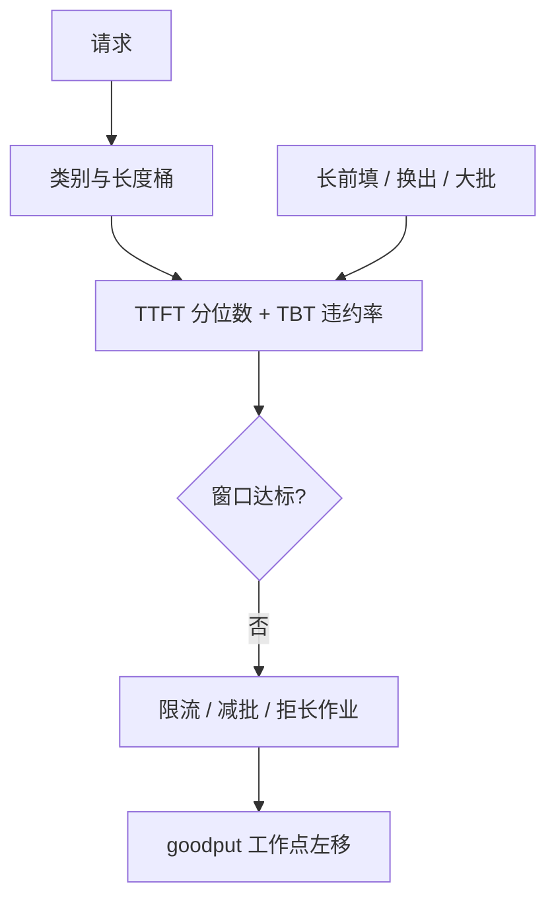

# 服务 SLO 与尾延迟

平均数达标只说明大部分请求还行；用户投诉和合同违约发生在分布的尾巴上——那一截由长提示、队头阻塞、偶发抢占和一次过长的前填共同写成。

<footer>—— 把服务等级目标写成 TTFT / TBT 分位数，而不是写成平均延迟</footer>

SLO（服务等级目标）是对内的可测量合同：在指定工作负载与模型下，某类请求的延迟分位数不得超过阈值，达成率不得低于某一比例。SLA 常指对外法律或商务条款，数字更松，留出余量。生成服务里，SLO 至少要落到 [TTFT](/llm/ttft) 与逐步 [ITL / TBT](/llm/tpot-itl) 的尾部，而不是端到端均值。[优先级](/llm/priority-sla) 决定过载时先保谁；本篇写合同本身：为什么必须用尾延迟、尾巴从哪来、以及如何避免用空载均值去签字。有效容量见 [goodput](/llm/goodput)。

## 问题

延迟在生成服务上不是单峰对称的。短提示空载时 TTFT 可以是几十毫秒；同一系统里，一条 32k 文档、或排在超长前填后面的聊天，TTFT 可以是数秒。平均被大量短请求拉低，P99 被少数长作业与排队决定。交互产品的失败体验几乎总是尾巴：一次卡死的打字机、一次始终不出字的对话框。把均值写进 SLO，调度器会继续优化好服务的那一部分，违约集中在投诉用户上。

生成还把尾巴拆成两种形状。TTFT 的尾巴偏排队与前填长度，一次违约是「半天没开始」。ITL 的尾巴偏某一次迭代被长作业或通信打穿，用户感觉是说话突然停住。两种尾巴的治理不同，不能收成一个 E2E P99 了事——E2E 还把输出长度混进来：爱写长的模型天然 E2E 更大，那不是服务变慢。

### SLO 要有范围，否则不可执行

一条可调度的 SLO 至少声明：请求类别、模型与精度、提示与输出长度桶（或上限）、测点（网关收到完整提示到第一个可见 token / 逐步 token）、分位数与窗口（例如 5 分钟滚动 P99）、达成率（例如 99% 的时间窗口达标）。缺任何一项，数字都可以用换模型、换长度、换测点来「达成」。范围也是拒绝的依据：超长提示不在合同内，应改类或拒绝，而不是让它们去打所有人的尾巴。

SLO 不是压测峰值。把实验室里刚饱和前的 P99 写成合同，上线后流量相关、缓存失效、换出风暴都会集体违约。对内阈值应严于对外 SLA，中间留给抢占、重试和故障。

## 方法

尾延迟用顺序统计量。窗口内对该类请求的 $\mathrm{TTFT}$ 样本取经验分位数 $q_{0.99}$。样本少则估计噪声大：P99 大约是百分之一的点，几百个样本远远不够。SLO 监控需要足够的完成量，或改用 P95 加更长窗口。对 ITL，有两种写法：按请求平均 TPOT 的 P99（弱，会吃掉逐步尖刺），或按逐步 TBT 违约率（强：任一步超过 $t$ 即记该请求违约）。交互产品更接近后者；Sarathi 一类工作把 TBT 当作一等目标，正是这个原因。

控制环把分位数接回调度。观测到交互类 TTFT 的滚动 P95 逼近阈值，就减低优先级准入、限制同时前填条数、或缩小 decode 批。等到均值报警往往太晚。老化（已等待时长 / 截止时间）让接近违约的请求获得临时提升，专门打尾巴，而不是打平均。

$$
\mathrm{breach}=\mathbf{1}\bigl[q_{p}(\mathrm{TTFT})\gt T_1\ \lor\ \mathrm{TBT\text{-}viol}> \rho\bigr]
$$

窗口级 `breach` 用于告警与自动降级（关投机、减 `max_tokens`、拒绝批处理类）。请求级违约用于 [goodput](/llm/goodput) 计数。两级都要，只留告警没有请求级滤镜，容量规划仍会按吞吐来。

### 尾巴的常见生成器

原子长前填：一次 $O(n^2)$ 作业把同卡所有 ITL 拉到前填时长，并让队列里所有 TTFT 加上这段。队头阻塞：FCFS 下超长作业之后的短请求继承等待。KV 满导致的换出/重算：受害者恢复时出现 TTFT 式尖刺。批过大：每步墙钟基线抬高，P50 和 P99 一起坏，这是工作点错了，不是偶发尾。冷启动、核编译、专家缺页：稀疏模型上会制造与负载无关的尖刺，应从稳态 SLO 中剔除并单独设发布检查。

## 机制

排队论里，利用率靠近 1 时等待时间的尾部比均值恶化得更快。连续批把 GPU 往高利用率推，正好踩在这一区：吞吐好看，P99 爆炸。分块前填给单次迭代加时间盖，等于把服务时间的方差砍掉一块，尾巴从「碰上 100k 提示」变成「块数 × 块时延」，可预测性上升，均值未必下降。优先级把不同类别放进不同有效利用率：交互类看到的负载被故意压在饱和点以下，批处理类去填剩余——交互 P99 改善，全局吞吐可能略降。

### 相关突发与缓存双峰

尾部对相关性敏感。独立短请求的 P99 已经不好看时，若再叠加「所有人同时发长文档」（会议纪要场景），分位数模型会失效。SLO 压测必须含突发与相关性，而不是只有泊松到达的均值负载。缓存命中制造双峰：命中极快、未命中走二次前填，混合 P99 由未命中峰决定。报表分列后，合同可以写成「未命中桶的 P99」，避免被命中流量粉饰。

P99.9 在中小流量上几乎不可估，会变成「今天最倒霉的那一条」。没有足够样本就不要签三九。用最大延迟当 SLO 更糟：它随观测时间单调变坏，激励停止测量。

## 边界与工程取舍

守尾部通常要牺牲峰值吞吐：减批、拒长、为交互留空槽。这是显式的经营选择，应通过 goodput 与成本一起看，而不是假装能同时要满载和极紧 P99。多类 SLO 档位不宜过多，否则无法解释某条请求为何违约。数字必须钉模型和模板：换 70B、打开思维链、换 FP8，旧 SLO 作废。

SLO 管不了模型质量。TTFT 达标但胡言乱语，合同在性能上成立、在产品上失败。性能 SLO 与质量门禁（自动基准、抽检）并行，不要把 Arena 分数写进延迟合同。前端与网关超时若比 SLO 更短，用户先断开，服务端仍可能把请求算完成——测点要与用户可见超时对齐，否则出现「SLO 绿、投诉红」。

跨区域、抢占式云实例、降级到更慢卡，都应视为合同范围变化。自动降级时要改对外预期或切类别，而不是默默用更差硬件去追同一 P99。

日志里的 P99 受计时精度、时钟回拨、重试重复计数污染。同一请求重试三次，三条都进分位数，会把尾巴写得更肥或更瘦，取决于你怎么去重。合同统计必须按用户可见的一次尝试定义。

## 小结

- SLO 是带范围的分位数合同（TTFT、TBT/ITL），不是平均延迟；SLA 对外更松。
- 交互尾巴来自长前填、排队、换出和大批；E2E 均值会把输出长度与两类尾巴混在一起。
- 窗口级违约驱动降级，请求级违约驱动 goodput；两者都需要足够样本。
- 高利用率让尾部先于均值爆炸；分块、优先级、拒绝是在买可预测的尾巴。
- 缓存命中、突发相关、冷启动必须分列，避免粉饰或冤枉稳态调度。
- 数字钉模型、精度、长度桶和测点；质量与性能分开签。
- 出处：对照生成服务中 TBT/TTFT 分位数实践（如 Sarathi-Serve 对逐步时限的强调）以及排队系统中尾延迟随利用率恶化的一般事实；优先级落地见站内 SLA 专文。
