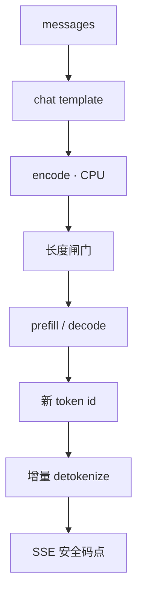

# Tokenizer 与 detokenize 开销

GPU 还没看见第一个矩阵，CPU 已经在把 Unicode 收成整数；流式出字时，半个汉字的字节还不能交给客户端。

<footer>—— 对照 Hugging Face tokenizers 与 TGI router 把分词放在引擎之外的工程划分</footer>

服务延迟表常只报 GPU 上的 TTFT 与每 token 时间。真实路径上，请求先要 [chat template](/llm/chat-template) 渲染，再经 BPE / Unigram 切成 token id，长度校验通过后才 prefill；反向则每步 decode 出一个 id，再 detokenize 成可显示字符串，经 SSE 送出。短模型、长提示、高并发时，CPU 上的 encode 可以追上甚至超过一次小模型 prefill。[Tokenizer 算法](/llm/tokenizer-design) 另一篇写训练目标；本篇写**服务路径上的开销与正确性**：Rust 分词器、增量解码、不完整 UTF-8、以及为什么 TGI 要把 tokenizer 放进 router。不编造一篇「tokenizer serving cost」的会议论文。

## 问题

Encode 的复杂度大致随字节数与合并次数走，不是 $O(1)$。32K 词表的字节级 BPE 在数万字符的提示（长文档、工具 JSON、多轮粘贴）上会打满网关 CPU，表现为 TTFT 变差、GPU 利用率却很低。这会被误诊成「引擎冷启动」或「KV 没分页」。Detokenize 的问题更隐蔽：流式要求每个 id 尽快变成字，但 BPE 的一个 token 可能是半个多字节字符、或英文词的半截。过早 `decode` 会抛异常或产出 `` 替换符，客户端出现乱码；过晚又把若干 token 攒成一次刷新，TTFT 的「字」不再是真正的首 token。

第三件是词表与模板版本。服务进程加载的 tokenizer 必须与权重训练时一致。Hub 上 `tokenizer.json` 与 `chat_template` 独立更新时，兼容层若只升级其一，encode 出的 id 与模型期望的分布错位，质量问题看起来像采样温度。MindIE 把 `/v1/tokenizer` 做成独立接口，就是让网关用**同一份**词表计数，而不是用另一套近似规则去卡上下文。

### 长度闸门在 GPU 之前

TGI router 的 `--max-input-tokens` / `--max-total-tokens` 在 Rust 侧按 token 计，而不是按字符计。汉字、emoji、代码对「字符数 ≈ token 数」的近似误差很大。业务用 `len(prompt)` 做配额，会在中文上低估、在重复标点上高估。正确的计费与拒绝都应发生在 encode 之后、prefill 之前，并把 `usage.prompt_tokens` 与闸门使用同一套计数。

不要在 Python 热路径里对每个请求构造新的 `AutoTokenizer`。加载词表、编译 regex 预分词的成本是秒级的，应在进程启动时做一次。Hugging Face `tokenizers` 库本身是 Rust，Python 绑定只是薄封装；真正的税是重复加载与错误的批处理。

## 方法

服务端应把 tokenizer 当成与权重同版本的只读工件：启动时加载，请求时 `encode`，禁止运行时下载。TGI 的 `--tokenizer-name` 挂在 router 上，validation workers 并行做校验与分词，model server 收的是已经合法的 id 或经协议约定的文本。LMDeploy / vLLM / MindIE 各自把分词放在 API 进程或引擎进程，但逻辑相同：热路径上不要做 Hub I/O。批处理 encode（多条提示一次调用）能摊薄 Python 开销，对离线批有用；在线延迟敏感路径往往是单条 encode，更依赖底层 Rust。

流式 detokenize 必须是**增量状态机**，而不是每步 `tokenizer.decode(all_ids)`。完整重解码的成本随已生成长度线性涨，会在长输出上把 CPU 做成第二条 decode 曲线。增量接口维护已输出的字节缓冲：新 token 的字节追加后，只把构成完整 UTF-8 码点、且不会被后续合并规则作废的前缀吐给客户端。BPE 没有「未来 token 改写过去字节」的语义，但特殊处理（byte fallback、控制符、`<0xNN>`）仍可能让朴素逐 token `decode([id])` 失败。实现上应使用官方 incremental decoder，而不是自己按 id 查 vocab 字符串再拼接。

### 特殊 token 与跳过规则

`skip_special_tokens=True` 在聊天里通常要开，否则客户端看到 `</s>` 或角色标记。流式时，特殊 token 可能夹在正文中间（工具调用边界）。增量解码器必须按完整 id 判断是否特殊，而不能按字节。Stop sequence 往往定义在**字符串**空间，引擎若只在 token 空间匹配，会漏掉跨 token 边界的停词；若只在字符串空间匹配，又要在 detokenize 之后做，增加一步 CPU。生产系统常两条都做：token 级快速停，字符串级兜底。

工具调用的参数是 JSON。若在增量 UTF-8 未闭合时把半截 JSON 交给解析器，会假失败。应等一段可解析边界（或整段 tool 调用结束）再 parse，这与「对用户可见文字尽早出字」的策略不同，不要用同一套 flush 规则。

## 机制

Encode 的屋顶线在 CPU 缓存与分支：BPE 贪心合并对长字节串是顺序的，多线程加速靠请求级并行（TGI 的 validation workers），而不是把一条提示切成多段乱序合并——乱序会改变切分。Unigram 的 Viterbi 比贪心 BPE 更重，服务若用 SentencePiece Unigram，CPU 预算要单独测。字节级模型几乎不做合并，encode 极轻，但序列变长，GPU 注意力变重；这是算法篇里的权衡在服务上的镜像。

Detokenize 的屋顶线在短字符串处理与锁。高并发下，若所有请求共享一把 Python GIL 上的 decode，流式会在 CPU 上排队。Rust tokenizer 或在 router 里解码（TGI 模型）能把 GIL 挪开。输出 token 速率 50–100 tokens/s 时，单条 decode 看起来微不足道；并发 200 条流同时 detokenize，CPU 核数不够就会回压，表现为 SSE 帧成团到达，用户以为模型在「一顿一顿」地想。

`usage` 里的 token 数应按引擎真正吃进去的 id 计，包括特殊标记与图像占位，不包括 UTF-8 字节数。网关用字符数估算再乘 0.7，会在账单和上下文截断上同时犯错。

### 多模态与预分词

图像、音频进入模板后，可能插入固定数量的占位 token 或变长视觉 token。Encode 文本部分仍走 BPE，视觉部分由另一套编码器计数。服务若只对文本 tokenizer 做闸门，会在图多的请求上打爆 KV。ASR 流式则是音频块到达导致前缀变长，tokenize 文本部分相对轻，见 Qwen3-ASR 走 vLLM 的设定。无论哪种，闸门必须看**引擎序列长度**，不是看 HTTP JSON 的字符长度。

## 边界与工程取舍

不要为了省 CPU 在网关用另一种词表做「近似截断」，再在引擎用官方词表——两次 encode 不一致时，截断点会落在 token 中间，表现为首尾乱码或系统提示被切半。不要在流式路径上对每个 chunk 做完整 `decode` 以便「实现简单」。不要假设 OpenAI 兼容客户端会自己分词：计数在服务端，客户端的 tiktoken 往往对不上开源词表。

本地引擎（llama.cpp）把分词嵌进 C++ 进程，云服务常把分词放在 API 层。两种都可以对，只要版本钉死。跨语言词表（中英混合、代码）的预分词规则会导致同一空格是否成 token 的差异，压测语料必须含生产语言，而不是只用英文 `lorem ipsum` 去报 TTFT。

引用：Hugging Face tokenizers 与 TGI router 参数说明；各引擎 OpenAI 层的 `usage` 字段；tokenizer 算法见 Sennrich 等 BPE 与 Kudo Unigram 原文。本篇不新增 arXiv 号。

## 小结

- 服务路径上 encode 在 GPU 之前，长提示的 CPU 分词可以主导 TTFT。
- 流式 detokenize 必须增量，并只 flush 完整 UTF-8；取消时丢弃缓冲。
- 长度闸门与计费共用引擎词表，不要用字符启发式。
- Tokenizer 与 chat template 和权重同版本发布；TGI 把分词放在 Rust router 是为了校验与并行。
- 特殊 token、stop 字符串、工具 JSON 对 flush 策略的要求不同。
- 出处：Hugging Face TGI / tokenizers 文档；OpenAI 兼容层的 usage 约定；[tokenizer 设计](/llm/tokenizer-design) 中的算法文献。
