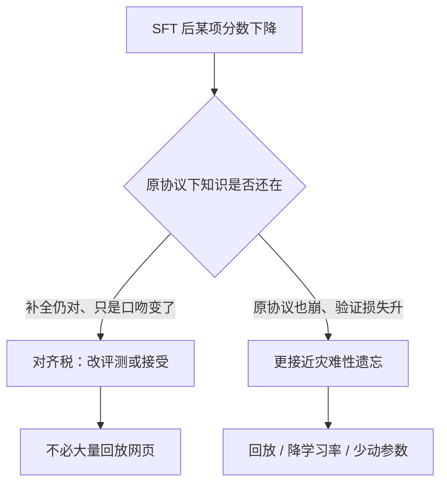

# 遗忘与原能力保持

指令调参改的是条件前缀下的回答分布，不一定把预训练权重里的世界知识擦掉；把基准掉分一律叫做灾难性遗忘，会找错解药。

<footer>—— 对照经典持续学习里的灾难性遗忘，与 Ouyang 等 InstructGPT 所报告的对齐税；LIMA 则显示小而净的示范足以改口吻而不必重写知识</footer>

监督微调之后，MMLU、代码、校准或 few-shot 续写掉一点，是后训练里几乎总会遇到的现象。实验室里这常被叫做「遗忘」，并立刻搬来持续学习的药：回放、正则、把学习率打到接近零。其中一部分确实是参数被指令梯度推离了预训练解；另一部分只是输出格式变了——模型不再愿意直接填空、不再给出未加礼貌包装的短答案，于是用预训练协议去测，分数下降。Ouyang 等人在 InstructGPT 里把后一种代价称为对齐税（alignment tax）：人类更喜欢的模型，在若干公开 NLP 基准上可以变差。本篇把**灾难性遗忘**与**指令调参带来的行为改写**拆开，讨论原能力要怎样才算「还在」，以及哪些干预对得上哪一种机制。

## 问题

灾难性遗忘（catastrophic forgetting）来自持续学习：模型先在任务 A 上学到一组决策边界，再在分布不同的任务 B 上做梯度下降，共享参数上的更新破坏 A 所需的特征。McCloskey 与 Cohen 以来的实验，典型设定是任务切换、旧数据不可见、目标标签空间可以完全不同。表征被覆盖，旧任务准确率崩到近随机，才配得上这个词。

指令调参不是这种设定。SFT 的文本仍是自然语言，标签仍是下一 token，知识来源仍是预训练语料里已经压缩过的统计。数据量通常小几个数量级，学习率也低于预训练（见 [全参微调超参](/llm/full-sft-hparams)）。更常见的变化是：同一知识，在「用户提问、助手作答」的前缀下被要求用另一种语体、另一种拒绝规则、另一种逐步推理格式说出来。评测若仍用完形填空或五选一的续写协议，等于在一种模型已经不按该协议说话的条件下打分。把这种掉分叫做灾难性遗忘，会推导出错误处方——例如拼命往 SFT 里塞预训练网页，却不修评测协议。

### 灾难性遗忘不是指令调参的别名

判别标准应看**旧任务在原协议下是否仍可解**，以及**中间表征是否被破坏**。若把 chat 模板去掉、用基座同样的补全方式问事实，答案仍在，只是套上了「好的，这个问题……」，这是行为改写。若补全也开始胡编、代码语法崩溃、语言建模损失在持有的预训练验证集上大幅上升，才更接近遗忘。InstructGPT 观察到：RLHF 模型在人类偏好上明显胜出，但在部分学术基准上出现退步；他们没有把退步写成「GPT-3 的知识被擦除」，而写成对齐过程改变了模型在那些基准格式上的表现。LIMA 用约一千条精心挑选的示范适配 65B Llama，核心论点是：能力主要在预训练里，对齐主要改风格。若遗忘真像任务切换那样剧烈，一千条交叉熵就应毁掉 65B 的知识——经验上没有发生。

「原能力」要先定义协议。基座的原能力是 $p_{\mathrm{pt}}(x_t\mid x_{<t})$ 在网页、代码、书籍上的平均行为；助手的原能力是在消息前缀下遵循指令。用助手模型去比基座的 Pile 损失，或用基座去比 MT-Bench，都不是在测遗忘，是在测另一项任务。

## 方法

先分三张表，再决定动哪一层。第一张：预训练验证损失或持有的领域续写（网页、代码、数学推导），模板与基座相同。第二张：指令遵循与多轮（同一 chat 模板）。第三张：需要对齐的安全与拒答。只有第一张显著变差，才优先按遗忘处理；只有第二张变好、第一张微掉、第三张按设计改变，是对齐税，按产品取舍。两张同时崩，才是学习率过大、epoch 过多或数据脏导致的真损伤。

对真损伤，手段与持续学习同源，但剂量要按「同构的语言建模、小数据」来减。回放：在 SFT batch 里混入一定比例的预训练数据或高质量通用文本，使梯度不完全由指令风格主导。正则：对偏离基座参数加约束（KL、权重空间的锚定），等价于告诉优化器不要离开预训练解太远。少动参数：LoRA 或冻结底层，把更新限制在低秩或上层，本身就是一种保底。短日程：1–2 个 epoch、低于预训练的学习率，避免在小指令集上把嵌入和词头推飞。Llama 2 强调高质量小规模 SFT，而不是百万条嘈杂指令，部分原因正在于脏数据会逼模型用大步更新去拟合噪声，损伤更像遗忘。

对齐税的处理相反：不要把学术基准的填空格式硬塞回 SFT 当「防遗忘数据」，除非产品真的还要做填空。更有效的是在指令数据里保留「短答案、无套话、代码只出代码」的子集，使模型按题面选择语体，而不是把所有输出推到同一助手腔。LIMA 的示范多样且干净，走的就是这条路：用风格覆盖面代替堆数量。Self-Instruct 的合成指令若句式单一，税会更重，因为模型把「一种开头」当成任务本身。

### 回放混的是分布，不是把预训练再训一遍

回放比例是连续旋钮。混入过多预训练文档，指令条件出现的频率下降，遵循变弱，等于没做 SFT。混入过少，则对真遗忘帮助有限。应在第一张表与第二张表上一起扫，而不是只看指令损失——指令损失下降与预训练验证损失上升可以同时发生。回放文档的领域要针对掉分的那一项：代码掉了混代码，不要混随机网页指望通用地「保持智能」。这与 [数据来源](/llm/sft-data-sources) 的分桶是同一逻辑。

## 机制

指令梯度来自相对少的、高密度的目标句。它们强烈塑造末层与词预测头附近的方向：哪些开场白、哪些拒绝模板、哪些列表格式获得低损失。底层特征——词法、句法、已压缩的事实关联——在小步长、短日程下往往只被轻轻转动。因此出现典型的分离：对话评测上升、填空评测下降、而用探针去读中间层的事实关联仍在。灾难性遗忘的机制是旧任务梯度被新任务覆盖到特征层；指令调参的机制更常是**输出头上的条件分布平移**。

数学上，基座近似 $p_{\mathrm{pt}}(y\mid x)$，$x$ 来自文档前缀。SFT 把训练测度改到指令前缀 $x'$，优化 $p_\theta(y\mid x')$。若 $x'$ 与 $x$ 的重叠很小（始终有角色标记、始终是问答），模型可以在几乎不改 $p_\theta(\cdot\mid x)$ 的情况下大改 $p_\theta(\cdot\mid x')$——这正是「知识还在、说话方式变了」。只有当更新太大，使共享特征 $h(x)$ 对两种前缀都坏掉，两个条件分布才会一起崩。学习率、全参还是 LoRA、数据噪声，决定的是落在哪一段。

校准变差经常被算进遗忘。助手被训练成自信、完整、逐步说明，概率质量从「简短正确」挪到「长而礼貌」。期望校准误差上升，不证明事实被擦除。要测事实，用短答案或闭卷检索式提问，并禁止套话，或对基座与助手用各自合适的解码约束。

### 过拟合指令表面与覆盖知识不同

在小 SFT 集上多个 epoch，模型会背诵示范里的具体句子。这是记忆训练样本，不是遗忘预训练。表现是：碰到相近题面就复读示范，碰到预训练里见过、示范里没有的题面仍然可能答对。处理是降 epoch、增多样性、去重，而不是回放 Common Crawl。反过来，脏指令里的错误事实会被写成新的「正确答案」，这是**知识污染**，也不是遗忘：旧知识被一个错误监督覆盖。清洗（见数据来源篇）在这里比持续学习正则更对症。

## 边界与工程取舍

没有一张表能单独宣布「没有遗忘」。人类偏好胜出可以与代码能力下降同时发生，InstructGPT 已经展示了这种组合。产品必须显式选择：哪些原能力是约束（例如内部代码助手不能掉 HumanEval 一类探针），哪些是可接受的税（例如不再擅长无提示的网页续写）。把所有基座基准都当成硬约束，SFT 会缩成几乎不动，指令遵循上不去。

LIMA 不能外推成「任何小数据都不会遗忘」。它的前提是示范极干净、基座已经很强、评测偏开放生成。嘈杂的百万条合成指令、过大的学习率、全参多 epoch，仍然可以把小模型训伤。Self-Instruct 解决的是覆盖面，不保证保持原能力；混合物越大，越要看第一张表。ShareGPT 真实多轮会把教师模型（当时的 ChatGPT）的拒绝与口吻写入学生，基座原有的补全风格几乎必然改掉——这是目标，不是事故。

LoRA 降低遗忘风险，是因为可更新子空间小，不是因为低秩更新「懂」哪些知识该留。任务若真需要改表示（新语言、新工具语法），LoRA 会表现为学不动，而不是表现为完美保能力。保与学是同一组参数预算上的权衡。

也不要把 RLHF / DPO 阶段的变化算进 SFT 遗忘。偏好优化会再推一轮分布，长度偏置、安全拒答都会改基准。诊断时应保存 SFT 检查点，分别报告 SFT 相对基座、偏好优化相对 SFT。混在一个「对齐之后」里，无法决定是回放指令数据还是改奖励。

## 小结

- 灾难性遗忘指旧任务在原协议下崩掉、共享特征被覆盖；指令调参更常改的是新前缀下的回答风格。
- InstructGPT 的对齐税是：人类更偏好的模型可以在部分学术基准上退步，这不等于知识被擦除。
- LIMA 表明，干净的小规模示范足以改口吻；这与「一千步梯度毁掉预训练」的遗忘叙事不相容。
- 诊断要分原协议续写、指令评测、安全行为三张表，再决定回放还是改评测。
- 真损伤：降学习率、短日程、回放对应领域、少动参数。对齐税：保留多种语体，而不是堆网页。
- 背诵示范是过拟合，错误事实是污染，都不要叫做遗忘。
- 出处：Ouyang 等，InstructGPT，NeurIPS 2022；Zhou 等，LIMA，2023；灾难性遗忘对照持续学习传统用法，而不是把指令调参改名。
