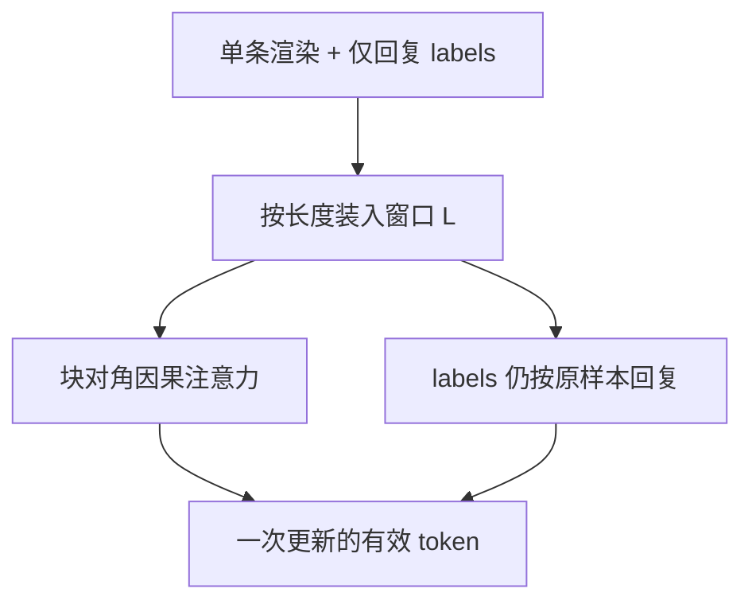

# SFT 打包与掩码

把短指令首尾相接可以喂满上下文窗口，但注意力与损失必须仍按样本切开；否则下一条的提示会成为上一条回复的合法上文。

<footer>—— 打包来自预训练的序列拼接习惯；SFT 要额外保住样本边界上的因果隔离与仅回复损失</footer>

[上一课](/llm/response-only-loss)把梯度限制在助手 token 上。实现若按「一条样本一个序列」padding 到最大长度，短指令会让有效 token 占比掉到 20% 以下，[全参批次](/llm/full-sft-hparams)名存实亡。打包（packing）把多条样本拼进同一长度 $L$ 的缓冲，提高硬件利用率。缺口是：拼上之后，[仅回复损失](/llm/response-only-loss)与注意力掩码必须一起改，否则样本互相污染。本课写隔离契约，不把长上下文外推（[后课](/llm/long-context-finetune)）提前写进来。

## 问题

预训练打包网页时，文档边界用特殊 token 断开，有的实现仍允许跨文档attend——网页本来就是杂糅流。SFT 每条样本是独立的指令事件：用户 A 的问题不得成为用户 B 回答的条件。若打包后仍用下三角满掩码，位置 $t$ 属于样本 $i$ 的回复，却能看见样本 $i-1$ 的完成，模型会学到「抄上一包里的答案」，评测单条时这条捷径消失，表现为训练 NLL 很好、推理变傻。

第二条污染在损失：拼接后 `labels` 若只按「最后一个助手段」书写，中间样本的回复被当成人为前缀而掩码，或反过来把下一条的用户段解掩码。打包不是把 `input_ids` concat 完就结束；它是布局问题，掩码是正确性。

### 有效批次按 token，隔离按样本

[全参超参](/llm/full-sft-hparams)要求有效批次按 token 计。打包提高每步 token 数，等价于在不加大微批次的前提下抬有效批次。但「每步多少 token」与「这些 token 是否跨样本可见」是两件事。只报 packing=true 而不报文档掩码，无法复现，也无法解释角色泄漏。

FlashAttention 一类变长接口用 <code>cu_seqlens</code> 做样本内满因果、样本间断开，避免 padding 浪费。这是实现，不是新损失。逻辑上仍是：块对角因果掩码 + 仅回复 labels。

## 方法

先把每条样本独立经[chat template](/llm/chat-template)渲染，并打好仅回复 `labels`。再按长度贪心装进容量 $L$ 的桶：装不下就新开一条打包序列。拼接处插入明确的分隔（EOS 或专用 pad），**注意力在分隔处切断**：样本 $i$ 的位置不能 attend 到 $j\neq i$。损失对分隔与 padding 忽略；各样本的回复掩码保持渲染时的定义，不要在 concat 后重算「最后一个 assistant」。

超长单条：截断策略要写清——截提示保回复、还是丢整条。截提示会改条件，等于换任务；丢整条更干净，但会偏置短样本。两者都优于静默截断回复末尾（学一个不完整的结束）。

与预训练衔接：若基座预训练用了打包，SFT 继续打包可减少分布偏移；但预训练未必切断文档注意力。SFT 默认更严：切断。不要为了多几个 token 把隔离关掉。

## 机制

块对角掩码使样本 $i$ 的回复位置上，$p(x_t\mid x_{<t})$ 的条件只含本条前缀。梯度因此只沿本条计算图回传。若不断开，条件里出现异质前缀（别人的系统提示、别人的答案），注意力把这些键当捷径：短回复尤其爱抄包内邻近完成，因为位置近、标记相似。这会表现为[模板](/llm/chat-template)「没问题」但多卡训练偶发串话——串的是包内邻居，不是模板写错。

打包还改变长度分布。未打包时，短样本被 pad，损失若错误地在 pad 上计（未忽略），梯度被 pad token 稀释。打包后 pad 少了，同样的名义学习率下回复 token 的更新更猛。因此打开 packing 应视为有效数据密度上升，需要重新确认 $\eta$ 与步数，而不是「免费加速」。

[LoRA](/llm/lora) 不改变隔离需求。适配器容量小，更容易记住包内捷径。脏打包 + LoRA 是常见过拟合组合。

## 边界与工程取舍

打包不适合必须保持「单条超长、不许切断注意力」的任务，例如要学满窗口依赖的长上下文 SFT——那是[后课](/llm/long-context-finetune)用真实长序列或跳步位置，而不是把十条短指令拼成 32k。也不要把不同谱系（FLAN 短标签与 ShareGPT 长多轮）无权重地塞进同一包而不打来源：有效批次的任务混合会随长度偏置被长对话主导。

核对：随机抽一条打包序列，画出注意力允许的块、以及 `labels != ignore` 的位置，确认块与回复同属一条原始样本。能过这一可视化，再谈吞吐。

## 小结

- 打包提高 SFT 的 token 利用率，使有效批次接近名义窗口。
- 必须块对角切断注意力，并保持按样本的仅回复 `labels`。
- 不断开会导致包内抄答案；训练很好、单条推理变差。
- 打开 packing 会改变有效数据密度，学习率与步数可能要重扫。
- 超长样本的截断策略要写进配方；勿静默截断回复。
- 出处：预训练序列打包的工程习惯；SFT 侧的正确性约束来自样本独立性与仅回复目标，而非单独一篇「发明打包」的论文。
