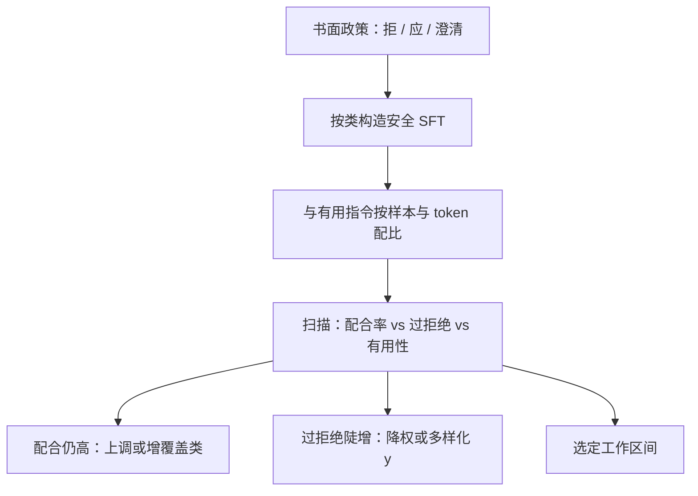

# 安全数据在 SFT 中的比例

有用与安全在同一条交叉熵里抢词头：安全样本过少，有害配合会被普通示范带过；过多，拒答模板会变成默认助手腔。

<footer>—— 对照 Ouyang 等 InstructGPT 把政策写入示范与比较，以及 Touvron 等 Llama 2 将有用性与安全性分头建模；比例是配比旋钮，不是公开公式里的常数</footer>

SFT 的普通指令教模型答应用户；安全样本教模型在同一套角色格式下拒绝、改写或给无害替代。二者的题面可以很像——「如何做 X」既可能是无害的 DIY，也可能是危害请求——差别在监督 $y$。Ouyang 等人的 InstructGPT 从示范阶段就把标注指南里的拒答与边界情况写进 SFT，后续奖励模型与 PPO 再放大；他们没有把安全留给只在 RL 才出现的惩罚。Llama 2-Chat 更明确地把有用性与安全性拆开收集与建模，因为两条目标经常打架。公开的 ShareGPT 与 OpenHermes 混合物通常**安全样本不足或定义不一致**：教师当时的拒绝被当成应当模仿的 $y$，或反过来把越狱成功的配合也学进去。本篇谈 SFT 里安全数据的功能、如何与有用数据共处、以及为何不存在一个可抄的百分比。

## 问题

没有安全监督时，模型对有害题面的行为来自预训练先验与普通指令的类比。预训练里危害步骤可能以教程、小说、论坛形式出现；普通 SFT 又强化「用户要什么就给什么」。结果不是模型「变坏了」，而是从未见过「在 chat 前缀下应当拒绝」这一事件。补安全数据，就是补这类事件的 $(x_{\mathrm{unsafe}}, y_{\mathrm{refuse}})$。

有了安全数据，新问题是比例。交叉熵不理解政策，只理解 token 频率。拒答句式若在测度里太稀，会被大量有用长回答淹没，推理时稍一改写题面就回到配合。若太密，尤其是拒答句式单一（「我无法协助该请求」），模型会把该句式当成助手的无条件开场，无害请求也被拒，即过拒绝（over-refusal）。InstructGPT 用指南定义应当拒绝的类别，而不是靠把安全样本加到占满训练集来「平均出」政策。Llama 2 则承认有用与安全的比较经常相反，因而后面用**分开的奖励模型**，而不是指望 SFT 混合比单独解冲突。

### 有用性与安全性在同一交叉熵里打架

同一参数既要降低「请总结这篇文章」的损失，也要降低「请写出可执行的危害步骤」的拒答损失。两个 $x$ 在词法上可能共享「请写出」。梯度在词头上把「请写出」后面的质量推向哪边，取决于两类样本的相对频率、长度（长配合对损失的贡献更大）以及是否多样。安全样本若全是短拒答、有用样本全是长教程，即使条数上安全占 10%，token 上可能只占 1%，有效比例被长度悄悄改写。报告比例必须同时给**样本比与 token 比**。

ShareGPT 里的拒绝是教师政策，不是你的政策。照学会把过时的拒答边界写进学生；照删又会留下越狱成功的配合。清洗时应按自己的政策重写 $y$，而不是按「助手是否拒绝过」二值保留。

## 方法

先写政策，再造数据，再谈比例。政策列出：必须拒绝的类别、必须遵守的类别、应澄清的模糊区。SFT 安全样本按类覆盖，而不是只堆「炸弹 / 毒品」几个关键词——否则模型学的是关键词检测，换一种委婉说法就失败。每类里 $y$ 要多样：拒绝、给合法替代、解释边界、在模糊时反问。单一模板等于把安全做成触发器。InstructGPT 的示范阶段与 Llama 2 的安全标注，共同点是**人按指南写或标**，不是从 OpenHermes 里筛含「sorry」的行。

比例当作扫出来的旋钮，而不是论文常数。公开报告很少给出可复现的「SFT 安全%」。可运行的扫描是：在固定有用数据上，安全样本从很低提到明显可见，看三条曲线——危害请求的配合率、无害敏感题（医疗科普、安全研究、虚构写作）的过拒绝率、以及普通指令的有用性。停在过拒绝尚未陡增、配合率已明显下降的区间。安全样本在 [课程](/llm/instruction-curriculum) 的两段都应出现，避免只在末期灌入造成拒答过拟合。有用数据里若已含 ShareGPT 式教师拒绝，应先按政策清洗，再计入安全配额，以免重复计又风格冲突。

Llama 2 的启示是：SFT 混合只能把行为推到大概对的区域；有用与安全的细冲突更适合留给比较数据与分开的奖励（见 [奖励模型](/llm/reward-model)）。因此 SFT 安全比例的目标应是**不要学坏、学会基本拒绝**，而不是在 SFT 里把政策执行到最终产品精度。把 RLHF 或 DPO 还没做的压力全部加在 SFT 百分比上，会逼出过拒绝。

### 负例、正例与对照题

安全桶里应同时有：危害题+拒答（正拒绝）；无害但表面敏感的题+应回答（正有用，防过拒绝）；改写自危害题的合法题（对照）。缺少第二、三类，模型会把「敏感词」当成拒绝特征。这与 InstructGPT 指南里区分恶意与善意请求是同一逻辑。合成安全数据（用模型生成危害题再写拒绝）能扩覆盖，但题面分布像生成器，真实越狱像 ShareGPT 用户。应保留一部分真人措辞的越狱题面，回答按政策重写，而不是用教师原答。

## 机制

设有用测度为 $p_u$，安全测度为 $p_s$，混合 $p=\lambda p_s+(1-\lambda)p_u$。$\lambda$ 增大，使拒答 token 的平均对数似然上升，配合性回答在 $p$ 下的质量下降。因为两类 $x$ 重叠，对共享前缀的预测会向在 $p$ 下更常见的延续移动。若 $p_s$ 的 $y$ 熵极低（同一拒绝句），移动会过度，无害 $x$ 也被吸过去。若 $p_s$ 的 $y$ 多样且含澄清，共享前缀后的质量仍然分散，模型必须再读题面细节才能决定，这才是想要的条件行为。

长度偏置通过损失求和进入机制：一条 2k token 的有害教程若被误留在 $p_u$ 里，其对参数的拉力可能超过十条短拒答。所以清洗（见 [数据来源](/llm/sft-data-sources)）是比例的前置条件——脏的长配合会让任何 $\lambda$ 失效。Token 比 $\lambda_{\mathrm{tok}}$ 与样本比 $\lambda_{\mathrm{n}}$ 不一致时，真正进入平均损失的是前者。

过拒绝在评测上常表现为安全分虚高、有用分下降。只报安全分会把 $\lambda$ 调到产品不可用。必须成对看。Llama 2 把两条奖励分开，正是承认单一标量分解决不了这种权衡。

### SFT 拒绝与 RM 拒绝不是同一层

SFT 把具体 $y_{\mathrm{refuse}}$ 写进条件分布，学的是示范。奖励模型学的是比较：同样题面下，哪一个回答更安全或更有用。SFT 比例不够时，RM 仍可能给拒绝打高分，但策略若从未把拒绝当高概率事件，PPO 或 DPO 要走很远才能到达。SFT 比例过大时，策略已经过拒绝，后面的有用性奖励会与之对拉。因此 $\lambda$ 的合理区是为后一阶段留出两边都能动的初始化，而不是替代后一阶段。InstructGPT 的三阶段设计（SFT → RM → RL）把这一点写进了流程；只做 SFT 的开源配方更容易把所有压力加在 $\lambda$ 上。

## 边界与工程取舍

不要从某篇论文里「读出」一个通用百分比。InstructGPT 与 Llama 2 都没有把「SFT 里安全数据占 12%」这类数字写成可迁移定律；他们写的是流程与分头目标。OpenHermes、ShareGPT 的安全含量随下载版本与清洗而变，不能当默认 $\lambda$。复制时应自建安全桶，再与公开有用数据混，而不是假设开源指令集已经按你的政策配好。

政策会变。$\lambda$ 扫出来的工作点绑定当前 $p_s$ 的句式与类别覆盖。换一套拒绝文案而不重扫，过拒绝曲线会动。安全 SFT 应版本化：政策版本、数据版本、扫描曲线一起存。多语言上，英语拒答模板混进其他语言有用数据，会导致只在英语拒、或在其他语言乱码式拒答，应按语言分层配比。

把全部安全负担放在系统提示里（「你是一个无害的助手」）而 $\lambda=0$，等于指望基座理解自然语言政策。SFT 没见过拒绝事件时，系统提示只是又一段条件文本，遵守不稳定。系统提示是推理约束，不是安全数据的替代。

评测集要含故意的过拒绝探针（合法的安全研究、新闻、虚构），否则扫描会单调地提高 $\lambda$。危害集也要含改写与多轮（先无害再转入有害），因为 ShareGPT 式真实用户很少一上来就用评测关键词。多轮安全样本的格式必须正确，否则模型只在第一轮拒、第三轮配合。

## 小结

- SFT 安全数据补的是 chat 前缀下的拒绝事件；普通指令不会自动教会拒绝。
- 比例 $\lambda$ 同时改变配合率与过拒绝率，必须报样本比与 token 比，并成对看有用性。
- InstructGPT 从示范阶段写入指南；Llama 2 把有用与安全分头建模，暗示 SFT 混合只能做粗对齐。
- 安全 $y$ 要多样，并含表面敏感但应回答的对照题；单一拒答模板会变成触发器。
- 公开的 ShareGPT / OpenHermes 不能当政策；教师拒绝要按自己的指南重写。
- $\lambda$ 用扫描选定，目标是为 RM/DPO 提供两边都能动的初始化，而不是在 SFT 里执行最终政策。
- 出处：Ouyang 等，InstructGPT，NeurIPS 2022；Touvron 等，Llama 2，2023。无通用安全百分比可抄，不编造。
