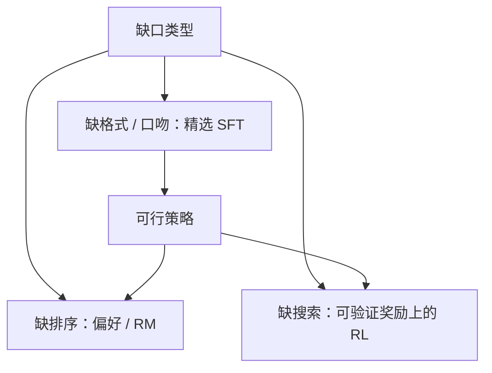

# SFT 对 RL 的数据效率

示范告诉模型「像这样写」；奖励告诉模型「在这个方向上更好」。格式与口吻上，精选 SFT 往往更省标注；要探索示范里没有的推理链，RL 用同一批提示可以走得更远。

<footer>—— Ouyang 等 InstructGPT（NeurIPS 2022）的阶段分工；Zhou 等 LIMA（2023）的样本效率；对照后续偏好与 RL 文献</footer>

[领域适配](/llm/domain-adaptation-ft)把分布适应和接口对齐拆开。下一步要决定：**接口对齐该花在示范上还是奖励上**。InstructGPT 的顺序是 SFT → 奖励模型 → PPO；[LIMA](/llm/lima) 表明千条精选示范已能学会助手表层；开源则大量停在 SFT。本课写二者的数据效率分界，不把拒绝采样循环（[下一课](/llm/rft-data-loop)）的工程细节写满。链到已有 [InstructGPT](/llm/instructgpt)、[PPO](/llm/ppo-llm)、[DPO](/llm/dpo)。

## 问题

SFT 最大化示范上的 $p_\theta(y\mid x)$，样本效率在「$y$ 已经是对的、且覆盖需要的模式」时很高：再标一千条同类示范，边际收益迅速下降。RL（含 PPO 与偏好方法）优化的是奖励或偏好的期望，同一提示可采样许多 $y$，用分数排序，不必每条都由人写完整答案。代价是：要有奖励信号、要控 KL、要算力，且奖励错了会 Goodhart。

分界问的不是「SFT 过时了吗」，而是：当前缺口是**没见过正确格式**，还是**见过格式但不会在测试难度上搜索**。前者 SFT 更省；后者堆 SFT 等于让模型背现成链，出分布即断。

### 表层对齐与可验证任务不是同一预算

LIMA 的主张针对开放助手口吻：能力在预训练里，后训练选接口。数学、代码、可编译工具调用则有外部验证器，RL 可以把对错变成密集或稀疏奖励，用同一题生成大量尝试。把 LIMA 的「一千条够了」抄到竞赛数学上，是换了题目；把 PPO 用在只缺客套语的客服上，是用昂贵探索学一个 SFT 就能写死的模板。

Ouyang 等人用人写 SFT 打底，再 RLHF 改偏好。SFT 不是 RL 的失败模式，是策略的可行起点：从基座直接 PPO 往往不会说话。效率比较应在「已经会 SFT 格式」之后，看额外偏好对或奖励步带来多少增益。

## 方法

先用[谱系](/llm/instruction-data-lineage)里合适的示范做 SFT，[仅回复](/llm/response-only-loss)，$\eta$ 按[参数化](/llm/lora-vs-full-lr)。这一阶段的目标是：模板正确、拒答与工具分隔出现、不要明显有害。数据以质量为先，条数服从覆盖，不服从「必须十万」。

若产品指标是偏好（更有用、更少谄媚）且没有单元测试：收集比较对，上奖励模型或 DPO，而不是把比较对压成单一示范再 SFT——SFT 无法表达「A 比 B 好但两者都对」。若指标可自动验证：用 RL 或下一课的拒绝采样，提示集可以小，采样预算可以大。

记账：SFT 的单位是人写或教师写的完成；RL 的单位是提示 × 采样数 × 奖励查询。比较「哪更高效」必须换算到同一人力或同一 GPU 小时，不能比「步数」。

## 机制

SFT 把概率质量堆到示范轨迹上，示范外的高奖励轨迹得不到质量。RL 在参考策略附近探索，奖励把质量推向示范没写过但分数更高的完成。这解释了为何推理链任务上，SFT 蒸馏教师链很强（教师已经搜索过），纯 SFT 学生自己搜索弱；而 RL 或拒绝采样能在学生自己的分布上筛。也解释了为何无奖励的开放闲聊上，RL 容易把模型推到奖励模型癖好（冗长、阿谀），SFT 精选反而更稳。

遗忘：全参 RL 步子大时与全参 SFT 同类；[LoRA](/llm/lora) 同样学得少忘得少。数据效率优势可以被灾难性遗忘抵消，监控仍要两张表。

DPO 把偏好写成分类损失，没有显式采样循环，但目标仍是「序」而不是「模仿单一 y」。它不把本课变成「只有 PPO 才算 RL」；效率上它介于成对标注与在线探索之间。

## 边界与工程取舍

没有验证器又没有可靠人好时，扩大 SFT 脏合成（Alpaca 式）往往比弱奖励 RL 更可控。教师很强时，SFT 蒸馏的数据效率可以高于学生自己 RL——付的是教师 API。领域适配阶段 A 的全文 LM 也不属于本课比较。

下一课把「采样再筛再 SFT」当作中间道路：比纯 SFT 多用计算，比在线 PPO 少维护奖励模型稳定性。

## 小结

- 缺格式与口吻：精选 SFT 通常最省标注；LIMA 是这一侧的上限实验。
- 缺排序：用偏好对，不要压成单示范 SFT。
- 缺搜索且可验证：同一提示多次采样的 RL / 拒绝采样更划算。
- InstructGPT 的顺序（SFT 打底再 RL）说明二者互补，不是替代。
- 比较效率要换算人力与采样预算，不要比原始步数。
- 出处：Ouyang 等，InstructGPT，NeurIPS 2022；Zhou 等，LIMA，2023；Rafailov 等，DPO，NeurIPS 2023。
