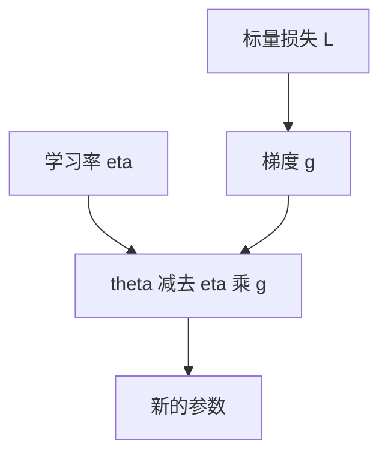

# 梯度下降与学习率

沿损失下降最快的方向走一小步；这一小步有多长，由学习率说了算，不由梯度自己的欧氏长度说了算。

<footer>—— 据 Cauchy, Méthode générale pour la résolution des systèmes d'équations simultanées, 1847；Goodfellow et al., Deep Learning, 2016 整理</footer>

[下一词分类](/llm/clm-as-next-token)给出标量损失 $L(\theta)$。本课不重写因式分解。缺口是：有了对 $\theta$ 的导数之后，如何改参数。方法是梯度下降：$\theta\leftarrow\theta-\eta\nabla_\theta L$。本课只钉住「方向来自梯度、步长来自 $\eta$」；小批量噪声、动量、二阶自适应是后课。反向如何算出 $\nabla L$，要等到计算图那一单元。

## 问题

损失是参数的函数。在当前 $\theta$，一阶泰勒说：沿 $v$ 走 $\varepsilon$，损失改变约 $\varepsilon\langle\nabla L,v\rangle$。要使改变最负，$v$ 应与 $-\nabla L$ 同向。缺口不是新的损失，而是这条局部规则如何变成一次更新，以及 $\eta$ 为什么不能从梯度里消掉。

若令 $\eta$ 等于 $1/\|\nabla L\|$，每步都在参数空间走固定欧氏长度，损失的局部曲率一变就会过冲。若令 $\eta$ 随损失绝对值变，又把损失的任意可加常数引进步长。正确的接口是：$\nabla L$ 只给方向与相对尺度，$\eta$ 是独立超参，用来匹配参数的典型量级和损失的局部光滑程度。

### 学习率不是「梯度的倒数」

有人把 $\eta$ 理解成让 $\eta\|\nabla L\|$ 等于某一个固定的参数扰动。那是在用一阶信息冒充线搜索。真实线搜索要沿该方向试 $L$，深度学习几乎不做；$\eta$ 是全局常数或按日程衰减的标量。自适应方法稍后会给每个坐标不同的有效步长，但那是用梯度历史估尺度，仍不是「这一步的梯度取倒数」。把 $\eta$ 当成梯度归一化，后课 Adam 的 $\hat m/\sqrt{\hat v}$ 会看起来像重复劳动。

全梯度下降用整个训练集的 $L$。本课先写这一形式，只为把 $\eta$ 从噪声里分开。下一课才把 $\nabla L$ 换成小批量估计。实践中几乎从不用全梯度。

## 方法

一次更新 $\theta_{t+1}=\theta_t-\eta_t g_t$，其中 $g_t=\nabla_\theta L(\theta_t)$（或下一课的批量估计）。$\eta_t$ 可以恒定，可以按步数分段衰减，可以按余弦从初值降到末值。选择 $\eta$ 的量级通常与初始化、层宽、损失平均方式绑定：损失若从「求和」改成「求平均」，梯度缩小 $B$ 倍，$\eta$ 往往要放大，否则名义上的同一数字其实不是同一有效步长。

停步条件不是本课的重点。本课只需承认：固定 $\eta$ 时，靠近极小点若曲率很大，会在谷底振荡；曲率很小，则走得极慢。这是一阶方法的几何，不是实现 bug。

## 机制

$\eta$ 把参数空间的欧氏度量强加给损失的几何。损失在不同层、不同矩阵上的尺度可以差几个数量级，同一 $\eta$ 对有的坐标过大、对有的过小。这正是后课自适应方法要补的缺口。本课先把问题暴露出来：不是「先把网络训好再谈优化」，而是没有 $\eta$ 就没有训练。

梯度下降保证的是：在 $\eta$ 足够小、 $L$ 足够光滑时，一步之后 $L$ 不会上升。足够小取决于 Lipschitz 常数一类量，实践中靠试。过大的 $\eta$ 让损失发散或长期震荡；过小的 $\eta$ 让人误以为模型没有容量。调 $\eta$ 是在调这条一阶程序，不是在调词表。

## 边界

本课不计算梯度，只使用它。不讲牛顿法、不讲自然梯度。下一课[小批量噪声](/llm/minibatch-noise)把 $g$ 换成随机估计，并解释噪声为何既妨碍又有用。后课默认：参数更新是减 $\eta$ 乘梯度；改变损失的平均方式必须同时声明对 $\eta$ 的影响。

## 小结

- 一阶更新沿 $-\nabla L$，步长由独立的学习率 $\eta$ 给定。
- $\eta$ 不是梯度的归一化常数；损失从求和改成平均会改变有效步长。
- 过大则震荡或发散，过小则看似训不动。
- 全梯度只是记号；实现几乎总是后课的小批量。
- 出处：Cauchy, 1847；Goodfellow et al., Deep Learning, 2016。
