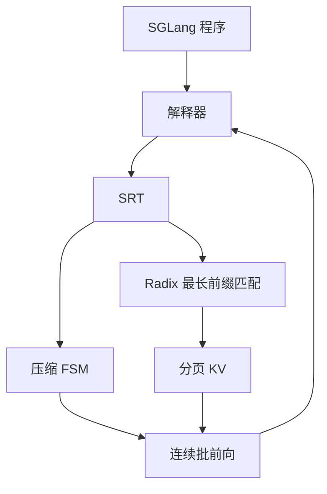

# SGLang 论文

    
前端把多次生成写成程序，运行时用前缀树把 KV 留下来；语言与缓存共设计，复用才不必靠调用方手工传 cache 句柄。

    <footer>—— Zheng et al., SGLang: Efficient Execution of Structured Language Model Programs, NeurIPS 2024</footer>

Zheng、Yin、Xie、Sun、Huang、Yu、Cao、Kozyrakis、Stoica、Gonzalez、Barrett、Sheng 的 SGLang 论文（arXiv:2312.07104，NeurIPS 2024）把对象定义成 **语言模型程序**：多次 `gen`、控制流、结构化输入输出，而不是一次 HTTP 补全。当时的 vLLM、TGI、TensorRT-LLM 把每次生成当独立请求，调用结束就丢 KV，程序里共享的系统提示与 few-shot 被反复 prefill。SGLang 的声称是前后端共设计：Python 内嵌 DSL 给出 `extend` / `gen` / `select` / `fork` / `join`，SRT 运行时用 RadixAttention 自动复用 KV，并用压缩 FSM 加速约束解码。概念说明见 [SGLang 与 RadixAttention](/llm/sglang)；树的插入淘汰见 [前缀树](/llm/sglang-radix-tree)。本篇钉论文的问题陈述、实验数字与边界。

## 问题

代理、思维树、多路评判、JSON 抽取的质量来自多步，而不是单次采样。用字符串拼接调 OpenAI 式 API，既难写 `fork` 出的并行，又把每次往返当冷启动。开源引擎侧对称：连续批和分页解决了单次服务的碎片，默认语义仍是「请求结束 → KV 可回收」。公共前缀变成重复计算。约束输出是第二条低效：schema 或正则把合法词表收得很小，有的 token 已被文法唯一确定，逐步前向仍按全词表节奏走。

高阶框架（LangChain、DSPy）管提示模板与优化器；低阶层（LMQL、Guidance、SGLang）直接操作提示状态。SGLang 相对后两者的差异是自带 Runtime：原语可以变成运行时提示，例如 `fork` 先把前缀插入 radix 再发剩余 token。没有共设计，前端只能把完整字符串丢给通用引擎，复用模式在到达时已经摊平。

### 程序级加速不是核级加速

Radix 命中省的是 prefill。Decode 仍要逐步读变长 KV，带宽屋顶线不变。把论文里的吞吐倍数听成「每步 GEMM 快了若干倍」，是把程序结构说成内核优化。评测必须用多调用、有共享前缀的负载；无共享的单轮短补全上，论文自己写了收益可忽略。

出处钉 arXiv:2312.07104 与 https://github.com/sgl-project/sglang。LMSYS 博客与论文是同一条工作的不同文本，倍数以实验节为准，不要给博客另编一篇 arXiv。

## 方法

前端把提示当成可追加的流。`extend` 追加字符串，`gen` 采样写入命名槽，`select` 按分数在候选里挑，`regex` 把生成约束到文法。解释器把原语异步提交给流执行器，类似异步启动 CUDA 核。`fork` 复制提示状态做多路，`join` 合并。同一程序也可 trace 成图再编译；论文默认评测走解释器。

RadixAttention：请求结束后 KV 不立即丢，按 token 序列插入压缩前缀树，边可标一段 token，节点指向分页 KV。新请求做最长前缀匹配，命中部分跳过 prefill。淘汰 LRU，先逐叶子，公共祖先尽量留到变成叶子。正在被当前 batch 引用的节点不能逐。缓存与运行中请求共用同一 KV 池：等待队列很长时，缓存页让给更大的运行中集合。

压缩 FSM：约束编成状态机后，把单出口路径压成一步，一次前向吐多个已被文法决定的 token。仅 API 的模型另走推测执行后续 `gen`，减少往返与输入 token 计费——这条不适用于自托管 SRT。

### 实验负载与倍数

对照 Guidance、vLLM、LMQL 等，模型含 Llama 7B/70B、Mixtral-8x7B、LLaVA 等。负载覆盖代理、推理、few-shot、JSON、RAG、多轮与多模态。论文报告的峰值吞吐约 6.4 倍量级出现在有大量共享前缀或约束路径的程序上，不是所有任务的平均数。缓存感知调度按已匹配前缀长度排序；离线且缓存容量足够时，论文给出与树上 DFS 相关的最优命中论述（假设忽略输出长度不确定性等）。在线到达会打乱 DFS，算法仍偏向加厚当前热前缀。

6.4× 是程序级峰值，钉在具体负载与硬件上。无共享前缀时不要用这个数做容量规划。Radix 树在 CPU 上，空树的额外开销论文称为可忽略——那是「没有复用机会」时的代价，不是「永远免费」。

## 机制

KV 只依赖前缀 token，相同前缀的键值可以字节级复用，不改采样分布。命中率 = 缓存住的提示 token / 提示 token 总数。调度顺序影响命中：在无关请求间来回切会造成颠簸。最长前缀优先是在线近似：让当前树的热路径更热，而不是全局最优。前端 `fork` 先发前缀，是共设计：运行时若只收到完整字符串，仍能匹配，但插入顺序更难保证「先有可共享节点」。

压缩 FSM 不改变有分支处的采样。它只把「中间没有分支」的链一次写完。JSON 的固定键名、引号、逗号特别吃这一招。更一般的 CFG 与掩码缓存是后续 Outlines / XGrammar 的故事；论文原文的加速点是这条压缩。

### 与 vLLM 论文的关系

RadixAttention 写成与 continuous batching、PagedAttention、张量并行相容。差别在生命周期：vLLM 论文主路径是请求结束归还块；SGLang 把归还延迟到 LRU 需要腾空间时。没有共享时两者接近；有共享时吞吐差来自少做的 prefill。不要把 SGLang 读成「替代分页」；树的节点指向的仍是页。

公平性是原文列出的未来工作：最长前缀优先可能饿死短前缀请求。生产接入时要另接老化或配额，不能假设论文调度直接满足多租户 SLO。

## 边界与工程取舍

无共享的单轮补全应看连续批与核，而不是调大 radix 缓存。API 推测执行只对闭源、按 token 计费、多调用程序有意义。多模态节点按图像 token 序列对齐，编码器是否缓存取决于实现；文本 radix 不自动覆盖视频。数据并行下每张卡一份分片 KV；跨机命中还要 [decode 亲和](/llm/decode-affinity)，单机树不够。

约束解码后来接了更完整的文法引擎，论文中的压缩 FSM 不应写成 2026 年 SGLang 运行时的全部约束故事。加速比随程序结构变：few-shot 共享示例、代理共享工具说明时高；每次提示都独一无二时低。引用必须带任务名。

不要把 DSPy 的提示优化和 SGLang 的 KV 复用当成同一层。排障时要分清慢在「提示更长」还是「前缀没命中」。

NeurIPS 版本与 arXiv 实验表应对照后再抄。运行时仓库迭代很快，Radix 的默认淘汰与调度以发布说明为准，不要把 2024 年表格直接贴到另一主版本上。

## 小结

- SGLang 论文的对象是 LM 程序 + 共设计运行时，不是又一个仅 HTTP 的生成服务。
- RadixAttention 用前缀树 + LRU 跨调用保留 KV；缓存感知调度按最长命中排序。
- 压缩 FSM 在无分支约束路段一次吐多 token。
- 加速主要来自少做的 prefill；峰值约 6.4× 不可当成核加速常数。
- 与 PagedAttention、连续批相容；无共享与跨机亲和是边界。
- 出处：Zheng et al., *SGLang: Efficient Execution of Structured Language Model Programs*，NeurIPS 2024，arXiv:2312.07104。
