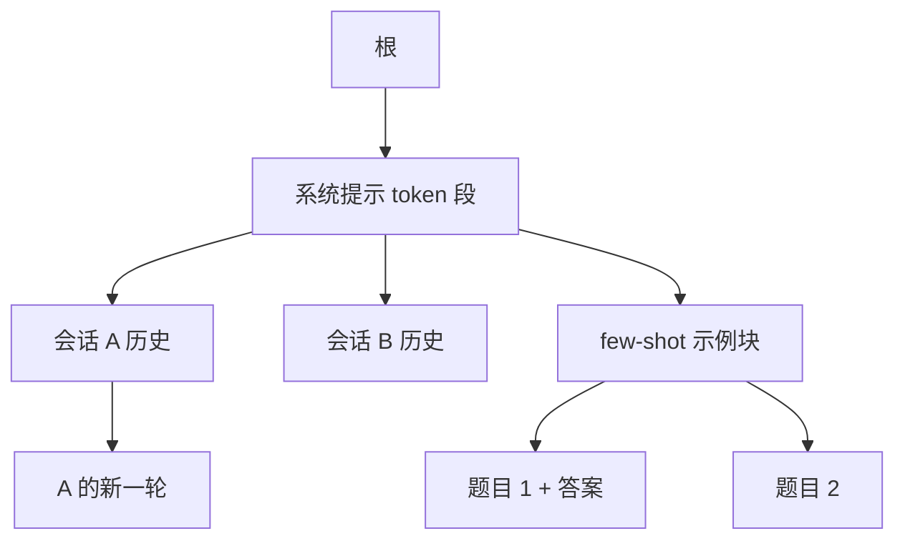

# SGLang 前缀树

边可以标一整段 token，而不只是一个字符；匹配、分裂、按 LRU 摘叶子，构成 RadixAttention 的全部索引操作。

<footer>—— Zheng 等 SGLang 论文中 RadixAttention 与定理 3.1</footer>

Radix 树（压缩前缀树）是字典树的空间改进：边上可以挂变长的 token 序列，公共前缀共享一条路径，第一次分叉才分裂节点。SGLang 用它当 **token 序列 → KV 张量** 的索引：GPU 上的键值仍按页存放，CPU 上的树决定新请求能复用哪一段页。[上一篇](/llm/sglang) 写为何要复用；本篇写树怎么长、怎么瘦、调度怎样顺着树走，以免把「开了 prefix cache」当成一个无结构的哈希表。

## 问题

共享模式不是单一的「系统提示」字符串。多轮聊天在历史处分叉；few-shot 在示例块之后接不同题目；自洽采样在同一问题下分出多条答案；`fork` 原语故意复制当前前缀再并行生成。哈希整段提示只能命中完全相同的请求，对「前 800 个 token 相同、后面不同」无能为力。逐 token 的普通 trie 则节点太多，边标签长度为 1，插入与指针开销涨得快。

还要和连续批、有限 HBM 共存。树若独占一块「缓存专用」显存，运行中 batch 就被卡住；树若可以任意逐正在使用的节点，注意力会读到已回收的页。索引必须带引用计数，并且和 [分页池](/llm/vllm-paged) 抢同一笔预算：页要么给正在算的序列，要么给 LRU 里的历史前缀，没有第三种魔法容量。

### 最长前缀匹配是热路径

每次新请求（或 `extend`）要把完整 token 序列拿来走树，找到已有 KV 的最长前缀，剩余后缀才进 prefill。匹配必须足够快，以至于相对 GPU 前向可忽略。这要求树在 CPU、节点数与真实不同前缀数同阶，而不是与 token 总数同阶——压缩边的意义在这里。

KV 依赖位置与完整前缀，相同子串出现在不同位置不能共用节点。树的键是「从序列开头出发的路径」，不是任意 infix。把后缀树、倒排索引的直觉搬过来会复用错误的页，数值立刻错。

## 方法

空树只有根。第一条请求跑完，系统提示、用户话与回复可以收成一条边上的一段 token，指向一组页。第二条请求若共享系统提示但不共享第一轮用户话，就在分叉点 **分裂边**：原边拆成「公共前缀」边和「旧后缀」边，再挂上「新后缀」边。这与论文图 3 里两个聊天会话共享 `You are a helpful assistant` 的步骤相同。few-shot 批次到来时，在示例块之后为每道题挂叶子。自洽采样则在问题节点下挂多条答案边。

淘汰：当池不够，按 LRU 选择 **引用计数为零的叶子** 驱逐，释放其页。祖先暂时保留，因为其他会话可能还走那条前缀；祖先变成叶子且变冷之后才会被摘。不能驱逐当前 batch 正在用的节点。插入与驱逐都可能伴随边的合并（只剩一个孩子时把边标签拼回去），以保持压缩树的形状。

前端在 `fork` 时先把已知前缀作为提示发给运行时，保证该前缀已经在树里，再发分叉后的增量。这降低调度器在乱序到达时匹配错位的概率，是语言与树操作的接合点。

### 缓存感知顺序近似树上的 DFS

等待队列不空时，先匹配每条请求的当前最长前缀，再按匹配长度排序，长者先入运行中集合。定理 3.1：离线给定一批请求，若缓存容量不小于最长请求长度，按这些请求构成的 radix 树上的 DFS 访问可达到最优命中率；最长共享前缀优先与 DFS 等价。证明依赖「访问子树时公共祖先都还在」一类容量条件。在线到达会打断 DFS，算法仍优先深化当前已经打开的分支，而不是在无关分支间跳。输出长度未知会导致额外重算，论文也写了实践与证明假设的差别。

## 机制

命中发生在 prefill：匹配长度为 $m$ 则少算 $m$ 个提示位置的 KV，decode 仍从当前位置继续追加，新生成的 token 作为新边或原叶的延伸写回树。因此树既是缓存索引，也是「刚生成的内容」的索引——下一轮聊天要把模型自己的回复当历史，这些页已经在叶子上，不必再从文本重算一遍（若尚未被 LRU 摘掉）。

空间上，树结构本身在 CPU，可忽略；占 HBM 的是节点指向的页。与专用前缀缓存不同，SGLang 不先划一块固定 cache：页的身份在「运行中」与「仅缓存」之间转换，只由引用计数区分。等待队列堆积时，淘汰会把历史前缀让给并发，命中率下降、batch 变大——这是故意的动态，不是配置错误。若运维强行「锁定系统提示永不淘汰」，等于给一条边提高优先级，应用层可以做，但会挤占别人的运行中槽。

把 radix 树画成「所有用户共享一棵全球树」时，要想多租户隔离。前缀相同才会汇合；不同客户的系统提示不同，树在根附近就分开。真正要小心的是同一提示模板服务所有人时，叶子上的用户内容不要错误共享——匹配必须走到分叉点为止，不能因为模板相同就把用户段别名到同一页。

### 张量并行下树不必分叉成多份逻辑

TP 时每张卡持有 KV 的分片，逻辑 token 序列仍是一条。树操作（匹配、分裂、LRU）在中央做一份即可，各卡按同一块号写自己的分片。数据并行多副本则是多棵树、多份页；跨副本命中要靠路由把同类前缀打到同一副本，否则树是空的。那是 [decode 亲和](/llm/decode-affinity) 的集群版，不是单树算法能解决的。

## 边界与工程取舍

定理 3.1 不是在线公平性保证。最长前缀优先会让一条热门 few-shot 主干上的请求长期插队，冷门短请求饥饿。生产要加老化、优先级或配额。输出很长时，叶子占页多，LRU 会更频繁地摘刚聊完的会话——多轮产品若希望下一轮必命中，需要把「会话钉住」做成显式策略，而不能仅依赖默认 LRU。

块大小与边标签长度是不同粒度。边可以跨许多分页块；分裂发生在 token 边界，不一定在块边界。实现上常在分裂点把页的引用拆开，必要时 copy-on-write 尾块。不要假设「radix 的一条边 = 一个 KV 块」。多模态边的 token 化必须与编码器一致，否则匹配长度没有定义。

调试命中率应打印匹配到的 token 数、分裂次数、逐出叶子类型（聊天尾、few-shot 题面、还是系统提示）。只报一个 $h$ 会把「树坏了」和「负载本来无共享」混在一起。无共享时树仍会插入再立刻逐出，这是正常稳态。

## 小结

- SGLang 用压缩前缀树索引「从序列起点出发的 token 路径」到分页 KV，边为变长段。
- 分叉靠裂边，淘汰先摘零引用的 LRU 叶子，以保留公共祖先。
- 缓存页与运行中页同一池；引用计数禁止逐正在使用的节点。
- 最长共享前缀优先在离线假设下等价于 DFS，给出最优命中；在线与公平性要另补。
- 跨副本的树不共享，命中依赖路由亲和。
- 出处：Zheng et al., *SGLang: Efficient Execution of Structured Language Model Programs*, NeurIPS 2024（arXiv:2312.07104）第 3 节与定理 3.1。
