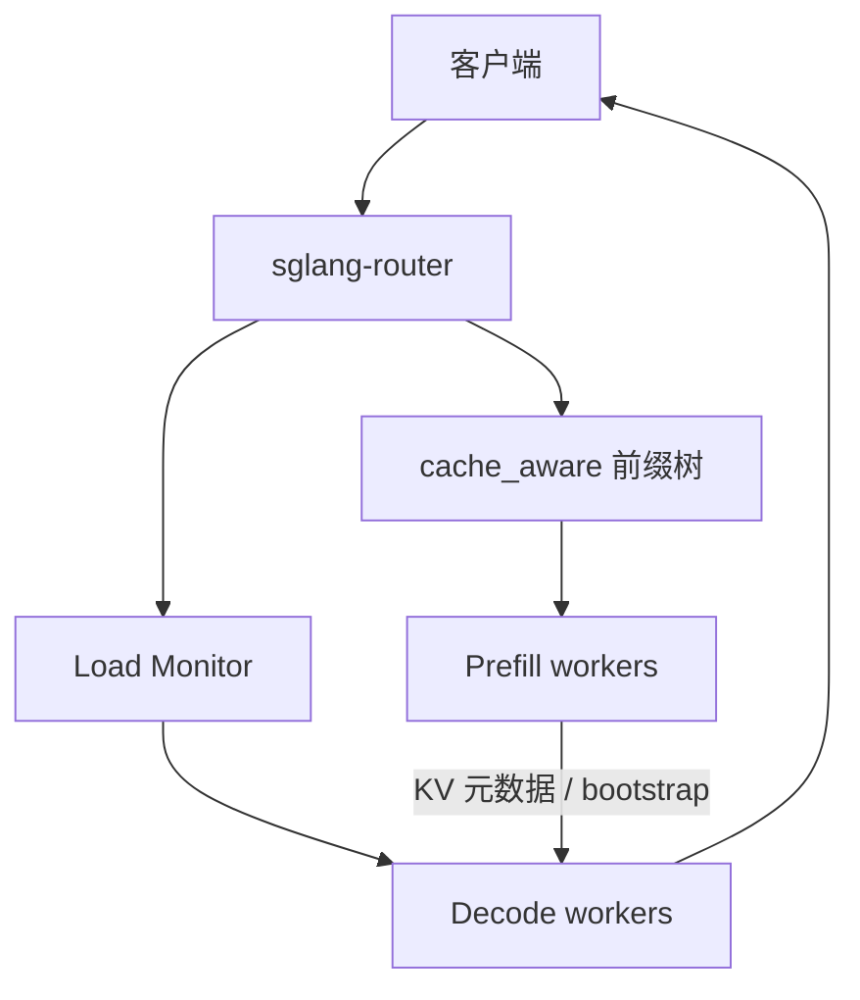

# SGLang Router

引擎内的 radix 树只能看见本进程的页；集群入口要用另一棵前缀树决定请求去哪台 worker，否则多副本把命中率摊成近似均匀随机。

<footer>—— SGLang Model Gateway / sglang-router 文档；树算法对照 Zheng et al., NeurIPS 2024</footer>

[SGLang](/llm/sglang) 的 RadixAttention 解决单运行时里「请求结束后 KV 先留着、按最长前缀匹配」。复制出 $N$ 个 SRT 进程之后，若不在入口做同样的事，第 $i$ 条共享系统提示的请求会以 $1/N$ 的概率打到持有该前缀的那台，命中期望按副本数稀释。`sglang-router`（Rust 实现，Python 入口 `sglang_router.launch_router`，近期文档也称 SGLang Model Gateway）是这层入口：负载策略、PD 分离时的双池选择、健康检查与重试。本篇写路由器，不写树节点如何裂边——那是 [前缀树](/llm/sglang-radix-tree) 的职责。

## 问题

数据并行多副本是多份权重、多份 KV、多棵 radix。引擎没有全局页表。轮询或随机对无共享负载是公平的；对多轮聊天、few-shot、智能体循环则系统性地破坏缓存局部性。Power-of-two 选择（随机抽两台、挑更闲的）能抑制羊群，但看不见前缀。需要一种策略：既维护「哪台 worker 上有过哪些前缀」的近似视图，又在某台过热时把流量溢出去。

PD 分离把问题再乘一次。前填 worker 与解码 worker 是两份名单；前填侧要缓存感知，解码侧往往要负载感知并遵守 [亲和](/llm/decode-affinity)——KV 已经交给某台解码机之后，后续 token 不能再按前缀随便换家。路由器还要合并前填元数据与解码输出、处理 bootstrap 端口、在 Kubernetes 里用 selector 发现两类 Pod。这些都不该塞回单个 SRT 进程。

### 入口树不是引擎树的副本

引擎 radix 指向 GPU 页，带引用计数与 LRU，和运行中 batch 抢同一池。路由器的树只存前缀 token 与 worker 身份，为的是选机器，不存 KV 张量。两棵树会暂时不一致：worker 已淘汰某前缀，路由器仍以为命中，请求打过去后引擎会全额前填——这是缓存感知路由的固有陈旧，要用淘汰周期、树大小上限和 worker 回报来逼近，而不能假设强一致。

`--policy cache_aware` 默认维护的是路由器进程里的树。它不会通过 RDMA 去读 worker 的页表。把「开了 cache_aware」理解成「集群级 Mooncake」，层位错了。

## 方法

文档列出的策略包括：`random`、`round_robin`、`power_of_two`（抽两台比负载）、`cache_aware`（默认：前缀局部性加负载阈值）、`bucket`（按负载分桶）。`cache_aware` 可调 `--cache-threshold`、`--balance-abs-threshold`、`--balance-rel-threshold`、`--eviction-interval`、`--max-tree-size`：重叠不够高或某 worker 明显更忙时，退回均衡，以免热前缀把一台打满。Load Monitor 给 power-of-two 与 cache-aware 提供实时负载；后台健康检查、带抖动的重试、worker 级熔断和令牌桶限流构成可靠性内核。

PD 模式：`--pd-disaggregation`，`--prefill` / `--decode` 列出两类 URL，前填项可带 bootstrap 端口。`--prefill-policy` 与 `--decode-policy` 可分别设，例如前填 `cache_aware`、解码 `power_of_two`。路由器负责把前填结果注入解码请求并流式回客户端。Kubernetes 上用 `--service-discovery` 加 `--prefill-selector` / `--decode-selector` 动态发现；历史上出现过「动态发现 + PD + cache_aware 时树未初始化、选不出 worker」的缺陷，后续用 `init_pd_cache_aware_policies` 在注册时把两类 worker 填进全局策略（见 sgl-project/sglang#23573 一类修复）。运维要确认当前发行版在 PD 下确实给树喂了 worker，而不是只看命令行写了 `cache_aware`。

多模型网关（IGW）允许按模型覆盖策略。gRPC、MCP 集成出现在较新的 gateway 文档里，属于入口扩展，不是 RadixAttention 论文的范围。

### 与引擎调度的两级优化

引擎内缓存感知调度按最长匹配前缀排序等待队列，Zheng 等人给出离线 DFS 最优命中的定理（NeurIPS 2024 / arXiv:2312.07104）。路由器决定的是**哪台机器上的树**会被这道请求加厚。两级都做最长前缀，命中才接近单机论文数字；只做引擎、入口轮询，论文里的 6.4× 量级不会在多副本上复现。只做入口、引擎关闭 radix，入口树指向的工人仍然每条请求冷启动。正确叠法是：入口 cache-aware + 引擎 RadixAttention + 可选的 [Mooncake Store](/llm/mooncake-store) 跨机对象。

DP 感知调度（文档中的 DP-aware）处理单进程内多数据并行 rank 的选择，与跨进程 worker 选择不是同一层。配置时不要把 `--dp-size` 与路由器副本数混成一个旋钮。

## 机制

cache-aware 的机制是**用 CPU 上的前缀索引逼近 GPU 上的页布局**。插入发生在请求被送到某 worker 之后（或并行地根据提示预插入）；淘汰按时间间隔与树大小，防止路由器内存无限涨。阈值让算法在「跟缓存走」和「跟负载走」之间切换：相对空闲差超过 `balance-rel-threshold` 时，宁可牺牲一点命中，也避免一台的 TBT 先爆。这与 Dynamo Smart Router 的 overlap score、Ray Serve 的前缀路由是同一权衡。

PD 下前填命中省的是 TTFT；解码侧 power-of-two 保的是 TBT 与 KV 容量。bootstrap 端口让解码工人找到前填侧的传输端点，语义上等于 DistServe 的 pull 握手，实现可以是 NIXL、Mooncake Transfer Engine 或引擎自带 connector。路由器自己通常不搬 GB 级 KV，只搬元数据；把传输做进路由器进程会把它变成带宽瓶颈。

熔断是 worker 级的。一台前填机连续失败应从树里摘掉，否则 cache-aware 会因为「它还有热前缀」而持续把流量送进坏节点。健康检查失败必须同时更新策略里的 worker 集。

### 陈旧命中与颠簸

路由器树比引擎树更大、更旧时，会出现「假命中」：请求被送到以为有前缀的机器，引擎 LRU 早已释放。假命中的代价是一次普通前填加上错误的亲和，通常仍可接受。更坏的是颠簸：两台来回抢同一热前缀，谁都形不成稳定的厚分支。阈值与 eviction 间隔是抑制颠簸的旋钮；把 `max-tree-size` 设太小，树频繁清空，策略退化成随机。观测应打「路由以为的匹配长度」和「引擎回报的真实匹配长度」，两者长期分叉就是陈旧或 bug。

## 边界与工程取舍

路由器是新的故障域。Rust 二进制崩溃则全集群入口不可用，需要多实例入口再在前面做无状态四层均衡——但无状态层不能再做轮询把 cache-aware 打散，要用一致性哈希把同一用户粘到同一路由器实例，否则每台路由器一棵互不相干的树。这是缓存感知入口的经典递归：入口本身也要亲和。

K8s 动态发现下，worker 注册与策略初始化的时序 bug 会表现为间歇性「Failed to select prefill/decode worker」。升级发行版、确认 `init_pd_cache_aware_policies` 被调用，比把策略改回 `round_robin` 再忘记改回来更正确。gRPC / HTTP 双协议、MCP 工具调用不要默认假定与 OpenAI 路径走同一套 cache 键——工具结果若进入提示，键必须包含那一段，否则多步智能体会在路由器上看不见共享。

不要把 sglang-router 写成论文贡献。NeurIPS 文本写的是单运行时 radix 与前端共设计；路由器是工程仓库为多副本与 PD 补的控制面，引用应以仓库文档与 PyPI `sglang-router` 说明为准，命中率数字仍以论文实验节的单机设定为上界。

出处钉 https://github.com/sgl-project/sglang 中 Model Gateway / router 文档、PyPI `sglang-router`，以及 Zheng et al., *SGLang: Efficient Execution of Structured Language Model Programs*, NeurIPS 2024（arXiv:2312.07104）对引擎内树与缓存感知调度的定义。

## 小结

- SGLang Router 在集群入口做 worker 选择；cache-aware 维护前缀→机器的索引，不保存 KV。
- PD 模式下前填与解码分策略、分发现；路由器合并元数据，传输仍走工人之间的数据面。
- 与引擎 RadixAttention 是两级：入口选树，引擎用树。只开一层，多副本收益到不了论文数字。
- 负载阈值防止热前缀羊群；健康检查必须把坏节点从树里摘掉。
- 多路由器实例时，入口本身也需要亲和，否则每棵树各记各的。
- 出处：sglang-router / Model Gateway 文档；引擎侧树见 Zheng et al., NeurIPS 2024。
