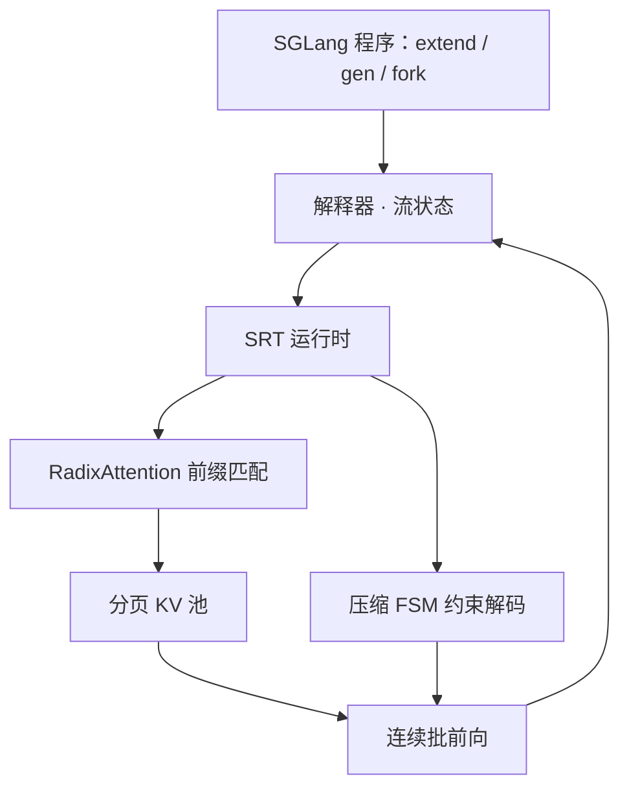

# SGLang 与 RadixAttention

语言模型程序里充满共享前缀与多次生成调用；运行时若用前缀树把 KV 留下来，复用就不必靠人手工配置缓存键。

<footer>—— Zheng 等，SGLang: Efficient Execution of Structured Language Model Programs，NeurIPS 2024</footer>

聊天补全把一次提示、一次生成当成全部。代理、多轮、few-shot、思维树、JSON 抽取则是 **语言模型程序**：多次 `gen`、控制流、结构化输入输出。Zheng 等人认为，当时的引擎（含 vLLM、TGI、TensorRT-LLM）把每次生成当独立请求，调用结束就丢 KV，程序里明明共享的系统提示与 few-shot 被反复 prefill。SGLang 把前端语言和运行时一起设计：前端用 `extend` / `gen` / `select` / `fork` / `join` 写出多调用结构，运行时用 RadixAttention 自动复用 KV，并用压缩有限状态机加速约束解码。本篇写这套共设计；树的插入与淘汰见 [前缀树](/llm/sglang-radix-tree)，文法掩码见 [约束解码](/llm/constrained-decoding)。

## 问题

LM 程序有两条性质。第一，多次生成调用夹杂控制流，质量靠多步而不是单次采样。第二，输入输出要结构化，才能嵌进原有软件。用字符串拼接调 OpenAI 式 API，既难写并行（`fork` 出多路评判再 `join`），又把每次 HTTP 当冷启动。开源引擎侧的问题对称：连续批和 [分页](/llm/vllm-paged) 解决了单次服务的碎片，却默认「请求结束 → KV 可回收」。多调用之间的公共前缀因此变成重复计算。

约束输出是第二条低效。JSON schema、正则、选择题把下一步合法词表收成很小的集合，甚至连续多个 token 已经被文法唯一确定。若仍逐步前向、每步只掩一个 token，既浪费步数，又把掩码开销打在热路径上。SGLang 要同时打这两点：跨调用的 KV 复用，以及约束下的多 token 推进。

### 高阶框架不替代运行时

LangChain、DSPy 一类高阶层管提示模板与优化器；LMQL、Guidance、SGLang 属于低阶层，直接操作提示状态与生成原语。SGLang 的差异是自带 Runtime（SRT），原语可以变成运行时提示——例如 `fork` 先把前缀插入 radix 再发剩余 token。没有共设计，前端只能把完整字符串丢给通用引擎，复用模式又隐掉了。

论文把 SGLang 写成 Python 内嵌 DSL，兼容控制流与库。它不负责自动改写提示词。把 DSPy 的提示优化和 SGLang 的 KV 复用当成同一层，会在排障时不知道慢在「提示更长」还是「前缀没命中」。

## 方法

前端把提示状态当成可追加的流。`+=` / `extend` 追加字符串，`gen` 采样并写入命名槽，`select` 在候选里按分数挑，`regex` 把生成约束到文法，`image` / `video` 接入多模态。解释器把原语异步提交给流执行器，类似异步启动 CUDA 核：Python 继续跑，取结果时再同步。`fork` 复制提示状态做并行多路，`join` 合并。同一程序也可 trace 成图再编译，论文默认评测走解释器。

运行时第一项是 RadixAttention。请求结束后，提示与生成的 KV **不立即丢**，而是按 token 序列插入一棵 radix 树：边可以标一段 token，节点指向分页存放的 KV。新请求做最长前缀匹配，命中部分跳过 prefill，只对后缀前向。淘汰用 LRU，且先逐叶子，以便公共祖先尽量留到变成叶子。正在被当前 batch 引用的节点引用计数非零，不能逐。缓存与运行中请求共用同一块 KV 池：等待队列很长时，系统会把缓存页让给更大的运行中集合，而不是预留一块专用 cache。

第二项是压缩 FSM：把约束编成状态机后，把单出口的路径压成一步，从而一次前向吐多个已被文法决定的 token。第三项针对仅 API 的模型（如当时的 GPT-4）：推测执行后续 `gen` 以减少往返与输入 token 计费。开源权重走 SRT；API 模型走另一条后端。两者共享前端原语。

### 与 vLLM 的关系是叠而不是替

RadixAttention 明确写成与 continuous batching、PagedAttention、张量并行相容。差别在生命周期：vLLM 论文的主路径是请求结束归还块；SGLang 把归还延迟到 LRU 需要腾空间时。没有共享前缀的负载上，论文称额外内存与时间开销可忽略——树在 CPU 上，空树就是每次插入再很快淘汰。有共享时，吞吐来自少做的 prefill，不是来自更快的 decode 核。

## 机制

KV 只依赖前缀 token。因此相同前缀的两次调用，键值张量可以字节级相同，复用是精确的，不改变采样分布。命中率定义为缓存住的提示 token 数比上提示 token 总数。等待队列里的执行顺序会影响命中：在无关请求之间来回切会导致颠簸。SGLang 用缓存感知调度，按已匹配前缀长度排序，优先最长共享前缀；离线情形下这与在请求的 radix 树上做 DFS 等价，论文给了最优命中的定理（在缓存容量不小于最长请求、且忽略输出长度不确定性等假设下）。在线时 DFS 会被打乱，算法仍在「当前树的加厚部分」上近似 DFS。

多调用程序的加速往往集中在 prefill。代理每一步都带同一段工具说明、few-shot 每条样本共享同一示例块、多轮聊天共享系统提示加历史。Decode 步仍要逐步读不断变长的 KV，Radix 不改变 decode 的带宽屋顶线。把「6.4× 吞吐」听成「每步 GEMM 快 6.4 倍」，是把程序级复用说成核级加速。该数字来自论文在代理、推理、few-shot、JSON、RAG、多轮及多模态等负载上相对 Guidance、vLLM、LMQL 的峰值，硬件与模型（Llama 7B/70B、Mixtral-8x7B、LLaVA 等）写在实验节，不能当常数抄到另一张集群。

前端提示（fork 先发前缀）是共设计的例子：运行时若只收到完整字符串，仍能匹配，但插入与调度更难保证「先有可共享节点」。语言把结构说出来，运行时才能把结构变成树操作。

### 约束路径上的压缩与掩码

合法下一步往往远小于词表。逐步掩码保证结构正确，但逐步前向的开销还在。压缩 FSM 找到「中间没有分支」的 token 链，一次写入多个 token 并推进状态。这与采样随机性不冲突：有分支的地方仍要跑模型。JSON 的固定键名、引号、逗号特别吃这一招。更一般的 CFG 与运行时掩码缓存是 Outlines / XGrammar 的故事，SGLang 运行时后来也接这些引擎；论文原文的贡献点是压缩 FSM 这条加速。

## 边界与工程取舍

Radix 对「完全无共享」的单轮短补全帮助很小，论文也写了无复用机会时的对比。此时应看连续批与核，而不是强行调大缓存。贪心的最长前缀优先可能饿死短前缀请求，公平性要另接；原文把与公平调度的结合列为未来工作。

API 推测执行只对闭源、按 token 计费、多调用的程序有意义，不能搬到自托管 SRT 上当吞吐开关。多模态节点在树里按「图像 token 序列」对齐，编码器是否缓存、像素是否参与键，取决于实现；不要假设文本 radix 自动覆盖视频。分布式数据并行下，每张卡一份分片 KV、树操作相同；跨机前缀命中还要 [decode 亲和](/llm/decode-affinity)，单机 radix 不够。

出处钉 Zheng 等 NeurIPS 2024 / arXiv:2312.07104 与 https://github.com/sgl-project/sglang。不要给「某次博客里的 5×」另编一篇 arXiv。LMSYS 博客与论文是同一条工作的不同文本，数字以论文实验节为准。

## 小结

- SGLang 是 LM 程序的前端原语加共设计运行时，不是又一个仅 HTTP 的生成服务。
- RadixAttention 用前缀树 + LRU 自动留下 KV，跨调用、跨请求共享前缀而不改数值。
- 缓存感知调度按最长命中前缀排序；与 PagedAttention、连续批相容。
- 压缩 FSM 让约束解码在无分支路段一次吐多 token。
- 加速主要来自少做的 prefill；无共享负载不要期待同等倍率。
- 出处：Zheng et al., *SGLang: Efficient Execution of Structured Language Model Programs*, NeurIPS 2024（arXiv:2312.07104）。
