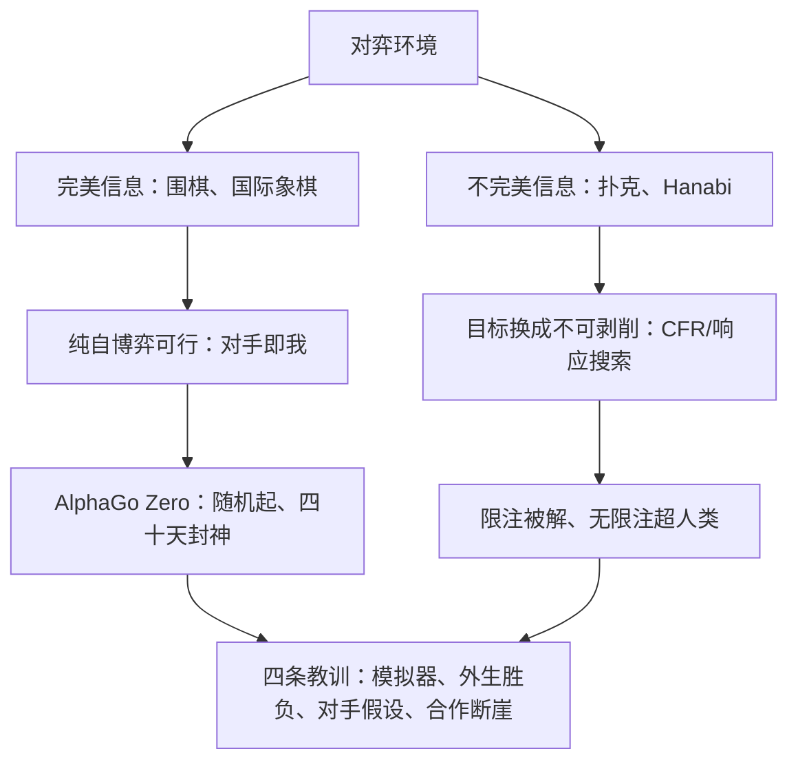

# 棋牌与棋类的教训

自博弈在棋与牌上各自封神，但两顶王冠是两种方法赢来的：棋赢在「我可以假设对手就是我」，牌赢在「我承认对手不是」。

<footer>—— 据 Silver et al., 2016/2017；Bowling et al., 2015；Moravčík et al., 2017；Brown &amp; Sandholm, 2018/2019 整理</footer>

[上一课](/llm/sgt-nontransitivity)解释了对手课程为什么永远做不完：策略空间带环，有限采样必有盲区。本课回头读一部成功史——自博弈在完美信息的棋（国际象棋、围棋）与不完美信息的牌（德州扑克）上达到超人类水平——并提炼每条经验对语言模型的适用条件。教训不是「自博弈有效」，而是「自博弈在哪些条件下有效」；下一课的奖励塑形会用到其中最硬的一条：胜负判据必须先于策略存在。

## 问题

自博弈的第一次系统胜利早于深度学习：Samuel 1959 的跳棋程序与自己对弈改进，Tesauro 1995 的 TD-Gammon 靠时序差分自博弈达到西洋双陆棋人类水平。当代的两个范式则把条件差异摆上台面。围棋侧：AlphaGo（Silver 等 2016）先模仿人类棋谱再自博弈超越；AlphaGo Zero（Silver 等 2017）从随机初始化、不用任何人类棋谱，纯自博弈加 MCTS 自蒸馏，三天超过战胜李世乭的版本，四十天定稿。扑克侧：不完美信息下最优策略依赖对手的真实范围，「对手即我」不能直接用，于是换引擎：CFR（Zinkevich 等 2007）用遗憾最小化逼近均衡，Cepheus 解决限注（Bowling 等 2015），DeepStack 与 Libratus 靠对当前策略反复求最佳响应拿下无限注（Moravčík 等 2017；Brown 与 Sandholm 2018），Pluribus 靠对平衡蓝本做局部搜索拿下六人局（Brown 与 Sandholm 2019）。

两边的方法分工由**信息结构**决定：完美信息零和里对手无私有信息，假设「对手是我」几乎无损，纯自博弈可以从零爬到神；不完美信息里均衡是混合策略，纯自博弈会暴露自身规律，目标必须从「赢下这局」退化成「不可被打穿」。

### 教训清单

四条直接可搬。其一，**环境可模拟**：棋与牌都能在闭环里以极低成本采样对局，自博弈的数据引擎是模拟器；语言任务缺少等价物，「对话模拟器」本身就是另一个模型。其二，**胜负判据外生且廉价**：将死、筹码清零，判据不随训练漂移；语言任务的「赢」要靠评测或奖励模型，判据自己会博弈（下一课与[奖励黑客](/llm/reward-hacking-llm)的主题）。其三，**对手假设要与信息结构匹配**：完美信息可以「对手即我」，不完美信息必须以可利用度为目标、用均衡求解或防御式自博弈。其四，**多人与合作是断崖**：Hanabi 作为合作不完全信息博弈成为新基准（Bard 等 2020），其难点是约定与信念而非计算——这预告了语言模型自博弈的真正难度：那里几乎全是 Hanabi 式问题。

AlphaGo Zero 与扑克 AI 的对照一句话：Zero 不需要人类数据因为它可以定义「更好」（胜率），扑克 AI 不敢只用胜率因为它要定义「不可剥削」。语言模型两边都不占：既无外生胜率，也无可算的可利用度。

## 机制

为什么「对手即我」在围棋成立、在扑克不成立？完美信息零和里双方共享同一状态、效用严格相反，均衡恰好是自博弈的不动点，这个假设无偏；不完美信息引入私有信息后，「我若这样想对手也会这样想」的二阶推理不再自洽——均衡要求随机化，确定性的追逐必然暴露。CFR 的机制是用遗憾和逼近这个混合，而不是让两个确定性策略互相追：自博弈没有消失，它退到「对自身混合的期望」这层。

语言模型自博弈在机制表上的位置很尴尬：对话是不完美信息（用户意图不可见）、一般和（不必你输我赢）、且模拟器与被判据都由模型充任。按本课清单，它的可行域最接近 Hanabi 而不是围棋：先把约定与信念搞对，再谈强度。这解释了后课为什么要给自博弈配塑形、辩论与协商，而不是直接开两个模型对打。

## 边界

本课教训的适用边界在「环境」上：棋牌环境是真规则系统，「可模拟、判据外生」是环境的属性；语言任务的环境本身是模型的产物，教训只能以类比方式借用。多人零和（Pluribus）的成功还依赖「多数对手近似均衡」的假设，语言场景的对手分布离它更远。把教训读成「自博弈万能」或「只对棋有效」都错：正确的读法是逐条件核对，缺哪条补哪条——补模拟器、补判据、补对手假设，分别通向塑形课、评测课与机制课。

## 小结

- 棋与牌的胜利方法不同：完美信息用纯自博弈（对手即我），不完美信息以可利用度为目标（CFR、响应搜索）。
- 教训四条：可模拟的环境、外生的胜负判据、与信息结构匹配的对手假设、多人合作是断崖。
- AlphaGo Zero 证明无人类数据的自博弈上限，但其前提是外生胜率；扑克 AI 证明防御式自博弈上限，前提是可算均衡近似。
- 语言模型自博弈的条件结构最近 Hanabi 而非围棋：不完美信息加一般和加自充判据。
- 教训是逐条件核对，缺哪条补哪条，不做「有效/无效」的二值外推。
- 出处：Silver 等 2016/2017；Zinkevich 等 2007；Bowling 等 2015；Moravčík 等 2017；Brown 与 Sandholm 2018/2019；Bard 等 2020。
