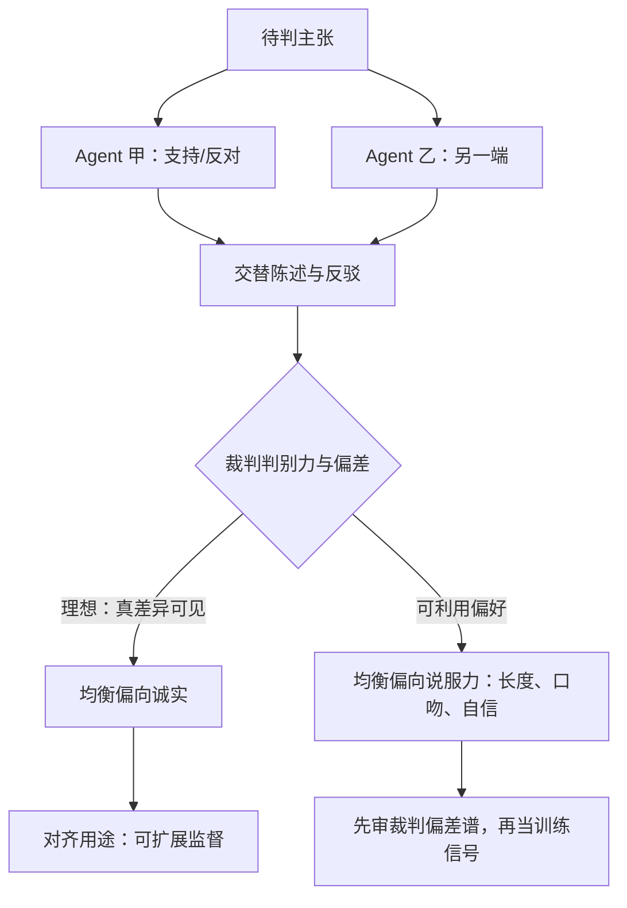
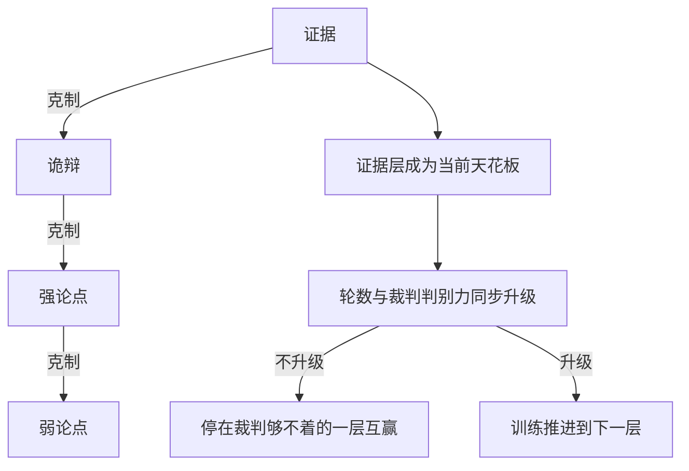

# 辩论作为博弈

辩论把「答案对不对」换成「哪边站得住」：真话不必然赢，但设计得好的辩论可以让假话越来越难赢。

<footer>—— 据 Irving, Christiano &amp; Amodei, AI Safety via Debate, 2018 整理</footer>

[上一课](/llm/sgt-reward-shaping)给自博弈配了塑形信号，其中最激进的通道是裁判打分——判据因此入了局。本课把这个通道推到底：与其让裁判给单个回答打分，不如让两个模型就一个主张各执一端对辩，裁判只选边。这就是辩论作为博弈：主干课的[辩论](/llm/debate-oversight)讲它作为可扩展监督的应用面，本课讲它的博弈结构——均衡在什么条件下偏向诚实，裁判的哪些偏差会把这个条件拆掉。

## 问题

辩论博弈的元素：一个待判主张，两个 Agent 交替给出支持本方、攻击对方的陈述，一个裁判（人或模型）在有限轮后宣布胜方。Irving、Christiano 与 Amodei 2018 的核心观察是：若真话在辩论中**总可胜出**，则人类无须亲自检查繁重证据，只须比较两边陈述——这是一种把「判断正确」外包给「比较优劣」的降本。其成立依赖一个博弈论命题：在理想裁判（判别力无界、不受表面特征干扰）下，诚实策略是均衡——因为说谎一方面对诚实方时，谎总会被拆，预期效用更低；于是双方都被迫向诚实靠拢，辩论退化成「共同出示证据」。

缺口在理想裁判不存在。真实裁判（尤其是 LLM 裁判）有可利用的偏好：长度、口吻、自信度、先后顺序。一旦裁判偏好偏离真值，均衡就向「说服力」移动而不是向「真值」移动，辩论变成寻找裁判弱点的研究。这正是不这么设计的常见错误：把辩论当数据引擎用，却从没测过裁判的偏差谱——产出的训练信号是「怎么赢裁判」，不是「什么是真的」。

「均衡」翻译成大白话：所有玩家都觉得自己换策略不划算的稳定局面，就像路口大家都靠右走，谁单独改成靠左反而更吃亏——没有人有动机先动，局面就锁死了。说「诚实是均衡」，意思是裁判足够公正时，说谎一方单独改成诚实会输得更惨。

### 均衡偏向诚实的三个条件

把条件摆开便于审计。其一，**裁判判别力**：真差异要能被裁判看见，假差异（修辞、重复）不能被加权。Khan 等人 2024 的实验给了正面证据：辩论中「更有说服力的论点」系统性导向更真实的答案——说服力与真值在他们的设置里正相关，但注意这是**经验观察**，不是结构保证，换个裁判或换个任务域相关可以变号。其二，**证据可出示**：真话的优势必须能被陈述出来；若证据超出双方（与裁判）的理解范围，辩论退化为表演，这是该提案对「超人类能力对齐」的原始动机，也是其最不可验证的假设。其三，**对称性**：双方能力、轮次、信息访问对称，否则辩论测的是资源差而不是真假。

辩论的扩展式博弈树深度是轮数、分支是可选论断，规划空间指数膨胀；实务的「裁判只选边、不逐句评分」正是为压裁判成本——但这也让「哪一句起了作用」不可归因。

## 方法

本课的方法是**均衡条件审计**：把辩论形式化为扩展式博弈——双方交替陈述、裁判选边——不问「辩论有没有用」，改问「均衡偏向诚实需要哪些前提」，再把三个条件（裁判判别力、证据可出示、双方对称）摆成可逐项核对的清单。评测方法配套辩题隔离：训练池与评测池切分、定期换域，检验说服力与真值的相关是否仍在。裁判的偏差谱先审后用，是全课方法的一个落点。

## 机制

辩论的自博弈结构里，对手课程问题是内置解决的：对手就是「最强的反方」，方向自动对准当前模型最薄弱的论证。这让辩论成为带天然课程的自博弈——上一单元的循环维以论点环的形式重现（强论点克制弱论点、诡辩克制部分强论点、证据克制诡辩），训练会沿环推进，所以轮数与裁判质量要同步升级，否则模型停在「裁判够不着的那一层」互赢。

常见误区：以为自博弈会像爬坡一样单调变强。实际上对手就是自己的镜像，两边能力一起涨，训练沿「证据-诡辩-强论点-弱论点」的环循环推进——这一轮的胜方下一轮可能就被克。所以别看单局胜负，要看随轮数的趋势线是否在往上走。与奖励塑形的接口：辩论的胜负就是稀疏终局信号，塑形按上一课菜单办理——逐轮小奖励要小心把「轮轮赢」塑形成目标，那会鼓励抢答与纠缠格式而非真值。

这张环回答的问题是：训练沿什么方向推进、为什么轮数与裁判质量要同步升级。

作为训练信号与作为评测协议是两个工程，混用会互相污染：训练用过的辩题会让模型对裁判偏好过拟合，评测再拿同分布辩题就只测了过拟合。合理顺序是辩题隔离：训练池与评测池切分，评测池定期换域，检验说服力-真值相关是否仍在。

## 边界

辩论不改判据的根本地位：裁判仍是那个可被对策的对象，辩论只是把「单点打分」换成「结构化比较」，把裁判偏差的利用难度提高了一档，没有消除。它也要求任务可陈述：不可陈述的判断（直觉、审美）无法入辩。与协商的区别要划清：辩论是零和导向的对抗（一方胜出），协商是一般和的分配（可双赢），博弈结构不同、均衡不同，下一课专门处理。

「零和」就是你赢多少我就输多少，总和恒为零，好比分一笔固定的钱；「一般和」允许总和变大变小，谈得好两人双赢。辩论只有一方胜出、偏零和，协商可以共创增量、偏一般和——结构不同，均衡和策略也完全不同。最后，Irving 等人 2018 的诚实均衡论证是**规范性**的——它说「若裁判理想则诚实占优」，不保证现实裁判满足前提；引用时别把方向读反。

## 小结

- 辩论博弈：双方交替陈述、裁判选边；理想裁判下诚实是均衡，这是可扩展监督的博弈论根据。
- 均衡偏诚实需三条件：裁判判别力、证据可出示、双方对称；缺一即向「说服力」均衡滑动。
- 经验上说服力与真值可以正相关（Khan 等 2024），但那是设置相关的观察，不是结构保证。
- 对手课程内置：对手是最强反方；论点环使轮数与裁判质量须同步升级。
- 训练与评测的辩题必须隔离，否则测的是对裁判偏好的过拟合。
- 出处：Irving、Christiano 与 Amodei 2018；Khan 等 2024。
