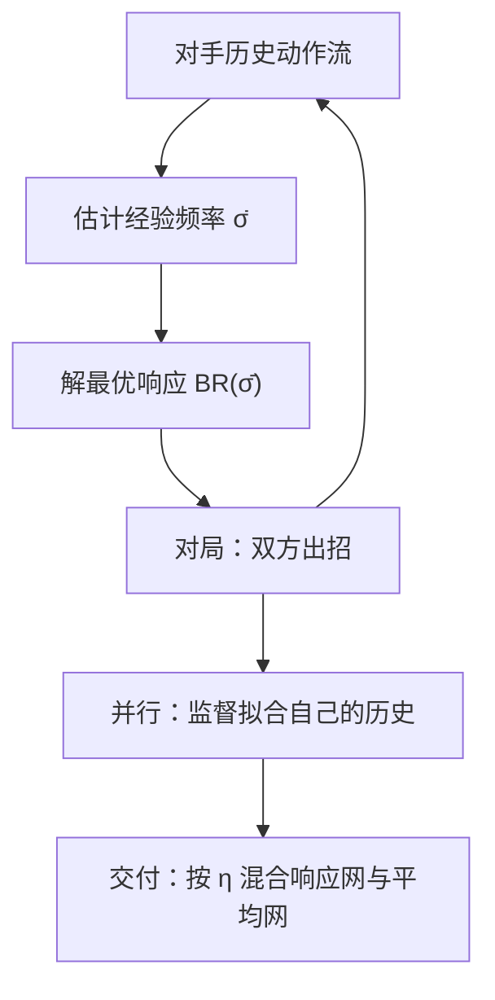
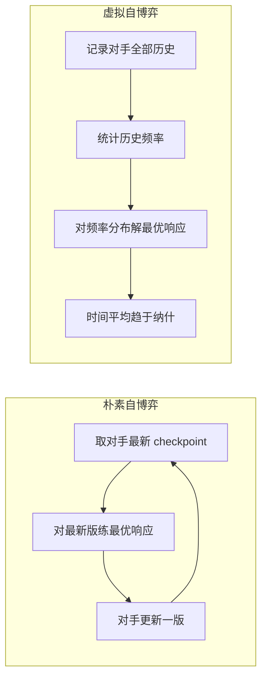

# 虚拟自博弈 FSP

别猜对手下一手怎么想，看他迄今为止平均怎么出；虚拟自博弈把「最优响应」作用在对手的历史频率上，而不是作用在他最新的模型上。

<footer>—— 据 Brown, Iterative Solution of Games by Fictitious Play, 1951；Heinrich &amp; Silver, 2016 整理</footer>

[上一课](/llm/sgt-nash-convergence)把均衡立为审计工具，并留下一句承诺：若每轮对着「当前策略的可利用方向」做最优响应，可利用度可以逐轮压低。本课兑现这句承诺的最老实现——虚拟自博弈（fictitious play），以及它的深度学习版 NFSP。它是后课 PSRO 的直接祖先：先懂对历史频率做最优响应，才懂对均衡分布做最优响应。

## 问题

朴素自博弈有一个人人踩过的坑：两边永远互相追着对方的**最新**策略。对手上一版怕什么，你就练什么；他改一版，你的绝招作废。这是过拟合到单一对手——若对手是混合策略，最新一版只是它的一次采样，追采样等于追噪声。FSP 的修法在结构上极简：每个参与者维护对手的历史动作频率 $\bar\sigma_{-i}^t$，每轮把**最优响应**（best response）算在 $\bar\sigma_{-i}^t$ 上，并把自己这轮的选择并入自己的历史。响应的是经验平均，不是最后一帧。

「混合策略」翻译成大白话：不是死出一招，而是按概率轮换着出，比如剪刀石头布各出三分之一。这时对手最新一版只是随机抽的一次结果——你看见他这次出了剪刀就断定「他爱出剪刀」，练石头必输，这就是「追采样等于追噪声」。

为什么这样能收敛？零和两人博弈里，Robinson 1951 证明了 FSP 的平均策略趋于纳什均衡；Brown 1951 提出它时正是把它当作解博弈的迭代法。而 Shapley 1964 给出一般和博弈里不收敛的循环反例——「FSP 总是有效」从提出后十年就被钉死了边界。本课要记的不是「FSP 收敛」，而是「FSP 把收敛性从学习动力学挪到了一个可解的序列问题上」。

### 从查表到神经网络

经典 FSP 假设最优响应可以精确解出，这在围棋或对话里不成立。Heinrich 与 Silver 2016 的 NFSP（neural fictitious self-play）把两件事网络化：一个网络学最优响应（用 RL 对抗对手的平均策略），另一个网络拟自己的历史动作分布（监督学习自己的过往），对局时按一个混合参数 $\eta$ 在两者间采样。平均策略网络的意义是让「我的历史」也可采样，于是双方都在对对方的经验分布响应——查表时代的收敛叙述被搬到函数逼近时代，虽然正式保证只在这些近似足够好时才随行。

NFSP 的两个记忆体值得记牢：最优响应网络用 RL，只信最近的对局；平均策略网络用监督学习，消化全部历史。一个管「当前能打赢什么」，一个管「我整体长什么样」——混在一个网络里就丢了 FSP 的本意。

## 方法

本课的方法是**算法解剖**：把 FSP 拆成两件可分离的部件——响应对象（对手的历史频率而非最新策略）与响应算子（最优响应），收敛叙述归 Robinson 1951、边界归 Shapley 1964，各自对号入座。NFSP 的网络化按同一刀法再拆：RL 网络管最优响应、监督网络管平均策略，$\eta$ 定交付混合。方法上的贡献据此重述：FSP 不是「又一类自博弈」，而是把「响应什么分布」从追最新一帧改成可解的序列问题。

## 机制

FSP 的有效成分是**平均化**：把对手的混合策略从「一次采样」还原成「分布」，最优响应才能对着整个支撑计算。这解释了它在有循环结构的博弈里不崩——剪刀石头布的 FSP 平均会滑向均匀分布，而追最新策略的朴素自博弈永远差半拍。成本结构同样清晰：每轮要解一次最优响应（贵），但每轮对历史只做一次统计（便宜）；贵与便宜的分界决定了后课 PSRO 会把「解最优响应」再外包给 RL，而把「对谁响应」升级成一个 meta 博弈。

这张对比回答的问题是：同样在做最优响应，追「最新一帧」和追「历史平均」为什么一个振荡、一个收敛。

对语言模型，FSP 视角给出一个便宜的诊断：若你的自博弈脚本里「对手」永远是最新 checkpoint，你跑的不是任何有收敛叙述的算法，只是一个振荡器。把对手池按历史频率混合再采样（哪怕池子只有五个旧版），就在结构上进入了 FSP 的家族——这也是[自博弈的对手选择](/llm/player-selection-bias)在主干里给出的工程建议，此处给了它理论户口。

数字实例：对手过去 100 局出剪刀 60 次。只追最新一帧，你只记得他上一次出了什么，等于扔掉 99 局信息；记历史频率，你知道剪刀占六成，最优响应就是六成以上出石头——把对手的固定偏差直接兑换成胜率。

## 边界

FSP 不救一般和博弈（Shapley 1964 反例），不救函数逼近误差（NFSP 的保证以近似质量为前提），也不保证 last-iterate 收敛——收敛的是时间平均，交付策略若取当前网络，仍可能停在圈上（上一课的边界原样适用）。

「时间平均收敛」和「最后一次收敛」是两回事。类比：时间平均像大学四年的平均绩点，last-iterate 像最后一次考试——绩点很高不代表最后一次没考砸。如果交付上线的是「当前网络」（最后一次），而保证只覆盖平均绩点，你就把没有保证的东西发了出去。另外，「历史频率」在非平稳对手面前语义会糊：对手如果也在学，他的早期动作对预测他的未来用处递减，指数加权平均是常见补丁，但加权本身又是一个无保证的超参。后课的 PSRO 保留 FSP「对分布响应」的骨架，把「响应什么分布」交给一个显式求解器。

## 小结

- FSP 对对手的历史频率做最优响应，修复朴素自博弈「追最新一帧」的过拟合。
- 零和两人收敛（Robinson 1951），一般和有循环反例（Shapley 1964），边界从提出起就清楚。
- NFSP 用 RL 网络学最优响应、监督网络学平均策略，把查表版搬到函数逼近时代。
- 平均化是有效成分：响应分布而非采样；成本在每轮解最优响应。
- 交付取时间平均而非当前网络，否则 last-iterate 的圈仍在。
- 出处：Brown 1951；Robinson 1951；Shapley 1964；Heinrich 与 Silver 2016（NFSP）。
