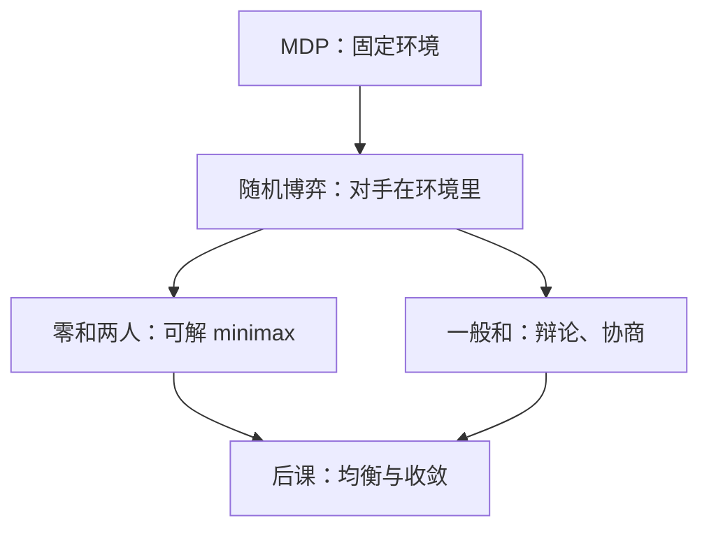
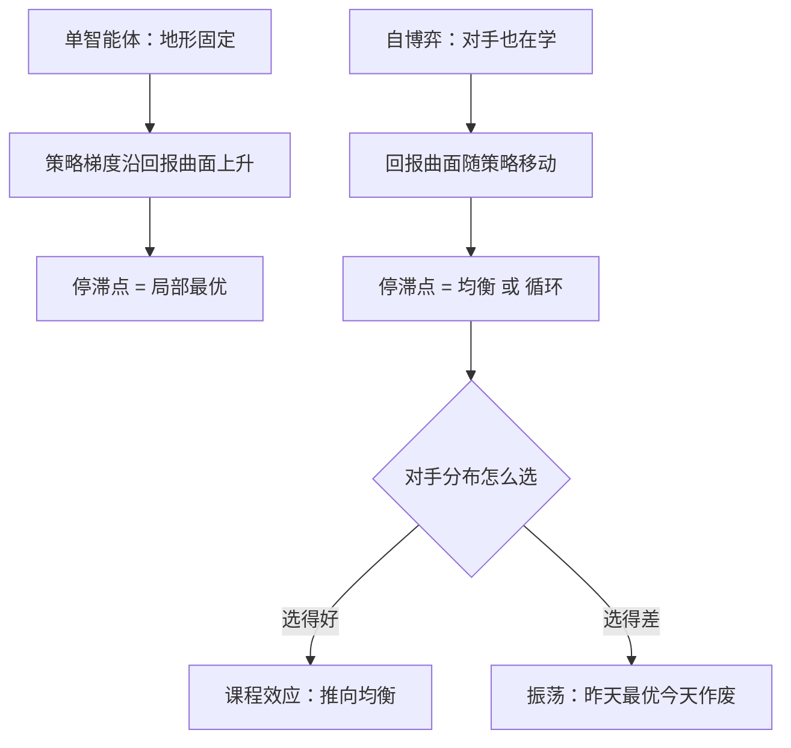

# 博弈论基础的 RL 映射

两个人以上、利益不完全一致的环境里，最优动作取决于别人会怎么做；RL 把对手写进转移函数，博弈论把转移函数里那个「别人」也写成正在学习的人。

<footer>—— 据 Shapley, Stochastic Games, 1953；Littman, Markov games as a framework for multi-agent RL, 1994 整理</footer>

[上一课](/llm/continual-map)把「在线与持续学习」收束成一张图：遗忘、回放、LoRA 生命周期、漂移与评测在那门课里各自成课，末课只留地图。本课开启「自博弈与博弈论深化」。主干课已经写过[自博弈](/llm/self-play-lm)的做法面——两个模型互为对手互相提升；本课程要补的是它脚下的理论面：自博弈在什么条件下成立、什么时候循环不收敛、语言模型把哪些假设弄松了。本课先把博弈论的基本对象一一映射到 RL 词汇上，后课的均衡、FSP、PSRO 都默认这张映射表已在手。

## 问题

单智能体 RL 的收敛故事依赖一个隐藏假设：环境不动。转移函数 $p(s'\mid s,a)$ 与奖励 $r(s,a)$ 由物理或仿真器固定，策略改善只会让回报单调变好。自博弈打破这个假设：你的对手是另一个策略，而且它也在被同一个损失更新。于是环境变成「别人眼中的你」的函数——昨天最优的招，今天对手已经会拆。缺口不是重新学一遍 RL，而是换一套记账单位：从「回报」换到「对手条件下的回报」。

博弈论恰好是为这种记账发明的。规范式博弈给每个参与者一个策略集 $\Delta(A_i)$ 与效用 $u_i$；随机博弈把一串阶段博弈用状态 $s$ 串起来——这正是 MDP 的多人版。Littman 1994 把 Markov games 引进 RL 时给的判断至今成立：只要环境里有别的学习者，价值函数就必须对「对方策略」条件化，否则估值本身在漂。

「记账单位换成对手条件下的回报」翻译成大白话：成绩单换了科目。以前你这一手得多少分只看环境；现在同一招对新手满分类、对高手可能零分——打分前必须先写上「对面是谁」，否则分数本身没有意义。

### 映射表

对象对齐是本课的全部产出：MDP 对应单人随机博弈；策略 $\pi(a\mid s)$ 对应混合策略，即动作分布上的分布；回报对应效用 $u_i$；on-policy 采样对应「按当前策略联合行动」；环境平稳性对应「对手策略固定」。零和两人博弈里 $u_1=-u_2$，minimax 有一条成熟理论；一般和博弈——辩论、协商、多模型竞争用户——没有这个免费午餐，这是后课反复回头的前提。

von Neumann 1928 的 minimax 定理已经保证零和两人规范式博弈存在均衡：每个可解出值的博弈里「攻守同价」。RL 映射不是发明新对象，而是把 1928 年以来的记账接上梯度下降。

## 方法

本课的方法是**对象映射表**：把博弈论词汇逐项对齐到 RL——随机博弈对多人版 MDP、混合策略对动作分布上的分布、效用对回报——对齐的判据只有一条：环境里出现别的学习者时，记账单位必须换成对手条件下的回报。方法上刻意不做两件事：不引入收敛结论（那是后课的命题），不改更新器（PPO、GRPO 原样可用，变的只是采样对手那份 roll-out 由谁出）。本课交付的是词汇表与三处不许越界的边界。

## 机制

映射之后，训练动力学的性质整体改变。单智能体里，策略梯度沿着回报曲面上升，停滞点就是局部最优；自博弈里回报曲面本身随策略移动，「梯度在动过的地形上追最高点」，停滞点可以是纳什均衡，也可以是无人满意的循环。所以自博弈的工程问题从来不是「怎么加梯度」，而是「怎么选对手」——对手分布就是你的环境设计，这是[自博弈的对手选择](/llm/player-selection-bias)在主干里立过的事实，本课程后几课给它配理论。

这张图回答的问题是：单智能体与自博弈的训练动力学差在哪、工程杠杆因此挪到了哪里。

第二处机制差异在信用分配：对手的失误算你的功劳还是运气？零和博弈可以用可利用度（exploitability）——被最优对手打穿的程度——做绝对标尺；一般和与语言任务里没有可算的标尺，只能靠评测集，而评测集也会被博弈，这个坑留给收束课。PPO、GRPO 这些更新器[原样可用](/llm/ppo-llm)，变的只是采样对手那份 roll-out 由谁出。

数字实例：零和博弈里若算出可利用度 0.5，意思是来了一个理论上最优的对手，平均每局能比你多赢 0.5 分；把它压到 0.01，才说明几乎没人能打穿你。它像「被职业选手虐的程度」，数值越低策略越接近无懈可击。

## 边界

映射有三处不许越界。其一，博弈论的均衡概念是对「无限理性、无限样本」的极限描述，不承诺有限算力的学习过程到达它；其二，随机博弈仍假设状态可观测、转移可采样，语言博弈的「状态」是对话历史加双方不可见的意图，采样靠生成；其三，本课只对齐词汇，不引入任何收敛结论——「自博弈趋于均衡」是下一课要专门拆解的命题，这里不给保证。

常见误区：以为「存在纳什均衡」等于「训练会自动走到它」。均衡是无限理性、无限样本下的极限描述，好比「两点之间直线最短」并不保证你走路真能走直线——有限算力的学习过程可能永远在路上，甚至绕圈。

后课默认你已经把「对手是环境的一部分，而且是会变的那部分」当成第一性事实：谈均衡、对手池、辩论与协商时，都在回答同一个问题——这条会变的环境，怎么走才不会白学。

## 小结

- 自博弈把 RL 的固定环境假设换成「对手也是学习者」，记账单位必须换成对手条件下的回报。
- 映射表：混合策略对策略分布、随机博弈对 MDP 的多人版、效用对回报；零和有 minimax 理论，一般和没有。
- 自博弈的核心工程量在对手分布的选取，不在策略梯度本身。
- 均衡是极限概念，本课不给任何「自博弈会到均衡」的承诺。
- 出处：Shapley 1953（随机博弈）；Littman 1994（Markov games 与 RL）；von Neumann 1928（minimax 定理）。
