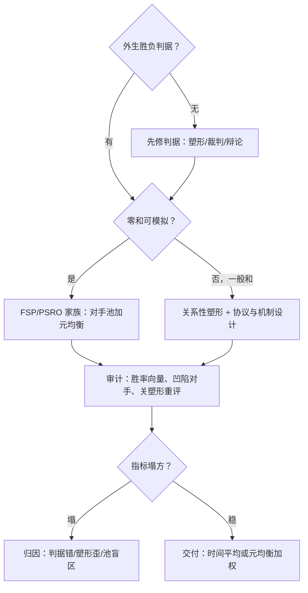
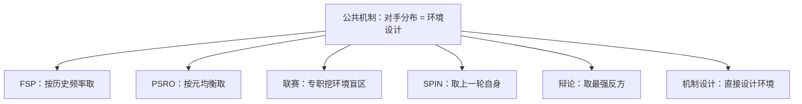

# 自博弈深化的边界与收束

自博弈的价值不在于「模型跟自己打会变强」，而在于它把一个直白的问题逼到墙角：你的胜负判据，经得起两个学习者对它发起的合谋吗。

<footer>—— 本课程对 FSP、PSRO、非传递性与机制设计诸线的收束口径</footer>

[上一课](/llm/sgt-mechanism-design)完成视角翻转：从在博弈里学习的人换成设计博弈的人，并把「评测的可博弈性」列为头号工程问题。本课程到此收束。十课的路线是：理论映射、均衡与收敛、FSP、PSRO 铺理论地基（理论映射单元）；非传递性、棋牌教训、奖励塑形、辩论、协商、机制设计逐层搬到语言模型（语言模型的自博弈与收束单元）。收束课不添新对象，只做两件事：把十课压成一张决策地图，把「语言模型自博弈还没解决什么」钉成清单。

## 问题

收束课要回答的问题是使用侧的：读完一门理论课，工程师明天面对「要不要给我们的模型上自博弈」时，按什么顺序检查？主干课的[自博弈](/llm/self-play-lm)给过做法面，本课程给的是条件面。逐课压下来，判据是三层。**第一层，判据层**：任务有没有外生、廉价、不可协商的胜负信号？有（数学、代码、可验证工具任务），进入第二层；没有，先解决判据——塑形、裁判或辩论都在这里排队，且每一项都要按[奖励塑形](/llm/sgt-reward-shaping)那课做「关闭塑形的审计」。**第二层，结构层**：博弈是零和还是一般和？零和有收敛叙述可借（FSP 的时间平均、PSRO 的元均衡），一般和（协商、多模型竞争）要按 Crawford–Sobel 的封顶预想结果，塑形关系性指标。**第三层，覆盖层**：对手池是否覆盖循环维？按[非传递性](/llm/sgt-nontransitivity)的结论，评测要报胜率向量，对手要按「对我胜率的凹陷」补入。

三层都不通过时，结论不是「自博弈无效」，而是「自博弈不是当前瓶颈」：先修判据或评测，比硬上自博弈便宜。这是把棋牌教训的[环境四条件](/llm/sgt-chess-poker-lessons)读成决策规则的意思。

为什么这一步重要：判据层不过关就硬上自博弈，等于在没有裁判的球场上加练体能——练得越狠，越不知道自己是不是在进步。先花一行代码做「关塑形重评」的审计，比跑一周自博弈便宜得多，还能顺带检验塑形失真与裁判共谋。

### 十课的压缩表

理论地基四课合一句话：自博弈把对手写进环境，均衡是审计工具不是训练目标，FSP 对历史频率响应、PSRO 对元均衡响应，二者的收敛保证都只在零和或良性元博弈里成立。语言模型五课合一句话：语言博弈天生不完美信息、一般和、判据自产，所以要么修判据（塑形、辩论），要么修结构（协商协议、机制设计），要么接受上限（非传递盲区永远补不完）。

一门课的最低限度可检验遗产：若你只记住一个动作，记住「关掉塑形、拿未塑形判据重评一次」——它同时检验塑形失真、裁判共谋与 Goodhart，成本一行代码。

## 方法

本课的方法是**压缩成决策序列**：十课不添新对象，压成三层判据按序检查——判据层（有无外生胜负）、结构层（零和可借收敛叙述、一般和按封顶预期）、覆盖层（对手池补循环维），每层不通过就换动作而不是换超参。第二件方法是统一命名：把各课方法化约为「按什么分布取环境」——FSP 按历史频率、PSRO 按元均衡、辩论取最强反方；审计钉死次序：关塑形、换判据、补盲区，一步一评。

## 机制

十课在机制层的公共资产是同一个视角：**对手分布就是环境设计**。主干课的做法面（换对手、留池子、迭代自博弈）在这一视角下获得统一解释——FSP 是「按历史频率取环境」，PSRO 是「按元均衡取环境」，AlphaStar 联赛是「专职挖掘环境盲区」，SPIN 是「环境退化为上一轮自身」，辩论是「环境取最强反方」，机制设计是「干脆设计环境」。方法间的取舍由此化约为：你的判据与预算，配得起哪种环境复杂度。

这张谱系图回答的问题是：同一个「取环境」视角下，各方法到底差在哪一环。

第二件公共资产是审计顺序。本课程反复出现的失败模式——追最新对手过拟合、塑形搬走均衡、裁判共谋、排行榜 Goodhart、协议变共谋——共享同一结构：**优化目标与评价目标脱钩**。审计有通用次序：先关塑形、再换判据、再补盲区对手，一步一评，定位脱钩发生在哪一层。跳步的诊断会把「判据错了」误治成「训练不够」。

直觉类比：优化是平时练习，评价是期末考试。「目标脱钩」就是刷的题和考的题不是一套——练得再熟，考试照样露馅。审计的次序就是逐层对答案：先确认练习卷（塑形）没错题，再确认考卷（判据）没跑偏，最后确认题库（对手池）覆盖了所有题型。

## 边界

钉下这门课没解决、也不装作解决了的清单。其一，**可利用度不可算**：语言博弈的 exploitability 没有算法入口，一切「接近均衡」的说法在语言模型上都是比喻，实证只能靠代理指标；其二，**均衡选择无理论**：一般和博弈多均衡时选哪个，语言场景连问题描述都未成形；其三，**判据自产的循环**：裁判、评测、协议都由模型充当时，系统在测自己，本课程给的是审计手法（隔离、关塑形、换域复测），不是解；其四，**效用可塑**：规则进权重还是进环境的双轨题没有答案。这四条不否定已写的内容，它们定义的是下一轮深钻的入口。

术语翻译：「判据自产」就是考卷由考生自己出、阅卷也由考生自己批。模型既当裁判又当选手时，系统在测自己——分数再高也只说明它学会了让自己满意。审计手法（换域、隔离、关塑形）相当于请外校出题，能缓解但消不掉这个循环。

后课默认：再遇到「自博弈」「对手池」「辩论训练」这些词，你会先问判据、结构、覆盖三层，而不是直接问超参数。本课程到此收束。

## 小结

- 十课压缩为三层判据：判据层（有无外生胜负）、结构层（零和可借收敛叙述，一般和按协商封顶预期）、覆盖层（对手池补循环维）。
- 机制层公共资产：对手分布即环境设计；各方法化约为「按什么分布取环境」。
- 失败模式共享结构——优化目标与评价目标脱钩；审计次序：关塑形、换判据、补盲区，一步一评。
- 未解清单：可利用度不可算、均衡选择无理论、判据自产的循环、效用可塑下的机制双轨题。
- 语言自博弈的可行域近 Hanabi 而非围棋：先修判据与约定，再谈强度。
- 出处：本课程各课口径的总收束；理论线见 Brown 1951、Robinson 1951、Lanctot 等 2017、Balduzzi 等 2019、Czarnecki 等 2020，语言线见 Heinrich 与 Silver 2016、Irving 等 2018、Bakhtin 等 2022、Chen 等 2024。
