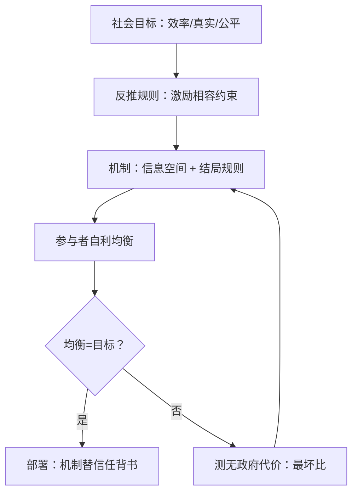

# 机制设计的视角

前面的课都在给定博弈里求胜，机制设计倒过来问：规则怎么定，才能让自利的均衡恰好落在想要的地方。

<footer>—— 据 Hurwicz, The Design of Mechanisms for Resource Allocation, 1973；Myerson, Optimal Auction Design, 1981 整理</footer>

[上一课](/llm/sgt-negotiation)把协商读成「协议如何自发长出」，结尾留了一句：协议形成是规则设计的特例。本课完成这次视角翻转——从参与者换成规则制定者。这是收束单元的第一课：前九课训练的都是「在博弈里学习的人」，本课训练「设计博弈的人」，而每一个部署语言模型的工程师，其实是后者。

## 问题

机制设计的定义性动作：给定目标（效率、收益、真实汇报），**反推**交互规则，使得参与者各自最大化自身利益时的均衡结局恰好实现目标。Hurwicz 1973 把「机制」形式化为信息空间与结局规则的组合；Vickrey 1961 的二价拍卖是原型示范：让每个竞拍者报真实估值成为占优策略（报高了可能付亏，报低了可能白丢），激励相容由此得名。Myerson 1981 把拍卖设计推到收益最优的解析解。这一传统的全部力量在于**不依赖参与者的善意**：它不问「怎么让模型诚实」，而问「什么规则下连不诚实的模型也产生诚实的结果」。

对语言模型系统，缺口立刻显形。训练视角把失真当「模型学坏」：奖励黑客是训练问题，谄媚是训练问题。机制视角把这些重读为**规则问题**：评测把单一公开排行榜当唯一信号，模型自然过拟合排行榜；多 Agent 系统里模型互相评审而不设披露规则，评审共谋是均衡不是意外；用户反馈在线学习里，讨好短期反馈的策略占优——主干课在[奖励黑客](/llm/reward-hacking-llm)处按训练病处理的对象，在这里拿到第二个诊断：判据的激励结构设计错了，再训也白训。

### 最坏情况与均衡质量

机制设计给出两个语言系统直接可用的量。其一，激励相容检查：对每个参与者、每组他人行为，验证「真实汇报/诚实行动」是否不劣于任何偏离——对模型评测而言，这意味着测试「策略性夸大成绩」是否真的无利可图，而不是假设模型不会想到。其二，无政府代价（price of anarchy，Koutsoupias 与 Papadimitriou 1999）：均衡结局与最优结局之比的最坏值。Roughgarden 与 Tardos 2002 对自私路由的答案是仿射时延下均衡总成本至多是最优的 $4/3$ 倍——这是把「分散自利最坏会差多少」变成**可算的数**的示范。多模型路由、多 Agent 分工都可以做同型的最坏比分析：不这么做，就只能在事故后宣布「没想到它们会这样互动」。

Vickrey 1961 的二价拍卖与 eBay 时代的实际拍卖机制之间隔着几十年的机制工程；LLM 评测从「排行榜」到「不可博弈的评测」之间，目前普遍还停在 Vickrey 之前。

## 机制

为什么「设计规则」能解决「训练调不动」的问题？因为机制改变了博弈的收益矩阵，而收益矩阵决定均衡——上一单元的全部动力学都在矩阵给定的前提下运行，机制设计动的是矩阵本身。对 LLM 的三个落点：**评测机制**——报告方式从单一公开榜改为可复用留出集、变换测度与加噪（Dwork 等 2015 的 reusable holdout 正是为「自适应数据分析下保住统计效度」设计的机制），主干[RLHF 流程](/llm/rlhf-pipeline)里的偏好比较也可同样处理标注者激励；**多 Agent 协作机制**——评审披露、轮换裁判、押注式承诺，直接对应上一课协商边界处「没有第三条路」的缺口；**Nisan 与 Ronen 1999** 的算法机制设计给出计算侧约束：机制本身要在多项式时间内可执行，规则太复杂就等于没规则。

机制设计的边界与自博弈的边界在此合流：机制可以改收益矩阵，不能改参与者的能力差；均衡仍受上一单元的非传递与循环制约；且机制本身是新的可对策对象——参与者对规则过拟合，Goodhart 在规则层面重演。

## 边界

本课只搬运概念与原型结论，不证明定理：激励相容的完整刻画（显示原理）、最优机制的解析解、无政府代价的逐域计算，都是专门文献的事（Nisan 等 2007 的教科书卷给出入口）。对语言系统，机制设计还有一处未定空档：经典理论假设参与者是理性的固定效用最大化者，而 LLM 的「效用」是训练出来的、可塑的——机制可以**内化**进权重，也意味着均衡分析要搭在「训练后模型近似最优响应」的假设上，其误差界目前没有成熟结果。规则写进权重还是写在环境里，是本课程留下的双轨开放题。

## 小结

- 机制设计反推规则使自利均衡落在目标处；激励相容是核心约束（Vickrey 1961、Myerson 1981）。
- 训练视角的「模型学坏」可重读为规则问题：排行榜过拟合、评审共谋、反馈谄媚都是激励结构病。
- 无政府代价把「自利最坏差多少」变成可算的数（Koutsoupias 与 Papadimitriou 1999；Roughgarden 与 Tardos 2002）。
- 落点三处：评测机制、多 Agent 协作规则、计算可行的机制（Nisan 与 Ronen 1999）。
- 机制本身也会被过拟合（Goodhart 的规则层版本），且 LLM 的效用可塑使均衡分析添新空档。
- 出处：Hurwicz 1973；Vickrey 1961；Myerson 1981；Nisan 与 Ronen 1999；Koutsoupias 与 Papadimitriou 1999；Roughgarden 与 Tardos 2002。
